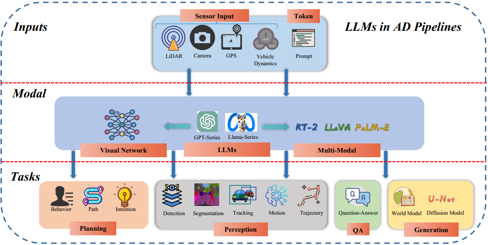
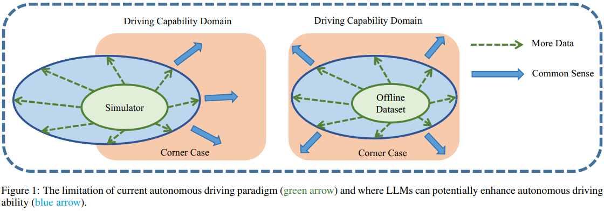

# Awesome-LLM-for-Autonomous-Driving-Resources
[](https://github.com/sindresorhus/awesome)  [](https://github.com/Thinklab-SJTU/Awesome-LLM4AD/blob/main/LICENSE)

This is a collection of research papers about **LLM-for-Autonomous-Driving(LLM4AD)**. The repository will be continuously updated to track the frontier of LLM4AD (Large Language Models for Autonomous Driving), which encompasses VLM4AD (Vision-Language Models for AD) and VLA4AD (Vision-Language-Action models for AD) as integral components of this unified paradigm.  *Maintained by SJTU-ReThinklab.*


Welcome to follow and star! If you find any related materials could be helpful, feel free to contact us (yangzhenjie@sjtu.edu.cn or jiaxiaosong@sjtu.edu.cn) or make a PR.

## Citation
Our survey paper is at https://arxiv.org/abs/2311.01043 which includes more detailed discussions and will be continuously updated. 

**The GitHub Pages was updated on July 03, 2025.**

**The Survey Paper latest version was updated on August 12, 2024.**

If you find our repo is helpful, please consider cite it.
```BibTeX
@misc{yang2023survey,
      title={LLM4Drive: A Survey of Large Language Models for Autonomous Driving}, 
      author={Zhenjie Yang and Xiaosong Jia and Hongyang Li and Junchi Yan},
      year={2023},
      eprint={2311.01043},
      archivePrefix={arXiv},
      primaryClass={cs.AI}
}
```

## Table of Contents
- [Awesome LLM-for-Autonomous-Driving(LLM4AD)](#awesome-llm-for-autonomous-driving-resources)
  - [Table of Contents](#table-of-contents)
  - [Overview of LLM4AD](#overview-of-llm4ad)
  - [Papers](#papers)
  - [Datasets](#datasets)
  - [Citation](#citation)
  - [License](#license)

## Overview of LLM4AD
LLM-for-Autonomous-Driving (LLM4AD) refers to the application of Large Language Models(LLMs) in autonomous driving. We divide existing works based on the perspective of applying LLMs: planning, perception, question answering, and generation. 



## Motivation of LLM4AD
The orange circle represents the ideal level of driving competence, akin to that possessed by an experienced human driver. There are two main methods to acquire such proficiency: one, through learning-based techniques within simulated environments; and two, by learning from offline data through similar methodologies. It’s important to note that due to discrepancies between simulations and the real-world, these two domains are not fully the same, i.e. sim2real gap. Concurrently, offline data serves as a subset of real-world data since it’s collected directly from actual surroundings. However, it is difficult to fully cover the distribution as well due to the notorious long-tailed nature of autonomous driving tasks. The final goal of autonomous driving is to elevate driving abilities from a basic green stage to a more advanced blue level through extensive data collection and deep learning.



## Papers
<details open>
<summary>Toggle</summary>

```
format:
- [title](paper link) [links]
  - author1, author2, and author3...
  - publisher
  - task
  - keyword
  - code or project page
  - datasets or environment or simulator
  - publish date
  - summary
  - metrics
```

- [Modular Autonomy with Conversational Interaction: An LLM-driven Framework for Decision Making in Autonomous Driving](https://arxiv.org/abs/2601.05806)
  - Marvin Seegert, Korbinian Moller, Johannes Betz
  - Publisher: Technical University of Munich
  - Publish Date: 2026.01.09
  - Task: Planning
  - Summary：
    - Proposes an LLM-driven framework for conversational interaction in Autonomous Driving Systems (ADS), integrating an LLM-based interaction layer with the Autoware software stack.
    - Introduces a three-component methodology: a taxonomization of interaction categories, an application-centric Domain Specific Language (DSL) for command translation, and a safety-preserving validation layer.
    - Employs a two-stage LLM architecture to ensure high transparency and provide execution feedback, with evaluation confirming timing efficiency and translation robustness.

- [SGDrive: Scene-to-Goal Hierarchical World Cognition for Autonomous Driving](https://arxiv.org/abs/2601.05640)
  - Jingyu Li, Junjie Wu, Dongnan Hu, Xiangkai Huang, Bin Sun, Zhihui Hao, Xianpeng Lang, Xiatian Zhu, Li Zhang
  - Publish Date: 2026.01.09
  - Task: Planning
  - Datasets: [NAVSIM](https://github.com/autonomousvision/navsim)
  - Summary：
    - Proposes SGDrive, a novel framework that structures a Vision-Language Model's (VLM) representation learning around a driving-specific scene-agent-goal hierarchy to mirror human driving cognition.
    - Addresses limitations of generalist VLMs by providing structured spatial-temporal representations for safe trajectory planning, integrating multi-level information into a compact format.
    - Achieves state-of-the-art performance among camera-only methods on the NAVSIM benchmark, validating the effectiveness of hierarchical knowledge structuring for adapting VLMs to autonomous driving.

- [LatentVLA: Efficient Vision-Language Models for Autonomous Driving via Latent Action Prediction](https://arxiv.org/abs/2601.05611)
  - Chengen Xie, Bin Sun, Tianyu Li, Junjie Wu, Zhihui Hao, XianPeng Lang, Hongyang Li
  - Publish Date: 2026.01.09
  - Task: End-to-End
  - Datasets: [NAVSIM](https://github.com/autonomousvision/navsim), [nuScenes](https://www.nuscenes.org/)
  - Summary：
    - LatentVLA, a novel framework using self-supervised latent action prediction to train Vision-Language-Action (VLA) models without language annotations, eliminating linguistic bias.
    - It transfers VLA generalization to efficient vision-based networks via knowledge distillation, achieving robust performance and real-time efficiency.
    - Establishes a new state-of-the-art on the NAVSIM benchmark (PDMS score of 92.4) and shows strong zero-shot generalization on nuScenes.

- [Dichotomous Diffusion Policy Optimization](https://arxiv.org/abs/2601.00898)
  - Ruiming Liang, Yinan Zheng, Kexin Zheng, Tianyi Tan, Jianxiong Li, Liyuan Mao, Zhihao Wang, Guang Chen, Hangjun Ye, Jingjing Liu, Jinqiao Wang, Xianyuan Zhan
  - Publish Date: 2025.12.31
  - Task: Planning, Control, End-to-End
  - Datasets: [NAVSIM](https://github.com/autonomousvision/navsim)
  - Summary：
    - Proposes DIPOLE (Dichotomous diffusion Policy improvement), a novel RL algorithm for stable and controllable diffusion policy optimization by decomposing the optimal policy into a pair of dichotomous policies for reward maximization and minimization.
    - Enables flexible control over greediness during inference by linearly combining the scores of the learned dichotomous policies.
    - Demonstrates effectiveness in offline and offline-to-online RL settings (ExORL, OGBench) and for training a large vision-language-action model for end-to-end autonomous driving on the NAVSIM benchmark.

- [LSRE: Latent Semantic Rule Encoding for Real-Time Semantic Risk Detection in Autonomous Driving](https://arxiv.org/abs/2512.24712)
  - Qian Cheng, Weitao Zhou, Cheng Jing, Nanshan Deng, Junze Wen, Zhaoyang Liu, Kun Jiang, Diange Yang
  - Publish Date: 2025.12.31
  - Task: Perception
  - Datasets: [CARLA](https://carla.org/)
  - Summary：
    - LSRE, a Latent Semantic Rule Encoding framework that converts sparsely sampled VLM judgments into decision boundaries within a recurrent world model's latent space for real-time semantic risk assessment.
    - Enables real-time semantic risk detection at 10 Hz without per-frame VLM queries, achieving accuracy comparable to a large VLM baseline with earlier hazard anticipation and low latency.
    - Demonstrates generalization to rarely seen semantic-similar test cases, indicating language-guided latent classification is an effective mechanism for semantic safety monitoring.

- [Counterfactual VLA: Self-Reflective Vision-Language-Action Model with Adaptive Reasoning](https://arxiv.org/abs/2512.24426)
  - Zhenghao "Mark" Peng, Wenhao Ding, Yurong You, Yuxiao Chen, Wenjie Luo, Thomas Tian, Yulong Cao, Apoorva Sharma, Danfei Xu, Boris Ivanovic, Boyi Li, Bolei Zhou, Yan Wang, Marco Pavone
  - Publish Date: 2025.12.30
  - Task: Planning
  - Summary：
    - Introduces Counterfactual VLA (CF-VLA), a self-reflective VLA framework that enables reasoning about and revising planned actions before execution via counterfactual reasoning.
    - Proposes a rollout-filter-label pipeline to mine high-value scenes and label counterfactual reasoning traces for efficient training.
    - Demonstrates improvements in trajectory accuracy (up to 17.6%) and safety metrics (20.5%), with adaptive reasoning enabled only in challenging scenarios.

- [Spatial-aware Vision Language Model for Autonomous Driving](https://arxiv.org/abs/2512.24331)
  - Weijie Wei, Zhipeng Luo, Ling Feng, Venice Erin Liong
  - Publish Date: 2025.12.30
  - Task: End-to-End
  - Summary：
    - LVLDrive (LiDAR-Vision-Language), a novel framework designed to upgrade existing Vision-Language Models (VLMs) with robust 3D metric spatial understanding for autonomous driving by incorporating LiDAR point clouds as an extra input modality.
    - Introduces a Gradual Fusion Q-Former to incrementally inject LiDAR features, mitigating catastrophic disturbance to pre-trained VLMs and preserving their existing knowledge base.
    - Develops a spatial-aware question-answering (SA-QA) dataset to explicitly teach the model advanced 3D perception and reasoning capabilities, achieving superior performance on driving benchmarks.

- [ColaVLA: Leveraging Cognitive Latent Reasoning for Hierarchical Parallel Trajectory Planning in Autonomous Driving](https://arxiv.org/abs/2512.22939)
  - Qihang Peng, Xuesong Chen, Chenye Yang, Shaoshuai Shi, Hongsheng Li
  - Publisher: The Chinese University of Hong Kong, Shanghai AI Laboratory
  - Publish Date: 2025.12.28
  - Task: Planning
  - Datasets: [nuScenes](https://www.nuscenes.org/)
  - Summary：
    - ColaVLA, a unified vision-language-action framework that transfers reasoning from text to a latent space for efficient trajectory planning.
    - Introduces a Cognitive Latent Reasoner for compact, decision-oriented scene understanding and a Hierarchical Parallel Planner for single-pass, causality-consistent trajectory generation.
    - Achieves state-of-the-art performance on the nuScenes benchmark in open-loop and closed-loop settings with improved efficiency and robustness.

- [KnowVal: A Knowledge-Augmented and Value-Guided Autonomous Driving System](https://arxiv.org/abs/2512.20299)
  - Zhongyu Xia, Wenhao Chen, Yongtao Wang, Ming-Hsuan Yang
  - Publish Date: 2025.12.23
  - Task: Planning
  - Datasets: [nuScenes](https://www.nuscenes.org/), [Bench2Drive](https://bench2drive.github.io/)
  - Summary：
    - Proposes KnowVal, an autonomous driving system integrating visual-language reasoning with a comprehensive driving knowledge graph and an LLM-based retrieval mechanism.
    - Develops a human-preference dataset and a Value Model to guide interpretable, value-aligned trajectory assessment.
    - Achieves state-of-the-art planning performance, including the lowest collision rate on nuScenes and top results on Bench2Drive.

- [LLaViDA: A Large Language Vision Driving Assistant for Explicit Reasoning and Enhanced Trajectory Planning](https://arxiv.org/abs/2512.18211)
  - Yudong Liu, Spencer Hallyburton, Jiwoo Kim, Yueqian Lin, Yiming Li, Qinsi Wang, Hui Ye, Jingwei Sun, Miroslav Pajic, Yiran Chen, Hai Li
  - Publish Date: 2025.12.20
  - Code: [LLaViDA](https://github.com/)
  - Task: Planning
  - Datasets: [NuScenes](https://www.nuscenes.org/)
  - Summary：
    - LLaViDA, a Large Language Vision Driving Assistant that leverages a Vision-Language Model (VLM) for object motion prediction, semantic grounding, and chain-of-thought reasoning for trajectory planning.
    - Employs a two-stage training pipeline of supervised fine-tuning followed by Trajectory Preference Optimization (TPO) to enhance scene understanding and planning.
    - Achieves state-of-the-art performance on the NuScenes benchmark for open-loop trajectory planning, with an average L2 error of 0.31 m and a 0.10% collision rate.

- [OmniDrive-R1: Reinforcement-driven Interleaved Multi-modal Chain-of-Thought for Trustworthy Vision-Language Autonomous Driving](https://arxiv.org/abs/2512.14044)
  - Zhenguo Zhang, Haohan Zheng, Yishen Wang, Le Xu, Tianchen Deng, Xuefeng Chen, Qu Chen, Bo Zhang, Wuxiong Huang
  - Publish Date: 2025.12.16
  - Task: Reasoning
  - Datasets: [DriveLMM-o1](https://github.com/OpenDriveLab/DriveLMM)
  - Summary：
    - OmniDrive-R1, an end-to-end VLM framework for autonomous driving, introduces an interleaved Multi-modal Chain-of-Thought (iMCoT) mechanism to unify perception and reasoning.
    - The core innovation is a Reinforcement-driven visual grounding capability, enabled by a two-stage RL pipeline and the Clip-GRPO algorithm, which uses an annotation-free, process-based grounding reward.
    - The model significantly improves reasoning, raising the overall score from 51.77% to 80.35% and final answer accuracy from 37.81% to 73.62% on DriveLMM-o1 compared to the Qwen2.5VL-7B baseline.

- [MindDrive: A Vision-Language-Action Model for Autonomous Driving via Online Reinforcement Learning](https://arxiv.org/abs/2512.13636)
  - Haoyu Fu, Diankun Zhang, Zongchuang Zhao, Jianfeng Cui, Hongwei Xie, Bing Wang, Guang Chen, Dingkang Liang, Xiang Bai
  - Publish Date: 2025.12.15
  - Task: Planning
  - Datasets: [Bench2Drive](https://github.com/OpenDriveLab/Bench2Drive)
  - Summary：
    - MindDrive, a Vision-Language-Action (VLA) framework for autonomous driving that uses online reinforcement learning to address limitations of Imitation Learning like distribution shift.
    - It features an LLM with two LoRA parameter sets: a Decision Expert for reasoning and an Action Expert to map decisions to trajectories, enabling trial-and-error learning over discrete linguistic decisions.
    - Achieves a Driving Score of 78.04 and Success Rate of 55.09% on the Bench2Drive benchmark using the lightweight Qwen-0.5B LLM.

- [DrivePI: Spatial-aware 4D MLLM for Unified Autonomous Driving Understanding, Perception, Prediction and Planning](https://arxiv.org/abs/2512.12799)
  - Zhe Liu, Runhui Huang, Rui Yang, Siming Yan, Zining Wang, Lu Hou, Di Lin, Xiang Bai, Hengshuang Zhao
  - Publish Date: 2025.12.14
  - Code: [DrivePI](https://github.com/happinesslz/DrivePI)
  - Task: Planning
  - Datasets: [nuScenes](https://www.nuscenes.org/)
  - Summary：
    - DrivePI, a spatial-aware 4D MLLM serving as a unified Vision-Language-Action (VLA) framework for autonomous driving, jointly performs spatial understanding, 3D perception, prediction, and planning through end-to-end optimization.
    - The method integrates point clouds, multi-view images, and language instructions, and uses a data engine to generate text-occupancy and text-flow QA pairs for 4D spatial understanding.
    - With only a 0.5B Qwen2.5 backbone, DrivePI as a single model matches or exceeds existing VLA and specialized VA models in key metrics across nuScenes and OpenOcc benchmarks.

- [Towards Efficient and Effective Multi-Camera Encoding for End-to-End Driving](https://arxiv.org/abs/2512.10947)
  - Jiawei Yang, Ziyu Chen, Yurong You, Yan Wang, Yiming Li, Yuxiao Chen, Boyi Li, Boris Ivanovic, Marco Pavone, Yue Wang
  - Publisher: Stanford University, NVIDIA
  - Publish Date: 2025.12.11
  - Task: End-to-End
  - Summary：
    - Presents Flex, an efficient and effective geometry-agnostic scene encoder for multi-camera data in end-to-end autonomous driving, using a small set of learnable scene tokens to jointly encode information across cameras and timesteps.
    - Achieves 2.2x greater inference throughput and improved driving performance on a large-scale proprietary dataset compared to state-of-the-art methods, challenging the necessity of explicit 3D inductive biases like BEV or occupancy.
    - Demonstrates that the compact scene tokens develop an emergent capability for scene decomposition without explicit supervision, offering a more scalable and data-driven path for future systems.

- [SpaceDrive: Infusing Spatial Awareness into VLM-based Autonomous Driving](https://arxiv.org/abs/2512.10719)
  - Peizheng Li, Zhenghao Zhang, David Holtz, Hang Yu, Yutong Yang, Yuzhi Lai, Rui Song, Andreas Geiger, Andreas Zell
  - Publisher: University of Tübingen
  - Publish Date: 2025.12.11
  - Task: Planning
  - Datasets: [nuScenes](https://www.nuscenes.org/)
  - Summary：
    - SpaceDrive, a spatial-aware VLM-based driving framework that treats spatial information as explicit positional encodings instead of textual digit tokens for joint semantic and spatial reasoning.
    - Employs a universal positional encoder for 3D coordinates from multi-view depth, historical ego-states, and text prompts, enhancing visual tokens and enabling direct trajectory coordinate regression.
    - Achieves state-of-the-art open-loop performance on nuScenes and a Driving Score of 78.02 on the Bench2Drive closed-loop benchmark among VLM-based methods.

- [Latent Chain-of-Thought World Modeling for End-to-End Driving](https://arxiv.org/abs/2512.10226)
  - Shuhan Tan, Kashyap Chitta, Yuxiao Chen, Ran Tian, Yurong You, Yan Wang, Wenjie Luo, Yulong Cao, Philipp Krahenbuhl, Marco Pavone, Boris Ivanovic
  - Publish Date: 2025.12.11
  - Task: End-to-End
  - Summary：
    - Latent-CoT-Drive (LCDrive): a model that expresses chain-of-thought (CoT) reasoning in a latent language that captures possible outcomes of driving actions, unifying reasoning and decision making in an action-aligned latent space.
    - The model reasons by interleaving action-proposal tokens and world model tokens, which are grounded in a learned latent world model to express future outcomes.
    - The approach is cold-started with supervision from ground-truth future rollouts and then post-trained with closed-loop reinforcement learning, achieving faster inference and better trajectory quality on a large-scale end-to-end driving benchmark.

- [UniUGP: Unifying Understanding, Generation, and Planing For End-to-end Autonomous Driving](https://arxiv.org/abs/2512.09864)
  - Hao Lu, Ziyang Liu, Guangfeng Jiang, Yuanfei Luo, Sheng Chen, Yangang Zhang, Ying-Cong Chen
  - Publish Date: 2025.12.10
  - Task: End-to-End
  - Summary：
    - Proposes UniUGP, a unified Understanding-Generation-Planning framework that synergizes scene reasoning, future video generation, and trajectory planning through a hybrid expert architecture.
    - Introduces a four-stage training strategy across multiple AD datasets to progressively build capabilities, demonstrating state-of-the-art performance and superior generalization to long-tail scenarios.

- [COVLM-RL: Critical Object-Oriented Reasoning for Autonomous Driving Using VLM-Guided Reinforcement Learning](https://arxiv.org/abs/2512.09349)
  - Lin Li, Yuxin Cai, Jianwu Fang, Jianru Xue, Chen Lv
  - Publish Date: 2025.12.10
  - Task: End-to-End
  - Datasets: [CARLA](https://carla.org/)
  - Summary：
    - COVLM-RL, a novel end-to-end driving framework integrating Critical Object-oriented reasoning with VLM-guided Reinforcement Learning to address generalization, efficiency, and interpretability.
    - Introduces a Chain-of-Thought prompting strategy for the VLM to reason over critical traffic elements, generating semantic decision priors that reduce input dimensionality and inject task knowledge into RL.
    - Proposes a consistency loss to align the VLM's semantic plans with the RL agent's continuous control outputs, improving interpretability and training stability.

- [A Multi-Agent LLM Framework for Design Space Exploration in Autonomous Driving Systems](https://arxiv.org/abs/2512.08476)
  - Po-An Shih, Shao-Hua Wang, Yung-Che Li, Chia-Heng Tu, Chih-Han Chang
  - Publish Date: 2025.12.09
  - Task: Planning
  - Summary：
    - A multi-agent, large language model (LLM)-based design space exploration (DSE) framework for autonomous driving systems, integrating multi-modal reasoning with 3D simulation and profiling tools.
    - Automates the interpretation of execution outputs and guides system design exploration using specialized LLM agents for user input, design generation, execution orchestration, and output analysis.
    - Evaluated on a robotaxi case study, the framework identifies more Pareto-optimal, cost-efficient solutions with reduced navigation time compared to a genetic algorithm baseline under the same exploration budget.

- [WAM-Diff: A Masked Diffusion VLA Framework with MoE and Online Reinforcement Learning for Autonomous Driving](https://arxiv.org/abs/2512.11872)
  - Mingwang Xu, Jiahao Cui, Feipeng Cai, Hanlin Shang, Zhihao Zhu, Shan Luan, Yifang Xu, Neng Zhang, Yaoyi Li, Jia Cai, Siyu Zhu
  - Publisher: Fudan University
  - Publish Date: 2025.12.06
  - Project Page: [WAM-Diff](https://github.com/fudan-generative-vision/WAM-Diff)
  - Code: [WAM-Diff](https://github.com/fudan-generative-vision/WAM-Diff)
  - Task: Planning
  - Datasets: [NAVSIM](https://github.com/autonomousvision/navsim)
  - Summary：
    - WAM-Diff, a Vision-Language-Action (VLA) framework that employs masked diffusion to iteratively refine a discrete sequence for future ego-trajectory generation in autonomous driving.
    - Features three key innovations: adaptation of masked diffusion for flexible decoding, scalable capacity via a sparse Mixture of Experts (MoE) trained on motion prediction and VQA, and online reinforcement learning using Group Sequence Policy Optimization (GSPO).
    - Achieves state-of-the-art performance on NAVSIM benchmarks (91.0 PDMS on v1, 89.7 EPDMS on v2), demonstrating masked diffusion as a promising alternative to autoregressive and continuous diffusion policies.

- [Are AI-Generated Driving Videos Ready for Autonomous Driving? A Diagnostic Evaluation Framework](https://arxiv.org/abs/2512.06376)
  - Xinhao Xiang, Abhijeet Rastogi, Jiawei Zhang
  - Publish Date: 2025.12.06
  - Task: Simulation
  - Datasets: [ADGV-Bench](https://arxiv.org/abs/2512.06376)
  - Summary：
    - Presents a diagnostic framework to evaluate the reliability of AI-generated driving videos (AIGVs) for training and evaluating autonomous driving models.
    - Introduces ADGV-Bench, a benchmark with human annotations and dense labels for perception tasks, and ADGVE, a driving-aware evaluator for scoring video quality.
    - Shows that filtering raw AIGVs with the proposed evaluator improves video quality metrics and downstream AD model performance, turning AIGVs into a beneficial data complement.

- [WAM-Flow: Parallel Coarse-to-Fine Motion Planning via Discrete Flow Matching for Autonomous Driving](https://arxiv.org/abs/2512.06112)
  - Yifang Xu, Jiahao Cui, Feipeng Cai, Zhihao Zhu, Hanlin Shang, Shan Luan, Mingwang Xu, Neng Zhang, Yaoyi Li, Jia Cai, Siyu Zhu
  - Publisher: Fudan University, Yinwang
  - Publish Date: 2025.12.05
  - Code: [WAM-Flow](https://github.com/fudan-generative-vision/WAM-Flow)
  - Task: Planning
  - Datasets: [NAVSIM](https://github.com/autonomousvision/navsim), [nuScenes](https://www.nuscenes.org/nuscenes)
  - Summary:
    - The paper introduces the first discrete flow matching architecture for autonomous driving, which achieves low-latency, parallel, and coarse-to-fine motion planning.

- [BeLLA: End-to-End Birds Eye View Large Language Assistant for Autonomous Driving](https://arxiv.org/abs/2512.06096)
  - Karthik Mohan, Sonam Singh, Amit Arvind Kale
  - Publish Date: 2025.12.05
  - Task: VQA
  - Datasets: [NuScenes-QA](https://www.nuscenes.org/), [DriveLM](https://drivelm.github.io/)
  - Summary：
    - BeLLA, an end-to-end architecture connecting unified 360° BEV representations with a large language model for question answering in autonomous driving.
    - Outperforms existing approaches on tasks requiring spatial reasoning, such as relative object positioning and behavioral understanding, achieving up to +9.3% absolute improvement.
    - Evaluated on NuScenes-QA and DriveLM benchmarks, demonstrating competitive performance across a diverse range of questions.

- [From Segments to Scenes: Temporal Understanding in Autonomous Driving via Vision-Language Model](https://arxiv.org/abs/2512.05277)
  - Kevin Cannons, Saeed Ranjbar Alvar, Mohammad Asiful Hossain, Ahmad Rezaei, Mohsen Gholami, Alireza Heidarikhazaei, Zhou Weimin, Yong Zhang, Mohammad Akbari
  - Publish Date: 2025.12.04
  - Project Page: [TAD](https://huggingface.co/datasets/vbdai/TAD)
  - Code: [TAD](https://github.com/vbdi/tad_bench)
  - Task: Reasoning
  - Datasets: [TAD](https://huggingface.co/datasets/vbdai/TAD)
  - Summary：
    - Introduces the Temporal Understanding in Autonomous Driving (TAD) benchmark, comprising nearly 6,000 QA pairs across 7 tasks, to evaluate VLMs on ego-centric driving footage.
    - Benchmarks 9 generalist and specialist models, finding substandard accuracy due to imperfect fine-grained motion understanding.
    - Proposes two training-free solutions, Scene-CoT and TCogMap, which improve average accuracy on TAD by up to 17.72% when integrated with existing VLMs.

- [E3AD: An Emotion-Aware Vision-Language-Action Model for Human-Centric End-to-End Autonomous Driving](https://arxiv.org/abs/2512.04733)
  - Yihong Tang, Haicheng Liao, Tong Nie, Junlin He, Ao Qu, Kehua Chen, Wei Ma, Zhenning Li, Lijun Sun, Chengzhong Xu
  - Publish Date: 2025.12.04
  - Task: End-to-End
  - Summary：
    - Proposes E3AD, an emotion-aware Vision-Language-Action (VLA) framework for Open-Domain End-to-End (OD-E2E) autonomous driving, which interprets free-form commands, infers passenger emotion, and plans trajectories.
    - Introduces a continuous Valence-Arousal-Dominance (VAD) emotion model and a dual-pathway spatial reasoning module for enhanced semantic understanding and human-like spatial cognition.
    - Employs a consistency-oriented training scheme combining modality pretraining with preference-based alignment, achieving state-of-the-art results in emotion estimation and improved visual grounding and planning.

- [dVLM-AD: Enhance Diffusion Vision-Language-Model for Driving via Controllable Reasoning](https://arxiv.org/abs/2512.04459)
  - Yingzi Ma, Yulong Cao, Wenhao Ding, Shuibai Zhang, Yan Wang, Boris Ivanovic, Ming Jiang, Marco Pavone, Chaowei Xiao
  - Publish Date: 2025.12.04
  - Task: End-to-End
  - Datasets: [nuScenes](https://www.nuscenes.org/), [WOD-E2E](https://waymo.com/open/)
  - Summary：
    - dVLM-AD, a diffusion-based vision-language model that unifies perception, structured reasoning, and low-level planning for end-to-end driving.
    - Introduces a controllable and reliable framework using discrete diffusion with bidirectional attention, addressing consistency and controllability issues in autoregressive VLMs.
    - Achieves improved behavior-trajectory consistency and planning performance on long-tail scenarios, outperforming AR-based baselines.

- [MindDrive: An All-in-One Framework Bridging World Models and Vision-Language Model for End-to-End Autonomous Driving](https://arxiv.org/abs/2512.04441)
  - Bin Sun, Yaoguang Cao, Yan Wang, Rui Wang, Jiachen Shang, Xiejie Feng, Jiayi Lu, Jia Shi, Shichun Yang, Xiaoyu Yan, Ziying Song
  - Publish Date: 2025.12.04
  - Task: Planning
  - Datasets: [NAVSIM](https://github.com/autonomousvision/navsim)
  - Summary：
    - MindDrive, a harmonized framework integrating high-quality trajectory generation with comprehensive decision reasoning for End-to-End Autonomous Driving.
    - Proposes a structured reasoning paradigm of "context simulation - candidate generation - multi-objective trade-off", featuring a Future-aware Trajectory Generator (FaTG) and a VLM-oriented Evaluator (VLoE).
    - Achieves state-of-the-art performance on NAVSIM benchmarks, enhancing safety, compliance, and generalization through reasoned, human-aligned decision making.

- [Think Before You Drive: World Model-Inspired Multimodal Grounding for Autonomous Vehicles](https://arxiv.org/abs/2512.03454)
  - Haicheng Liao, Huanming Shen, Bonan Wang, Yongkang Li, Yihong Tang, Chengyue Wang, Dingyi Zhuang, Kehua Chen, Hai Yang, Chengzhong Xu, Zhenning Li
  - Publish Date: 2025.12.03
  - Task: Perception
  - Datasets: [Talk2Car](https://github.com/talk2car/Talk2Car), [DrivePilot](https://github.com/), [MoCAD](https://github.com/), [RefCOCO/+/g](https://github.com/)
  - Summary：
    - Proposes ThinkDeeper, a framework for visual grounding in autonomous driving that uses a Spatial-Aware World Model (SA-WM) to reason about future spatial states for disambiguating context-dependent instructions.
    - Introduces DrivePilot, a multi-source visual grounding dataset for autonomous driving, with semantic annotations generated via a RAG and Chain-of-Thought prompted LLM pipeline.
    - Demonstrates state-of-the-art performance, ranking #1 on the Talk2Car leaderboard and outperforming baselines on DrivePilot, MoCAD, and RefCOCO benchmarks, with strong robustness in challenging scenes.

- [Lumos: Let there be Language Model System Certification](https://arxiv.org/abs/2512.02966)
  - Isha Chaudhary, Vedaant Jain, Avaljot Singh, Kavya Sachdeva, Sayan Ranu, Gagandeep Singh
  - Publish Date: 2025.12.02
  - Task: Reasoning
  - Summary：
    - Introduces Lumos, the first principled framework for specifying and formally certifying Language Model System (LMS) behaviors, using an imperative probabilistic programming DSL over graphs.
    - Demonstrates Lumos by specifying the first safety specifications for vision-language models (VLMs) in autonomous driving, revealing critical safety failures in a state-of-the-art VLM.
    - Provides a modular and extensible language-based framework that can encode complex relational and temporal specifications, enabling LMS certification to adapt to evolving threats.

- [VLM as Strategist: Adaptive Generation of Safety-critical Testing Scenarios via Guided Diffusion](https://arxiv.org/abs/2512.02844)
  - Xinzheng Wu, Junyi Chen, Naiting Zhong, Yong Shen
  - Publish Date: 2025.12.02
  - Task: Simulation
  - Summary：
    - Proposes a safety-critical testing scenario generation framework integrating Vision Language Models (VLMs) with adaptive guided diffusion models for autonomous driving systems.
    - Establishes a three-layer hierarchical architecture: a VLM strategic layer for objective determination, a tactical layer for guidance formulation, and an operational layer for guided diffusion execution.
    - Introduces an adaptive guided diffusion method enabling real-time, precise control of background vehicles in closed-loop simulation for generating realistic, diverse, and interactive safety-critical scenarios.

- [OpenREAD: Reinforced Open-Ended Reasoning for End-to-End Autonomous Driving with LLM-as-Critic](https://arxiv.org/abs/2512.01830)
  - Songyan Zhang, Wenhui Huang, Zhan Chen, Chua Jiahao Collister, Qihang Huang, Chen Lv
  - Publish Date: 2025.12.01
  - Task: End-to-End
  - Summary：
    - OpenREAD, an OPEN-ended REasoning reinforced vision-language model (VLM)-based autonomous driving (AD) framework that enables end-to-end reinforcement fine-tuning (RFT) from high-level reasoning to low-level trajectory planning.
    - Proposes using a large language model (LLM) as a critic in RFT to quantify reasoning quality for open-ended questions, addressing the challenge of reward modeling for scene understanding.
    - Constructs large-scale Chain-of-Thought (CoT) annotations on driving knowledge datasets and shows that joint end-to-end RFT yields substantial improvements in both upstream and downstream tasks, achieving state-of-the-art performance on reasoning and planning benchmarks.

- [RoboDriveVLM: A Novel Benchmark and Baseline towards Robust Vision-Language Models for Autonomous Driving](https://arxiv.org/abs/2512.01300)
  - Dacheng Liao, Mengshi Qi, Peng Shu, Zhining Zhang, Yuxin Lin, Liang Liu, Huadong Ma
  - Publish Date: 2025.12.01
  - Task: End-to-End
  - Datasets: [RoboDriveBench](https://arxiv.org/abs/2512.01300)
  - Summary：
    - Introduces RoboDriveBench, the first robustness benchmark for VLM-based end-to-end autonomous driving, evaluating 11 simulated scenarios with sensor and prompt corruptions.
    - Proposes RoboDriveVLM, a novel VLM-based framework that enhances robustness by mapping multimodal data (e.g., lidar, radar) into a unified latent space.
    - Introduces a Test-Time Adaptation method based on cross-modal knowledge distillation to improve system robustness for real-world deployment.

- [Seeing before Observable: Potential Risk Reasoning in Autonomous Driving via Vision Language Models](https://arxiv.org/abs/2511.22928)
  - Jiaxin Liu, Xiangyu Yan, Liang Peng, Lei Yang, Lingjun Zhang, Yuechen Luo, Yueming Tao, Ashton Yu Xuan Tan, Mu Li, Lei Zhang, Ziqi Zhan, Sai Guo, Hong Wang, Jun Li
  - Publish Date: 2025.11.28
  - Task: Reasoning
  - Datasets: [PotentialRiskQA](https://arxiv.org/abs/2511.22928)
  - Summary：
    - Introduces PotentialRiskQA, a novel vision-language dataset for reasoning about potential risks in driving before they become observable, with structured annotations of scene descriptions, precursors, and inferred outcomes.
    - Proposes PR-Reasoner, a vision-language-model-based framework tailored for onboard potential risk reasoning, which shows significant performance gains when fine-tuned on the new dataset.

- [CoT4AD: A Vision-Language-Action Model with Explicit Chain-of-Thought Reasoning for Autonomous Driving](https://arxiv.org/abs/2511.22532)
  - Zhaohui Wang, Tengbo Yu, Hao Tang
  - Publish Date: 2025.11.27
  - Task: Reasoning
  - Datasets: [nuScenes](https://www.nuscenes.org/)
  - Summary：
    - CoT4AD, a novel Vision-Language-Action (VLA) framework that introduces explicit Chain-of-Thought (CoT) reasoning to enhance numerical and causal reasoning for autonomous driving.
    - It integrates a perception-question-prediction-action CoT during training to align reasoning and action spaces, and performs implicit CoT reasoning during inference for robust decision-making.
    - Demonstrates state-of-the-art performance in open-loop and closed-loop evaluations on benchmarks like nuScenes and Bench2Drive.

- [RoadSceneBench: A Lightweight Benchmark for Mid-Level Road Scene Understanding](https://arxiv.org/abs/2511.22466)
  - Xiyan Liu, Han Wang, Yuhu Wang, Junjie Cai, Zhe Cao, Jianzhong Yang, Zhen Lu
  - Publish Date: 2025.11.27
  - Project Page: [RoadSceneBench](https://github.com/XiyanLiu/RoadSceneBench)
  - Code: [RoadSceneBench](https://github.com/XiyanLiu/RoadSceneBench)
  - Task: Reasoning
  - Datasets: [RoadSceneBench](https://github.com/XiyanLiu/RoadSceneBench)
  - Summary：
    - RoadSceneBench, a lightweight benchmark for evaluating visual reasoning of mid-level road semantics, focusing on relational understanding and structural consistency.
    - Proposes Hierarchical Relational Reward Propagation with Temporal Consistency (HRRP-T), a training framework for VLMs to enhance spatial coherence and semantic alignment in reasoning.

- [Learning from Risk: LLM-Guided Generation of Safety-Critical Scenarios with Prior Knowledge](https://arxiv.org/abs/2511.20726)
  - Yuhang Wang, Heye Huang, Zhenhua Xu, Kailai Sun, Baoshen Guo, Jinhua Zhao
  - Publish Date: 2025.11.25
  - Task: Simulation
  - Datasets: [CARLA](https://carla.org/), [SMARTS](https://github.com/huawei-noah/SMARTS)
  - Summary：
    - A high-fidelity scenario generation framework integrating a conditional variational autoencoder (CVAE) with a large language model (LLM) for autonomous driving safety validation.
    - The CVAE learns latent traffic structures to generate physically consistent base scenarios, while the LLM acts as an adversarial reasoning engine to guide generation across varying risk levels.
    - The framework increases coverage of high-risk and long-tail events, improves consistency with real-world traffic, and exposes autonomous systems to more challenging interactions than rule- or data-driven methods.

- [DeeAD: Dynamic Early Exit of Vision-Language Action for Efficient Autonomous Driving](https://arxiv.org/abs/2511.20720)
  - Haibo HU, Lianming Huang, Nan Guan, Chun Jason Xue
  - Publish Date: 2025.11.25
  - Task: Planning
  - Datasets: [Bench2Drive](https://github.com/OpenDriveLab/Bench2Drive)
  - Summary：
    - DeeAD, a training-free, action-guided early-exit framework that accelerates VLA planning by evaluating the physical feasibility of intermediate trajectories against lightweight planning priors.
    - Introduces a multi-hop controller to adaptively skip redundant transformer layers based on score change rates, achieving up to 28% layer sparsity and 29% latency reduction.
    - Integrates into existing VLA models (e.g., ORION) without retraining, preserving planning quality and safety on the Bench2Drive benchmark.

- [CoC-VLA: Delving into Adversarial Domain Transfer for Explainable Autonomous Driving via Chain-of-Causality Visual-Language-Action Model](https://arxiv.org/abs/2511.19914)
  - Dapeng Zhang, Fei Shen, Rui Zhao, Yinda Chen, Peng Zhi, Chenyang Li, Rui Zhou, Qingguo Zhou
  - Publish Date: 2025.11.25
  - Task: End-to-End
  - Summary：
    - Proposes CoC-VLA, a VLM-guided, end-to-end adversarial transfer framework for autonomous driving that transfers long-tail handling capabilities from simulation to real-world deployment.
    - The framework comprises a teacher VLM, a student VLM, and a discriminator, utilizing a shared Chain-of-Causality Visual-Language Model (CoC VLM) base architecture for chain-of-thought reasoning.
    - Introduces a novel adversarial training strategy with a discriminator to facilitate the transfer of capabilities from simulated to real-world environments.

- [Reasoning-VLA: A Fast and General Vision-Language-Action Reasoning Model for Autonomous Driving](https://arxiv.org/abs/2511.19912)
  - Dapeng Zhang, Zhenlong Yuan, Zhangquan Chen, Chih-Ting Liao, Yinda Chen, Fei Shen, Qingguo Zhou, Tat-Seng Chua
  - Publish Date: 2025.11.25
  - Task: End-to-End
  - Datasets: [Waymo](https://waymo.com/open/), [nuScenes](https://www.nuscenes.org/), [KITTI](http://www.cvlibs.net/datasets/kitti/), [Argoverse](https://www.argoverse.org/), [BDD100K](https://bdd-data.berkeley.edu/), [CARLA](https://carla.org/)
  - Summary：
    - A general and fast Vision-Language-Action (VLA) framework for autonomous driving that uses learnable action queries interacting with reasoning-enhanced features to generate continuous trajectories in parallel.
    - Consolidates eight public autonomous driving datasets into a standardized, Chain-of-Thought reasoning-based format for training.
    - Achieves state-of-the-art performance, superior generalization, and excellent inference speed through supervised learning and reinforcement learning fine-tuning.

- [Percept-WAM: Perception-Enhanced World-Awareness-Action Model for Robust End-to-End Autonomous Driving](https://arxiv.org/abs/2511.19221)
  - Jianhua Han, Meng Tian, Jiangtong Zhu, Fan He, Huixin Zhang, Sitong Guo, Dechang Zhu, Hao Tang, Pei Xu, Yuze Guo, Minzhe Niu, Haojie Zhu, Qichao Dong, Xuechao Yan, Siyuan Dong, Lu Hou, Qingqiu Huang, Xiaosong Jia, Hang Xu
  - Publish Date: 2025.11.24
  - Task: End-to-End
  - Datasets: [nuScenes](https://www.nuscenes.org/), [NAVSIM](https://github.com/autonomousvision/navsim)
  - Summary：
    - Percept-WAM, a perception-enhanced World-Awareness-Action Model that implicitly integrates 2D/3D scene understanding within a single vision-language model (VLM) for robust end-to-end autonomous driving.
    - Introduces World-PV and World-BEV tokens to unify 2D/3D perception tasks, and a grid-conditioned prediction mechanism with IoU-aware scoring and parallel autoregressive decoding for improved stability in long-tail and complex scenarios.
    - Achieves strong performance on perception benchmarks (e.g., 51.7/58.9 mAP on COCO, nuScenes BEV detection) and improves planning performance on nuScenes and NAVSIM, surpassing prior methods like DiffusionDrive.

- [Thinking Ahead: Foresight Intelligence in MLLMs and World Models](https://arxiv.org/abs/2511.18735)
  - Zhantao Gong, Liaoyuan Fan, Qing Guo, Xun Xu, Xulei Yang, Shijie Li
  - Publish Date: 2025.11.24
  - Task: VQA
  - Datasets: [FSU-QA](https://arxiv.org/abs/2511.18735)
  - Summary：
    - Introduces Foresight Intelligence as the capability to anticipate future events and presents FSU-QA, a new Visual Question-Answering dataset designed to evaluate this ability.
    - Conducts a comprehensive study showing current Vision-Language Models struggle with foresight reasoning, and demonstrates FSU-QA can effectively enhance this capability through fine-tuning.

- [QuickLAP: Quick Language-Action Preference Learning for Autonomous Driving Agents](https://arxiv.org/abs/2511.17855)
  - Jordan Abi Nader, David Lee, Nathaniel Dennler, Andreea Bobu
  - Publisher: MIT-CLEAR-Lab
  - Publish Date: 2025.11.22
  - Code: [QuickLAP](https://github.com/MIT-CLEAR-Lab/QuickLAP)
  - Task: Planning
  - Datasets: [CARLA](https://carla.org/)
  - Summary：
    - QuickLAP, a Bayesian framework that fuses physical and language feedback to infer reward functions in real time for autonomous driving agents.
    - The method uses LLMs to extract reward feature attention masks from language, integrating them with physical corrections via a closed-form update rule for fast, robust reward learning.
    - In a semi-autonomous driving simulator, QuickLAP reduces reward learning error by over 70% compared to baselines and is preferred by users for understandability and collaborative behavior.

- [Is Your VLM for Autonomous Driving Safety-Ready? A Comprehensive Benchmark for Evaluating External and In-Cabin Risks](https://arxiv.org/abs/2511.14592)
  - Xianhui Meng, Yuchen Zhang, Zhijian Huang, Zheng Lu, Ziling Ji, Yaoyao Yin, Hongyuan Zhang, Guangfeng Jiang, Yandan Lin, Long Chen, Hangjun Ye, Li Zhang, Jun Liu, Xiaoshuai Hao
  - Publish Date: 2025.11.18
  - Task: VQA
  - Datasets: [DSBench](https://github.com/autonomousvision/navsim)
  - Summary：
    - Introduces DSBench, the first comprehensive Driving Safety Benchmark to assess a Vision-Language Model's (VLM) awareness of both external environmental risks and in-cabin driving behavior safety in a unified manner.
    - The benchmark covers 10 key categories and 28 sub-categories, revealing significant performance degradation of VLMs in complex safety-critical situations.
    - Constructs a large dataset of 98K safety-focused instances, showing that fine-tuning on this data significantly enhances VLM safety performance for autonomous driving.

- [Enhancing End-to-End Autonomous Driving with Risk Semantic Distillaion from VLM](https://arxiv.org/abs/2511.14499)
  - Jack Qin, Zhitao Wang, Yinan Zheng, Keyu Chen, Yang Zhou, Yuanxin Zhong, Siyuan Cheng
  - Publish Date: 2025.11.18
  - Task: End-to-End
  - Datasets: [Bench2Drive](https://github.com/bench2drive/bench2drive)
  - Summary：
    - Introduces Risk Semantic Distillation (RSD), a framework that leverages Vision-Language Models (VLMs) to enhance End-to-End Autonomous Driving backbones by providing risk attention for key objects to improve generalization.
    - Proposes RiskHead, a plug-in module that distills causal risk estimates from VLMs into Bird's-Eye-View (BEV) features to generate interpretable risk-attention maps, enabling richer spatial and risk representations.
    - Demonstrates significant improvements in perception and planning on the Bench2Drive benchmark by aligning BEV features with human-like risk-aware driving behavior for complex and dynamic environments.

- [Enhancing LLM-based Autonomous Driving with Modular Traffic Light and Sign Recognition](https://arxiv.org/abs/2511.14391)
  - Fabian Schmidt, Noushiq Mohammed Kayilan Abdul Nazar, Markus Enzweiler, Abhinav Valada
  - Publisher: University of Stuttgart, Esslingen University of Applied Sciences
  - Publish Date: 2025.11.18
  - Code: [TLS-Assist](https://github.com/iis-esslingen/TLS-Assist)
  - Task: Planning
  - Datasets: [LangAuto](https://github.com/wayveai/LangAuto)
  - Summary：
    - Introduces TLS-Assist, a modular redundancy layer that augments LLM-based autonomous driving agents with explicit traffic light and sign recognition to enforce traffic rules.
    - The plug-and-play framework converts detections into structured natural language messages injected into the LLM input, supporting both single-view and multi-view camera setups.
    - Demonstrates relative driving performance improvements of up to 14% over LMDrive and 7% over BEVDriver on the LangAuto benchmark in CARLA, while reducing traffic infractions.

- [VLMs Guided Interpretable Decision Making for Autonomous Driving](https://arxiv.org/abs/2511.13881)
  - Xin Hu, Taotao Jing, Renran Tian, Zhengming Ding
  - Publish Date: 2025.11.17
  - Task: Planning
  - Summary：
    - Proposes a new approach that shifts the role of Vision-Language Models (VLMs) from direct decision generators to semantic enhancers for more reliable and interpretable autonomous driving.
    - Introduces a multi-modal interactive architecture that fuses visual and linguistic features for accurate decision-making and textual explanations, along with a post-hoc refinement module using VLMs to enhance prediction reliability.
    - Demonstrates state-of-the-art performance on two autonomous driving benchmarks, offering a promising direction for integrating VLMs into reliable AD systems.

- [Prompt-Driven Domain Adaptation for End-to-End Autonomous Driving via In-Context RL](https://arxiv.org/abs/2511.12755)
  - Aleesha Khurram, Amir Moeini, Shangtong Zhang, Rohan Chandra
  - Publish Date: 2025.11.16
  - Task: End-to-End
  - Datasets: [CARLA](https://carla.org/)
  - Summary：
    - Proposes a few-shot prompt-driven domain adaptation method for closed-loop autonomous driving using in-context reinforcement learning (ICRL), requiring no model updates or additional data collection in the target domain.
    - Extends prompt-driven DA to closed-loop driving by using general trajectories observed during inference, advancing beyond prior methods limited to perception tasks.
    - Experiments in CARLA show ICRL yields safer, more efficient, and more comfortable driving policies in adverse weather compared to state-of-the-art prompt-driven DA baselines.

- [Are LLMs The Way Forward? A Case Study on LLM-Guided Reinforcement Learning for Decentralized Autonomous Driving](https://arxiv.org/abs/2511.12751)
  - Timur Anvar, Jeffrey Chen, Yuyan Wang, Rohan Chandra
  - Publish Date: 2025.11.16
  - Task: Planning, Control
  - Summary：
    - Investigates whether small, locally deployed LLMs (< 14B parameters) can support autonomous highway driving through reward shaping for RL, rather than direct control.
    - Presents a case study comparing RL-only, LLM-only, and hybrid LLM-RL approaches for decentralized autonomous driving in complex scenarios like dense highways and merges.
    - Finds hybrid approaches fall between RL-only (moderate success) and LLM-only (high success but poor efficiency), with LLM-influenced methods showing a systematic conservative bias and model-dependent variability.

- [VLA-R: Vision-Language Action Retrieval toward Open-World End-to-End Autonomous Driving](https://arxiv.org/abs/2511.12405)
  - Hyunki Seong, Seongwoo Moon, Hojin Ahn, Jehun Kang, David Hyunchul Shim
  - Publish Date: 2025.11.16
  - Task: End-to-End
  - Summary：
    - VLA-R, an open-world end-to-end autonomous driving framework that integrates open-world perception with a novel vision-action retrieval paradigm.
    - Leverages a frozen vision-language model for open-world detection/segmentation and a Q-Former bottleneck to bridge perception and action domains.
    - Introduces a vision-action contrastive learning scheme to align vision-language and action embeddings for effective open-world reasoning and action retrieval.

- [CARScenes: Semantic VLM Dataset for Safe Autonomous Driving](https://arxiv.org/abs/2511.10701)
  - Yuankai He, Weisong Shi
  - Publisher: University of Delaware
  - Publish Date: 2025.11.12
  - Project Page: [CARScenes](https://github.com/Croquembouche/CAR-Scenes)
  - Code: [CARScenes](https://github.com/Croquembouche/CAR-Scenes)
  - Task: Perception
  - Datasets: [Argoverse](https://www.argoverse.org/), [Cityscapes](https://www.cityscapes-dataset.com/), [KITTI](http://www.cvlibs.net/datasets/kitti/), [nuScenes](https://www.nuscenes.org/)
  - Summary：
    - CAR-Scenes is a frame-level semantic dataset for training and evaluating Vision-Language Models (VLMs) for interpretable, scene-level understanding in autonomous driving.
    - The dataset provides 5,192 annotated images with a 28-category knowledge base, covering 350+ attributes related to environment, road users, and vehicle behavior, annotated via a GPT-4o-assisted pipeline with human verification.
    - It includes tools for semantic retrieval, risk-aware scenario mining, and reproducible baselines, releasing annotation and analysis scripts to support explainable, data-centric workflows for intelligent vehicles.

- [FLAD: Federated Learning for LLM-based Autonomous Driving in Vehicle-Edge-Cloud Networks](https://arxiv.org/abs/2511.09025)
  - Tianao Xiang, Mingjian Zhi, Yuanguo Bi, Lin Cai, Yuhao Chen
  - Publisher: University of Victoria, University of Toronto
  - Publish Date: 2025.11.12
  - Task: End-to-End
  - Summary：
    - FLAD, a Federated Learning framework for LLM-based Autonomous Driving, designed to address challenges of high computation/transmission costs and data privacy in collaborative model training.
    - Introduces a cloud-edge-vehicle collaborative architecture, an intelligent parallelized training with communication scheduling, and a knowledge distillation method to personalize LLMs for heterogeneous edge data.
    - Prototyped on a testbed with NVIDIA Jetsons, demonstrating efficient use of distributed vehicular resources and superior end-to-end AD performance.

- [A Low-Rank Method for Vision Language Model Hallucination Mitigation in Autonomous Driving](https://arxiv.org/abs/2511.06496)
  - Keke Long, Jiacheng Guo, Tianyun Zhang, Hongkai Yu, Xiaopeng Li
  - Publish Date: 2025.11.09
  - Task: Perception
  - Datasets: [nuScenes](https://www.nuscenes.org/)
  - Summary：
    - Proposes a self-contained low-rank method to automatically rank multiple VLM-generated captions by hallucination level using only the captions, without external references or model access.
    - Constructs a sentence-embedding matrix, decomposes it into low-rank consensus and sparse residual, and uses residual magnitude to select the most hallucination-free caption.
    - Achieves 87% selection accuracy on nuScenes, improves over baselines, shows strong correlation with human judgment, and reduces inference time by 51-67% for real-time application.

- [VLDrive: Vision-Augmented Lightweight MLLMs for Efficient Language-grounded Autonomous Driving](https://arxiv.org/abs/2511.06256)
  - Ruifei Zhang, Wei Zhang, Xiao Tan, Sibei Yang, Xiang Wan, Xiaonan Luo, Guanbin Li
  - Publish Date: 2025.11.09
  - Code: [VLDrive](https://github.com/ReaFly/VLDrive)
  - Task: End-to-End
  - Datasets: [CARLA](https://carla.org/)
  - Summary：
    - VLDrive, a novel lightweight MLLM architecture for language-grounded autonomous driving, featuring enhanced vision components to address limitations in visual representation.
    - It introduces compact visual tokens via cycle-consistent dynamic visual pruning and memory-enhanced feature aggregation, and a distance-decoupled instruction attention mechanism for improved visual-linguistic learning.
    - Achieves state-of-the-art driving performance in CARLA simulator while reducing parameters by 81% (from 7B to 1.3B), with substantial improvements in driving scores across various distances.

- [AdaDrive: Self-Adaptive Slow-Fast System for Language-Grounded Autonomous Driving](https://arxiv.org/abs/2511.06253)
  - Ruifei Zhang, Junlin Xie, Wei Zhang, Weikai Chen, Xiao Tan, Xiang Wan, Guanbin Li
  - Publish Date: 2025.11.09
  - Code: [AdaDrive](https://github.com/ReaFly/AdaDrive)
  - Task: Planning
  - Summary：
    - AdaDrive, an adaptively collaborative slow-fast framework that optimally determines when and how LLMs contribute to decision-making for language-grounded autonomous driving.
    - Introduces an adaptive activation loss to dynamically invoke the LLM only in complex scenarios and an adaptive fusion strategy to modulate a continuous, scaled LLM influence based on scene complexity.

- [SAFe-Copilot: Unified Shared Autonomy Framework](https://arxiv.org/abs/2511.04664)
  - Phat Nguyen, Erfan Aasi, Shiva Sreeram, Guy Rosman, Andrew Silva, Sertac Karaman, Daniela Rus
  - Publisher: Massachusetts Institute of Technology
  - Publish Date: 2025.11.06
  - Task: Planning
  - Datasets: [Bench2Drive](https://bench2drive.github.io/)
  - Summary：
    - A unified shared autonomy framework that integrates human input and autonomous planners at a high level of abstraction using Vision Language Models (VLMs) to infer driver intent.
    - The framework synthesizes coherent strategies to mediate between human and autonomous control, achieving strong alignment in human-subject surveys and improved performance on the Bench2Drive benchmark.

- [Dynamic Model Selection for Trajectory Prediction via Pairwise Ranking and Meta-Features](https://arxiv.org/abs/2511.00126)
  - Lu Bowen
  - Publish Date: 2025.10.31
  - Task: Prediction
  - Datasets: [nuPlan](https://www.nuscenes.org/nuplan)
  - Summary：
    - Proposes a dynamic multi-expert gating framework that adaptively selects the most reliable trajectory predictor among a physics-informed LSTM, a Transformer, and a fine-tuned GameFormer on a per-sample basis.
    - Formulates trajectory expert selection as a pairwise-ranking problem over internal model signals (meta-features), optimizing decision quality without requiring post-hoc calibration.
    - Evaluated on nuPlan-mini, the LLM-enhanced tri-expert gate achieves a 9.5% reduction in Final Displacement Error over GameFormer and demonstrates consistent improvements in open-loop simulations.

- [Token Is All You Need: Cognitive Planning through Belief-Intent Co-Evolution](https://arxiv.org/abs/2511.05540)
  - Shiyao Sang
  - Publish Date: 2025.10.30
  - Task: Planning
  - Datasets: [nuPlan](https://www.nuscenes.org/nuplan)
  - Summary：
    - Proposes that effective planning arises from the co-evolution of belief and intent within a minimal set of semantically rich tokens, challenging the need for exhaustive scene modeling.
    - Demonstrates that sparse intent tokens achieve strong performance, and conditioning trajectory decoding on predicted future tokens yields a 21.6% improvement in ADE, showing performance emerges from cognitive planning.
    - Observes the emergence of cognitive consistency and temporal fuzziness through training, establishing a new paradigm where intelligence lies in the tokenized duality of belief and intent.

- [Alpamayo-R1: Bridging Reasoning and Action Prediction for Generalizable Autonomous Driving in the Long Tail](https://arxiv.org/abs/2511.00088)
  - Yan Wang, Wenjie Luo, Junjie Bai, Yulong Cao, Tong Che, Ke Chen, Yuxiao Chen, Jenna Diamond, Yifan Ding, Wenhao Ding, Liang Feng, Greg Heinrich, Jack Huang, Peter Karkus, Boyi Li, Pinyi Li, Tsung-Yi Lin, Dongran Liu, Ming-Yu Liu, Langechuan Liu, Zhijian Liu, Jason Lu, Yunxiang Mao, Pavlo Molchanov, Lindsey Pavao, Zhenghao Peng, Mike Ranzinger, Ed Schmerling, Shida Shen, Yunfei Shi, Sarah Tariq, Ran Tian, Tilman Wekel, Xinshuo Weng, Tianjun Xiao, Eric Yang, Xiaodong Yang, Yurong You, Xiaohui Zeng, Wenyuan Zhang, Boris Ivanovic, Marco Pavone
  - Publisher: NVIDIA
  - Publish Date: 2025.10.30
  - Code: [Alpamayo-R1](https://github.com/NVlabs/alpamayo)
  - Task: Planning
  - Summary：
    - Alpamayo-R1 (AR1) is a vision-language-action model (VLA) that integrates Chain of Causation reasoning with trajectory planning for complex, long-tail driving scenarios.
    - It introduces the Chain of Causation (CoC) dataset, built via a hybrid auto-labeling and human-in-the-loop pipeline, and a modular architecture combining a reasoning VLM with a diffusion-based trajectory decoder.
    - The model uses a multi-stage training strategy with supervised fine-tuning and reinforcement learning, achieving improved planning accuracy and safety in simulation and real-time on-vehicle deployment.

- [Enhancing Vision-Language Models for Autonomous Driving through Task-Specific Prompting and Spatial Reasoning](https://arxiv.org/abs/2510.24152)
  - Aodi Wu, Xubo Luo
  - Publisher: University of Chinese Academy of Sciences, Central South University
  - Publish Date: 2025.10.28
  - Code: [UCAS-CSU-phase2](https://github.com/wuaodi/UCAS-CSU-phase2)
  - Task: VQA
  - Datasets: RoboSense Challenge
  - Summary：
    - A systematic framework for autonomous driving scene understanding, built on a Mixture-of-Prompts router, task-specific prompts with spatial reasoning, a visual assembly module, and optimized inference parameters.
    - Implemented on Qwen2.5-VL-72B, achieving 70.87% accuracy on clean data and 72.85% on corrupted data in the RoboSense Challenge at IROS 2025.

- [Towards Physics-informed Spatial Intelligence with Human Priors: An Autonomous Driving Pilot Study](https://arxiv.org/abs/2510.21160)
  - Guanlin Wu, Boyan Su, Yang Zhao, Pu Wang, Yichen Lin, Hao Frank Yang
  - Publish Date: 2025.10.24
  - Task: Perception
  - Datasets: [SIGBench](https://arxiv.org/abs/2510.21160)
  - Summary：
    - Introduces Spatial Intelligence Grid (SIG), a structured, grid-based schema to explicitly encode object layouts, relations, and physically grounded priors for foundation-model reasoning in autonomous driving.
    - Derives SIG-informed evaluation metrics to quantify a model's intrinsic Visual-Spatial Intelligence (VSI), separating spatial capability from language priors.
    - Releases SIGBench, a benchmark of 1.4K driving frames annotated with ground-truth SIG labels and human gaze traces to support VSI tasks.

- [Addressing Corner Cases in Autonomous Driving: A World Model-based Approach with Mixture of Experts and LLMs](https://arxiv.org/abs/2510.21867)
  - Haicheng Liao, Bonan Wang, Junxian Yang, Chengyue Wang, Zhengbin He, Guohui Zhang, Chengzhong Xu, Zhenning Li
  - Publish Date: 2025.10.23
  - Task: Prediction
  - Datasets: [nuScenes](https://www.nuscenes.org/), [NGSIM](https://ops.fhwa.dot.gov/trafficanalysistools/ngsim.htm), [HighD](https://www.highd-dataset.com/), [MoCAD](https://mocad-dataset.github.io/)
  - Summary：
    - WM-MoE, a world model-based motion forecasting framework unifying perception, memory, and decision-making to address high-risk corner-case scenarios.
    - Leverages LLMs with a lightweight temporal tokenizer for long-horizon reasoning and introduces a Mixture-of-Experts (MoE) to decompose complex corner cases.
    - Introduces the nuScenes-corner benchmark and shows state-of-the-art performance across multiple datasets under corner-case and data-missing conditions.

- [Robust Driving QA through Metadata-Grounded Context and Task-Specific Prompts](https://arxiv.org/abs/2510.19001)
  - Seungjun Yu, Junsung Park, Youngsun Lim, Hyunjung Shim
  - Publish Date: 2025.10.21
  - Task: VQA
  - Datasets: [nuScenes](https://www.nuscenes.org/)
  - Summary：
    - A two-phase vision-language QA system for autonomous driving that answers high-level perception, prediction, and planning questions using a large multimodal LLM.
    - The system conditions the model on multi-camera inputs, temporal history, and chain-of-thought prompts, enhanced by a self-consistency ensemble for reliability.
    - Phase-2 augments prompts with scene metadata and task-specific instructions, significantly improving accuracy and demonstrating robustness under severe visual corruption.

- [SAVANT: Semantic Analysis with Vision-Augmented Anomaly deTection](https://arxiv.org/abs/2510.18034)
  - Roberto Brusnicki, David Pop, Yuan Gao, Mattia Piccinini, Johannes Betz
  - Publish Date: 2025.10.20
  - Task: Detection
  - Summary：
    - Introduces SAVANT, a structured reasoning framework for detecting anomalous driving scenarios through layered scene analysis and a two-phase pipeline of structured scene description extraction and multi-modal evaluation.
    - Achieves high accuracy and recall on real-world driving scenarios, enabling a fine-tuned 7B open-source model to surpass proprietary models while enabling local, low-cost deployment.
    - Addresses data scarcity by automatically labeling over 9,640 real-world images with high accuracy, providing a practical path for reliable semantic monitoring in autonomous systems.

- [SimpleVSF: VLM-Scoring Fusion for Trajectory Prediction of End-to-End Autonomous Driving](https://arxiv.org/abs/2510.17191)
  - Peiru Zheng, Yun Zhao, Zhan Gong, Hong Zhu, Shaohua Wu
  - Publish Date: 2025.10.20
  - Task: Planning
  - Datasets: [NAVSIM](https://github.com/autonomousvision/navsim)
  - Summary：
    - SimpleVSF, a novel framework that enhances end-to-end planning by leveraging the cognitive capabilities of Vision-Language Models (VLMs) and advanced trajectory fusion techniques.
    - Utilizes conventional scorers and novel VLM-enhanced scorers, with a robust weight fusioner for quantitative aggregation and a VLM-based fusioner for qualitative, context-aware decision-making.
    - The leading approach in the ICCV 2025 NAVSIM v2 End-to-End Driving Challenge, demonstrating state-of-the-art performance in safety, comfort, and efficiency.

- [DiffVLA++: Bridging Cognitive Reasoning and End-to-End Driving through Metric-Guided Alignment](https://arxiv.org/abs/2510.17148)
  - Yu Gao, Anqing Jiang, Yiru Wang, Wang Jijun, Hao Jiang, Zhigang Sun, Heng Yuwen, Wang Shuo, Hao Zhao, Sun Hao
  - Publish Date: 2025.10.20
  - Task: End-to-End
  - Summary：
    - DiffVLA++, an enhanced autonomous driving framework that bridges cognitive reasoning and end-to-end planning through metric-guided alignment.
    - Introduces a VLA module for semantically grounded trajectories, an E2E module for physical feasibility, and a metric-guided trajectory scorer to align their outputs.
    - Achieves an EPDMS of 49.12 on the ICCV 2025 Autonomous Grand Challenge leaderboard.

- [VDRive: Leveraging Reinforced VLA and Diffusion Policy for End-to-end Autonomous Driving](https://arxiv.org/abs/2510.15446)
  - Ziang Guo, Zufeng Zhang
  - Publish Date: 2025.10.17
  - Task: End-to-End
  - Datasets: [nuScenes](https://www.nuscenes.org/)
  - Summary：
    - VDRive, a novel pipeline for end-to-end autonomous driving that models state-action mapping for interpretable and robust decision making.
    - Combines a Vision Language Action Model (VLA) for contextual state understanding with a generative diffusion policy-based action head for geometric action generation.
    - Employs a reinforcement learning fine-tuning pipeline with an actor-critic framework, achieving state-of-the-art performance on Bench2Drive and nuScenes benchmarks.

- [DriveCritic: Towards Context-Aware, Human-Aligned Evaluation for Autonomous Driving with Vision-Language Models](https://arxiv.org/abs/2510.13108)
  - Jingyu Song, Zhenxin Li, Shiyi Lan, Xinglong Sun, Nadine Chang, Maying Shen, Joshua Chen, Katherine A. Skinner, Jose M. Alvarez
  - Publish Date: 2025.10.15
  - Task: Planning
  - Summary：
    - Introduces DriveCritic, a novel framework for context-aware, human-aligned evaluation of autonomous driving planners, featuring a curated dataset of challenging scenarios annotated with human preferences and a Vision-Language Model (VLM) based evaluator.
    - The DriveCritic model is fine-tuned using a two-stage supervised and reinforcement learning pipeline to adjudicate between trajectory pairs by integrating visual and symbolic context, significantly outperforming existing metrics in matching human preferences.

- [DriveVLA-W0: World Models Amplify Data Scaling Law in Autonomous Driving](https://arxiv.org/abs/2510.12796)
  - Yingyan Li, Shuyao Shang, Weisong Liu, Bing Zhan, Haochen Wang, Yuqi Wang, Yuntao Chen, Xiaoman Wang, Yasong An, Chufeng Tang, Lu Hou, Lue Fan, Zhaoxiang Zhang
  - Publish Date: 2025.10.14
  - Task: End-to-End
  - Datasets: [NAVSIM](https://github.com/autonomousvision/navsim)
  - Summary：
    - Proposes DriveVLA-W0, a training paradigm using world modeling to predict future images, providing dense self-supervised signals to learn driving environment dynamics.
    - Introduces a lightweight action expert for real-time inference, built on representations learned from world modeling.
    - Demonstrates significant performance gains over baselines and shows the approach amplifies the data scaling law, with accelerating gains as training dataset size increases.

- [Align2Act: Instruction-Tuned Models for Human-Aligned Autonomous Driving](https://arxiv.org/abs/2510.10503)
  - Kanishkha Jaisankar, Sunidhi Tandel
  - Publish Date: 2025.10.12
  - Task: Planning
  - Datasets: [nuPlan](https://www.nuscenes.org/nuplan)
  - Summary：
    - Align2Act, a motion planning framework that transforms instruction-tuned LLMs into interpretable planners aligned with human behavior, using structured driving instructions based on human reasoning and traffic rules.
    - The Align2ActChain module guides step-by-step reasoning to produce an interpretable rationale and a safe trajectory, fine-tuned on LLaMA-2-7B with LoRA using the nuPlan dataset.
    - Demonstrates improved planning quality and human-likeness on the real-world nuPlan closed-loop benchmark, with structured reasoning significantly improving performance over baseline LLM planners.

- [LinguaSim: Interactive Multi-Vehicle Testing Scenario Generation via Natural Language Instruction Based on Large Language Models](https://arxiv.org/abs/2510.08046)
  - Qingyuan Shi, Qingwen Meng, Hao Cheng, Qing Xu, Jianqiang Wang
  - Publish Date: 2025.10.09
  - Task: Simulation
  - Summary：
    - LinguaSim, an LLM-based framework that converts natural language into realistic, interactive 3D scenarios for autonomous vehicle testing and training, ensuring both dynamic vehicle interactions and faithful alignment between input descriptions and generated scenarios.
    - A feedback calibration module refines generation precision, improving fidelity to user intent and reducing excessive aggressiveness (crash rate from 46.9% to 6.3%).
    - The framework bridges the gap between natural language and closed-loop, interactive simulations, constraining adversarial vehicle behaviors using both the scenario description and the autonomous driving model.

- [GTR-Bench: Evaluating Geo-Temporal Reasoning in Vision-Language Models](https://arxiv.org/abs/2510.07791)
  - Qinghongbing Xie, Zhaoyuan Xia, Feng Zhu, Lijun Gong, Ziyue Li, Rui Zhao, Long Zeng
  - Publish Date: 2025.10.09
  - Code: [GTR-Bench](https://github.com/X-Luffy/GTR-Bench)
  - Task: Reasoning
  - Summary：
    - Introduces GTR-Bench, a novel benchmark for evaluating geographic temporal reasoning of moving targets in a large-scale camera network, requiring perspective switches between maps and videos and joint reasoning across non-overlapping video views.
    - Evaluations show a significant performance gap between state-of-the-art VLMs and human performance on geo-temporal reasoning, revealing key deficiencies in context utilization, temporal forecasting, and map-video alignment.
    - The benchmark provides insights into spatial-temporal intelligence for applications like autonomous driving and embodied AI, with the code and benchmark to be released publicly.

- [Work Zones challenge VLM Trajectory Planning: Toward Mitigation and Robust Autonomous Driving](https://arxiv.org/abs/2510.02803)
  - Yifan Liao, Zhen Sun, Xiaoyun Qiu, Zixiao Zhao, Wenbing Tang, Xinlei He, Xinhu Zheng, Tianwei Zhang, Xinyi Huang, Xingshuo Han
  - Publish Date: 2025.10.03
  - Task: Planning
  - Datasets: [ROADWork](https://github.com/autonomousvision/navsim)
  - Summary：
    - Conducts the first systematic study of Visual Language Models (VLMs) for trajectory planning in work zones, revealing a 68.0% failure rate for mainstream VLMs and identifying 8 common failure patterns.
    - Proposes REACT-Drive, a trajectory planning framework integrating VLMs with Retrieval-Augmented Generation (RAG) to convert prior failures into constraint rules and retrieve similar patterns for guidance.
    - Demonstrates REACT-Drive's effectiveness, reducing average displacement error by ~3x compared to VLM baselines and achieving the lowest inference time (0.58s) in experiments on the ROADWork dataset and 15 real-world work zone scenarios.

- [Nav-EE: Navigation-Guided Early Exiting for Efficient Vision-Language Models in Autonomous Driving](https://arxiv.org/abs/2510.01795)
  - Haibo Hu, Lianming Huang, Xinyu Wang, Yufei Cui, Shangyu Wu, Nan Guan, Chun Jason Xue
  - Publish Date: 2025.10.02
  - Code: [Nav-EE](https://anonymous.4open.science/r/Nav-EE-BBC4)
  - Task: Navigation
  - Datasets: [CODA](https://github.com/OpenDriveLab/CODA), [Waymo](https://waymo.com/open/), [BOSCH](https://www.bosch-mobility.com/en/solutions/automated-driving/)
  - Summary：
    - Proposes Nav-EE, a navigation-guided early-exit framework for Vision-Language Models (VLMs) in autonomous driving, which precomputes task-specific exit layers offline and applies them dynamically online based on navigation priors.
    - Achieves accuracy comparable to full inference while reducing latency by up to 63.9%, with real-vehicle integration demonstrating reduced inference latency from 600ms to 300ms.

- [Strategic Fusion of Vision Language Models: Shapley-Credited Context-Aware Dawid-Skene for Multi-Label Tasks in Autonomous Driving](https://arxiv.org/abs/2510.01126)
  - Yuxiang Feng, Keyang Zhang, Hassane Ouchouid, Ashwil Kaniamparambil, Ioannis Souflas, Panagiotis Angeloudis
  - Publisher: Imperial College London
  - Publish Date: 2025.10.01
  - Task: Perception, Reasoning
  - Datasets: [HDD](https://usa.honda-ri.com/hdd)
  - Summary：
    - Presents a game-theoretic fusion method, Shapley-credited Context-Aware Dawid-Skene with Agreement, for multi-label understanding of dashcam video to address VLM hallucination in AV pipelines.
    - Curates a specialized dataset of 1,000 real-world dashcam clips with structured annotations using an automatic pipeline that fuses HDD ground truth, vehicle kinematics, and object tracking.
    - The method achieves significant improvements over single models, including a 23% reduction in Hamming distance and over 47% improvement in F1 scores, providing a calibrated and robust decision-support component.

- [NuRisk: A Visual Question Answering Dataset for Agent-Level Risk Assessment in Autonomous Driving](https://arxiv.org/abs/2509.25944)
  - Yuan Gao, Mattia Piccinini, Roberto Brusnicki, Yuchen Zhang, Johannes Betz
  - Publisher: Technical University of Munich
  - Publish Date: 2025.09.30
  - Task: VQA
  - Datasets: [nuScenes](https://www.nuscenes.org/), [Waymo](https://waymo.com/open/), [CommonRoad](https://commonroad.in.tum.de/)
  - Summary：
    - Proposes NuRisk, a comprehensive Visual Question Answering (VQA) dataset for agent-level risk assessment in autonomous driving, built on real-world data from nuScenes and Waymo and supplemented with safety-critical scenarios from the CommonRoad simulator.
    - The dataset provides Bird-Eye-View (BEV) based sequential images with quantitative, agent-level risk annotations, designed to enable and benchmark spatio-temporal reasoning.
    - Benchmarks show standard VLMs struggle with explicit spatio-temporal reasoning on this task, while a fine-tuned 7B VLM agent improves accuracy and reduces latency, establishing NuRisk as a critical benchmark for advancing reasoning in autonomous driving.

- [FuncPoison: Poisoning Function Library to Hijack Multi-agent Autonomous Driving Systems](https://arxiv.org/abs/2509.24408)
  - Yuzhen Long, Songze Li
  - Publisher: University of California, Los Angeles
  - Publish Date: 2025.09.29
  - Task: Planning
  - Summary：
    - Introduces FuncPoison, a novel poisoning-based attack that targets the shared function library in LLM-driven multi-agent autonomous driving systems to manipulate agent behavior.
    - Exploits weaknesses in text-based tool selection and standardized command formats to inject malicious tools, causing cascading errors that degrade system trajectory accuracy.
    - Demonstrates the attack's effectiveness in evading defenses and highlights the function library as a critical, under-explored attack surface for system reliability.

- [Less is More: Lean yet Powerful Vision-Language Model for Autonomous Driving](https://arxiv.org/abs/2510.00060)
  - Sheng Yang, Tong Zhan, Guancheng Chen, Yanfeng Lu, Jian Wang
  - Publish Date: 2025.09.29
  - Task: Planning
  - Datasets: [nuScenes](https://www.nuscenes.org/)
  - Summary：
    - Introduces Max-V1, a novel one-stage end-to-end autonomous driving framework that reconceptualizes driving as a generalized language and formulates trajectory planning as next waypoint prediction.
    - Proposes a single-pass generation paradigm leveraging a Vision-Language Model (VLM) for direct trajectory prediction from front-view camera input, supervised by a principled strategy from statistical modeling.
    - Achieves state-of-the-art performance on nuScenes with over 30% improvement, demonstrating strong generalization and cross-vehicle robustness through imitation learning on large-scale expert demonstrations.

- [Preventing Robotic Jailbreaking via Multimodal Domain Adaptation](https://arxiv.org/abs/2509.23281)
  - Francesco Marchiori, Rohan Sinha, Christopher Agia, Alexander Robey, George J. Pappas, Mauro Conti, Marco Pavone
  - Publisher: University of Padua, Stanford University, University of Pennsylvania
  - Publish Date: 2025.09.27
  - Project Page: [J-DAPT](https://j-dapt.github.io)
  - Task: Reasoning
  - Datasets: [Waymo Open Dataset](https://waymo.com/open/), [nuScenes](https://www.nuscenes.org/)
  - Summary：
    - Introduces J-DAPT, a lightweight framework for multimodal jailbreak detection in robotic environments using attention-based fusion and domain adaptation.
    - Integrates textual and visual embeddings to capture semantic intent and environmental grounding, aligning general-purpose jailbreak data with domain-specific references.
    - Evaluations across autonomous driving, maritime robotics, and quadruped navigation show J-DAPT boosts detection accuracy to nearly 100% with minimal overhead.

- [BEV-VLM: Trajectory Planning via Unified BEV Abstraction](https://arxiv.org/abs/2509.25249)
  - Guancheng Chen, Sheng Yang, Tong Zhan, Jian Wang
  - Publish Date: 2025.09.27
  - Task: Planning
  - Datasets: [nuScenes](https://www.nuscenes.org/)
  - Summary：
    - Introduces BEV-VLM, a framework for trajectory planning that uses Vision-Language Models with Bird's-Eye View feature maps as visual inputs.
    - Utilizes a unified BEV-HD Map format from fused multi-modal sensor data for a geometrically consistent scene description.
    - Demonstrates 44.8% improvements in planning accuracy and complete collision avoidance on the nuScenes dataset.

- [MTRDrive: Memory-Tool Synergistic Reasoning for Robust Autonomous Driving in Corner Cases](https://arxiv.org/abs/2509.20843)
  - Ziang Luo, Kangan Qian, Jiahua Wang, Yuechen Luo, Jinyu Miao, Zheng Fu, Yunlong Wang, Sicong Jiang, Zilin Huang, Yifei Hu, Yuhao Yang, Hao Ye, Mengmeng Yang, Xiaojian Dong, Kun Jiang, Diange Yang
  - Publish Date: 2025.09.25
  - Task: End-to-End
  - Datasets: [NAVSIM](https://github.com/autonomousvision/navsim)
  - Summary：
    - Introduces MTRDrive, a framework integrating procedural driving experiences with a dynamic toolkit to enhance generalization and proactive decision-making for end-to-end autonomous driving.
    - Proposes a closed-loop system combining a memory-based experience retrieval mechanism with dynamic toolkits to improve reasoning and decision-making.
    - Achieves state-of-the-art performance on the NAVSIM benchmark and demonstrates strong zero-shot generalization on a new Roadwork-VLM benchmark.

- [Universal Camouflage Attack on Vision-Language Models for Autonomous Driving](https://arxiv.org/abs/2509.20196)
  - Dehong Kong, Sifan Yu, Siyuan Liang, Jiawei Liang, Jianhou Gan, Aishan Liu, Wenqi Ren
  - Publish Date: 2025.09.24
  - Task: End-to-End
  - Summary：
    - Proposes the first Universal Camouflage Attack (UCA) framework for Vision-Language Models in Autonomous Driving, generating physically realizable camouflage textures that generalize across commands and model architectures.
    - Introduces a feature divergence loss (FDL) targeting encoder and projection layer vulnerabilities, along with a multi-scale learning strategy for robustness to viewpoint and scale changes in real-world scenarios.
    - Demonstrates strong attack performance, inducing incorrect driving commands across various VLM-AD models and significantly surpassing existing methods, with high robustness under diverse dynamic conditions.

- [Discrete Diffusion for Reflective Vision-Language-Action Models in Autonomous Driving](https://arxiv.org/abs/2509.20109)
  - Pengxiang Li, Yinan Zheng, Yue Wang, Huimin Wang, Hang Zhao, Jingjing Liu, Xianyuan Zhan, Kun Zhan, Xianpeng Lang
  - Publish Date: 2025.09.24
  - Task: Planning
  - Datasets: [NAVSIM](https://github.com/autonomousvision/navsim)
  - Summary：
    - Introduces ReflectDrive, a learning-based framework integrating a reflection mechanism for safe trajectory generation via discrete diffusion, addressing limitations of imitation learning in Vision-Language-Action models.
    - Proposes a safety-aware reflection mechanism that performs iterative self-correction without gradient computation, using local search to identify unsafe tokens and inpainting-based regeneration for safe anchors.
    - Evaluated on the NAVSIM benchmark, demonstrating significant advantages in safety-critical trajectory generation for autonomous driving systems.

- [Orchestrate, Generate, Reflect: A VLM-Based Multi-Agent Collaboration Framework for Automated Driving Policy Learning](https://arxiv.org/abs/2509.17042)
  - Zengqi Peng, Yusen Xie, Yubin Wang, Rui Yang, Qifeng Chen, Jun Ma
  - Publish Date: 2025.09.21
  - Task: Planning
  - Datasets: [CARLA](https://carla.org/)
  - Summary：
    - Proposes OGR, a novel automated driving policy learning framework that leverages a vision-language model (VLM)-based multi-agent collaboration system to automate the design of reward functions and training curricula.
    - Introduces a hierarchical agent system with an orchestrator, generation, and reflection module, enhanced by a memory module and a parallel generation scheme with human-in-the-loop augmentation for robust policy evolution.
    - Demonstrates superior performance, generalizability across urban scenarios in CARLA, and compatibility with various RL algorithms, with real-world experiments validating its practical viability.

- [Are VLMs Ready for Lane Topology Awareness in Autonomous Driving?](https://arxiv.org/abs/2509.16654)
  - Xin Chen, Jia He, Maozheng Li, Dongliang Xu, Tianyu Wang, Yixiao Chen, Zhixin Lin, Yue Yao
  - Publish Date: 2025.09.20
  - Task: VQA
  - Summary：
    - Systematically evaluates Vision-Language Models (VLMs) on their capability for road topology understanding, a key requirement for safe autonomous driving.
    - Proposes four diagnostic VQA tasks based on bird's-eye-view lane representations to capture essential components of spatial topology reasoning.
    - Finds that spatial reasoning remains a fundamental bottleneck for current VLMs, with performance correlating with model size, reasoning token length, and provided examples.

- [CoReVLA: A Dual-Stage End-to-End Autonomous Driving Framework for Long-Tail Scenarios via Collect-and-Refine](https://arxiv.org/abs/2509.15968)
  - Shiyu Fang, Yiming Cui, Haoyang Liang, Chen Lv, Peng Hang, Jian Sun
  - Publish Date: 2025.09.19
  - Code: [CoReVLA](https://github.com/FanGShiYuu/CoReVLA)
  - Task: End-to-End
  - Datasets: [Bench2Drive](https://github.com/FanGShiYuu/CoReVLA)
  - Summary：
    - CoReVLA, a continual learning end-to-end autonomous driving framework that improves performance in long-tail, safety-critical scenarios via a dual-stage process of data Collection and behavior Refinement.
    - The framework is fine-tuned on driving QA data, collects driver takeover data in CAVE simulation, and is refined via Direct Preference Optimization (DPO) to learn from human preferences and avoid reward hacking.
    - On the Bench2Drive benchmark, CoReVLA achieves a Driving Score of 72.18 and a Success Rate of 50%, outperforming state-of-the-art methods in long-tail scenarios.

- [AdaThinkDrive: Adaptive Thinking via Reinforcement Learning for Autonomous Driving](https://arxiv.org/abs/2509.13769)
  - Yuechen Luo, Fang Li, Shaoqing Xu, Zhiyi Lai, Lei Yang, Qimao Chen, Ziang Luo, Zixun Xie, Shengyin Jiang, Jiaxin Liu, Long Chen, Bing Wang, Zhi-xin Yang
  - Publish Date: 2025.09.17
  - Task: End-to-End
  - Datasets: [NAVSIM](https://github.com/autonomousvision/navsim)
  - Summary：
    - AdaThinkDrive, a novel Vision-Language-Action (VLA) framework with a dual-mode reasoning mechanism (fast answering and slow thinking) for adaptive reasoning in autonomous driving.
    - Introduces an Adaptive Think Reward strategy with Group Relative Policy Optimization (GRPO) to reward the model for selectively applying Chain of Thought (CoT) reasoning.
    - Achieves state-of-the-art performance on the Navsim benchmark (PDMS of 90.3) while reducing inference time by 14% compared to an always-reasoning baseline.

- [Large Foundation Models for Trajectory Prediction in Autonomous Driving: A Comprehensive Survey](https://arxiv.org/abs/2509.10570)
  - Wei Dai, Shengen Wu, Wei Wu, Zhenhao Wang, Sisuo Lyu, Haicheng Liao, Limin Yu, Weiping Ding, Runwei Guan, Yutao Yue
  - Publish Date: 2025.09.11
  - Task: Prediction
  - Summary：
    - A systematic survey on Large Foundation Models (LFMs), including LLMs and MLLMs, for trajectory prediction in autonomous driving, highlighting their role in enabling interpretable contextual reasoning.
    - Covers core methodologies like trajectory-language mapping, multimodal fusion, and constraint-based reasoning, along with tasks, metrics, datasets, and key challenges.
    - Discusses future research directions such as low-latency inference, causality-aware modeling, and motion foundation models.

- [TA-VLA: Elucidating the Design Space of Torque-aware Vision-Language-Action Models](https://arxiv.org/abs/2509.07962)
  - Zongzheng Zhang, Haobo Xu, Zhuo Yang, Chenghao Yue, Zehao Lin, Huan-ang Gao, Ziwei Wang, Hao Zhao
  - Publish Date: 2025.09.09
  - Task: Control
  - Summary：
    - Explores Torque-aware Vision-Language-Action (VLA) models to integrate force/torque signals for contact-rich robotic manipulation, addressing a gap in current VLAs.
    - Systematically studies the design space for incorporating torque, finding torque adapters in the decoder outperform encoder insertion.
    - Proposes predicting torque as an auxiliary output, inspired by autonomous driving paradigms, to improve performance and build a physically grounded internal representation.

- [DepthVision: Enabling Robust Vision-Language Models with GAN-Based LiDAR-to-RGB Synthesis for Autonomous Driving](https://arxiv.org/abs/2509.07463)
  - Sven Kirchner, Nils Purschke, Ross Greer, Alois C. Knoll
  - Publisher: Technical University of Munich
  - Publish Date: 2025.09.09
  - Task: Perception
  - Summary：
    - DepthVision, a multimodal framework enabling Vision-Language Models (VLMs) to exploit LiDAR data without architectural changes or retraining by synthesizing dense RGB-like images from sparse LiDAR point clouds.
    - Introduces a Luminance-Aware Modality Adaptation (LAMA) module that fuses synthesized and real camera images by dynamically weighting each modality based on ambient lighting to compensate for degradation like darkness or motion blur.
    - The design turns LiDAR into a drop-in visual surrogate when RGB is unreliable, extending the operational envelope of existing VLMs, with evaluations showing substantial improvements in low-light scene understanding over RGB-only baselines.

- [OccVLA: Vision-Language-Action Model with Implicit 3D Occupancy Supervision](https://arxiv.org/abs/2509.05578)
  - Ruixun Liu, Lingyu Kong, Derun Li, Hang Zhao
  - Publish Date: 2025.09.06
  - Task: Planning
  - Datasets: [nuScenes](https://www.nuscenes.org/)
  - Summary：
    - Proposes OccVLA, a framework integrating 3D occupancy representations into multimodal reasoning for autonomous driving, using occupancy as both a predictive output and supervisory signal.
    - Learns fine-grained spatial structures from 2D visual inputs without explicit 3D inputs or extra inference overhead, as occupancy predictions can be skipped.
    - Achieves state-of-the-art results on nuScenes for trajectory planning and superior performance on 3D visual question-answering tasks.

- [LatticeWorld: A Multimodal Large Language Model-Empowered Framework for Interactive Complex World Generation](https://arxiv.org/abs/2509.05263)
  - Yinglin Duan, Zhengxia Zou, Tongwei Gu, Wei Jia, Zhan Zhao, Luyi Xu, Xinzhu Liu, Yenan Lin, Hao Jiang, Kang Chen, Shuang Qiu
  - Publish Date: 2025.09.05
  - Project Page: [Demo Video](https://youtu.be/8VWZXpERR18)
  - Task: Simulation
  - Summary：
    - LatticeWorld, a 3D world generation framework that leverages lightweight LLMs (LLaMA-2-7B) and Unreal Engine 5 to create large-scale interactive worlds from multimodal textual and visual instructions.
    - The framework streamlines industrial 3D environment production, achieving over a 90× increase in efficiency while maintaining high creative quality compared to traditional manual methods.

- [SAM-LLM: Interpretable Lane Change Trajectory Prediction via Parametric Finetuning](https://arxiv.org/abs/2509.03462)
  - Zhuo Cao, Yunxiao Shi, Min Xu
  - Publish Date: 2025.09.03
  - Task: Prediction
  - Summary：
    - Introduces SAM-LLM, a hybrid architecture that combines Large Language Models (LLMs) for contextual reasoning with a kinematic Sinusoidal Acceleration Model (SAM) for physical precision in autonomous driving trajectory prediction.
    - For lane changes, the model outputs interpretable physical parameters (e.g., lateral displacement, duration) instead of raw coordinates, enabling continuous, plausible trajectories with an 80% reduction in output size compared to coordinate-based methods.
    - Achieves state-of-the-art intention prediction accuracy of 98.73%, matching traditional LLM predictors while offering superior explainability and computational efficiency.

- [KEPT: Knowledge-Enhanced Prediction of Trajectories from Consecutive Driving Frames with Vision-Language Models](https://arxiv.org/abs/2509.02966)
  - Yujin Wang, Tianyi Wang, Quanfeng Liu, Wenxian Fan, Junfeng Jiao, Christian Claudel, Yunbing Yan, Bingzhao Gao, Jianqiang Wang, Hong Chen
  - Publish Date: 2025.09.03
  - Task: Prediction
  - Datasets: [nuScenes](https://www.nuscenes.org/)
  - Summary：
    - KEPT, a knowledge-enhanced VLM framework for predicting ego trajectories directly from consecutive front-view driving frames.
    - Integrates a temporal frequency-spatial fusion video encoder with a k-means & HNSW retrieval-augmented generation pipeline, using retrieved knowledge in chain-of-thought prompts with planning constraints.
    - Employs a triple-stage fine-tuning paradigm to align the VLM backbone, achieving state-of-the-art open-loop performance on nuScenes.

- [Do LLM Modules Generalize? A Study on Motion Generation for Autonomous Driving](https://arxiv.org/abs/2509.02754)
  - Mingyi Wang, Jingke Wang, Tengju Ye, Junbo Chen, Kaicheng Yu
  - Publish Date: 2025.09.02
  - Task: Prediction
  - Datasets: [Waymo Sim Agents](https://waymo.com/open/)
  - Summary：
    - A comprehensive evaluation of five key LLM modules for transfer to autonomous driving motion generation: tokenizer design, positional embedding, pre-training paradigms, post-training strategies, and test-time computation.
    - Demonstrates that appropriately adapted LLM modules can significantly improve performance on the Waymo Sim Agents benchmark, achieving competitive results.
    - Identifies which techniques transfer effectively, analyzes reasons for failures, and discusses necessary adaptations for the autonomous driving domain.

- [2nd Place Solution for CVPR2024 E2E Challenge: End-to-End Autonomous Driving Using Vision Language Model](https://arxiv.org/abs/2509.02659)
  - Zilong Guo, Yi Luo, Long Sha, Dongxu Wang, Panqu Wang, Chenyang Xu, Yi Yang
  - Publish Date: 2025.09.02
  - Task: End-to-End
  - Summary：
    - A camera-only end-to-end autonomous driving solution that combines architectural design with Vision Language Models (VLMs), achieving 2nd place in the CVPR2024 E2E Challenge.
    - Demonstrates that integrating knowledgeable VLMs into an end-to-end framework yields impressive performance, highlighting the potential of vision-based approaches for driving tasks.

- [AutoDrive-R$^2$: Incentivizing Reasoning and Self-Reflection Capacity for VLA Model in Autonomous Driving](https://arxiv.org/abs/2509.01944)
  - Zhenlong Yuan, Chengxuan Qian, Jing Tang, Rui Chen, Zijian Song, Lei Sun, Xiangxiang Chu, Yujun Cai, Dapeng Zhang, Shuo Li
  - Publish Date: 2025.09.02
  - Task: Planning
  - Datasets: [nuScenes](https://www.nuscenes.org/), [Waymo](https://waymo.com/open/)
  - Summary：
    - AutoDrive-R$^2$, a novel VLA framework that enhances reasoning and self-reflection for autonomous driving via chain-of-thought (CoT) processing and reinforcement learning.
    - Introduces the nuScenesR$^2$-6K CoT dataset for supervised fine-tuning, building a four-step logical chain with self-reflection to connect perception to planning.
    - Employs the GRPO reinforcement learning algorithm within a physics-grounded reward framework to optimize for reliable and realistic trajectory planning.

- [OmniReason: A Temporal-Guided Vision-Language-Action Framework for Autonomous Driving](https://arxiv.org/abs/2509.00789)
  - Pei Liu, Qingtian Ning, Xinyan Lu, Haipeng Liu, Weiliang Ma, Dangen She, Peng Jia, Xianpeng Lang, Jun Ma
  - Publish Date: 2025.08.31
  - Task: Reasoning
  - Summary：
    - OmniReason, a temporal-guided Vision-Language-Action (VLA) framework for autonomous driving, introduces robust spatiotemporal reasoning by jointly modeling dynamic 3D environments and decision-making.
    - It proposes OmniReason-Data, large-scale VLA datasets with dense spatiotemporal annotations generated via a hallucination-mitigated auto-labeling pipeline for physical plausibility and temporal coherence.
    - It develops the OmniReason-Agent architecture with a sparse temporal memory module and an explanation generator, using spatiotemporal knowledge distillation to capture causal reasoning patterns for interpretable, temporally-aware driving.

- [DriveQA: Passing the Driving Knowledge Test](https://arxiv.org/abs/2508.21824)
  - Maolin Wei, Wanzhou Liu, Eshed Ohn-Bar
  - Publish Date: 2025.08.29
  - Task: VQA
  - Datasets: [nuScenes](https://www.nuscenes.org/), [BDD](https://bdd-data.berkeley.edu/)
  - Summary：
    - DriveQA, an extensive open-source text and vision-based benchmark that exhaustively covers traffic regulations and scenarios for evaluating LLMs and MLLMs.
    - Experiments show fine-tuning on DriveQA improves model accuracy in regulatory sign recognition and intersection decision-making, and pretraining on it enhances downstream driving task performance on real-world datasets.

- [DrivingGaussian++: Towards Realistic Reconstruction and Editable Simulation for Surrounding Dynamic Driving Scenes](https://arxiv.org/abs/2508.20965)
  - Yajiao Xiong, Xiaoyu Zhou, Yongtao Wan, Deqing Sun, Ming-Hsuan Yang
  - Publish Date: 2025.08.28
  - Project Page: [DrivingGaussian++](https://xiong-creator.github.io/DrivingGaussian_plus.github.io)
  - Task: Simulation
  - Summary：
    - DrivingGaussian++, an efficient framework for realistic reconstruction and controllable editing of surrounding dynamic autonomous driving scenes, using incremental 3D Gaussians for static background and a composite dynamic Gaussian graph for moving objects.
    - Integrates a LiDAR prior for detailed, consistent scene reconstruction and supports training-free controllable editing (texture, weather, object manipulation) by leveraging multi-view images, depth priors, and large language models (LLMs) for motion trajectory generation.

- [Drive As You Like: Strategy-Level Motion Planning Based on A Multi-Head Diffusion Model](https://arxiv.org/abs/2508.16947)
  - Fan Ding, Xuewen Luo, Hwa Hui Tew, Ruturaj Reddy, Xikun Wang, Junn Yong Loo
  - Publish Date: 2025.08.23
  - Task: Planning
  - Datasets: [nuPlan](https://www.nuscenes.org/nuplan)
  - Summary：
    - Proposes a diffusion-based multi-head trajectory planner (M-diffusion planner) fine-tuned with Group Relative Policy Optimization (GRPO) to learn diverse policy-specific driving behaviors.
    - Incorporates a large language model (LLM) at inference to guide strategy selection for dynamic, instruction-aware planning without model switching.
    - Achieves state-of-the-art performance on the nuPlan benchmark, with generated trajectories showing clear diversity to satisfy multi-modal driving requirements.

- [Prune2Drive: A Plug-and-Play Framework for Accelerating Vision-Language Models in Autonomous Driving](https://arxiv.org/abs/2508.13305)
  - Minhao Xiong, Zichen Wen, Zhuangcheng Gu, Xuyang Liu, Rui Zhang, Hengrui Kang, Jiabing Yang, Junyuan Zhang, Weijia Li, Conghui He, Yafei Wang, Linfeng Zhang
  - Publish Date: 2025.08.18
  - Task: End-to-End
  - Datasets: [DriveLM](https://github.com/OpenDriveLab/DriveLM), [DriveLMM-o1](https://github.com/OpenDriveLab/DriveLM)
  - Summary：
    - Prune2Drive, a plug-and-play visual token pruning framework for multi-view VLMs in autonomous driving, addressing computational overhead from high-resolution, multi-view images.
    - Introduces a diversity-aware token selection mechanism inspired by farthest point sampling and a view-adaptive pruning controller to learn optimal pruning ratios per camera view.
    - Achieves significant speedups and memory savings (e.g., 6.40× speedup, 13.4% of original FLOPs with 10% tokens) while maintaining task performance on DriveLM and DriveLMM-o1 benchmarks.

- [ViLaD: A Large Vision Language Diffusion Framework for End-to-End Autonomous Driving](https://arxiv.org/abs/2508.12603)
  - Can Cui, Yupeng Zhou, Juntong Peng, Sung-Yeon Park, Zichong Yang, Prashanth Sankaranarayanan, Jiaru Zhang, Ruqi Zhang, Ziran Wang
  - Publish Date: 2025.08.18
  - Task: End-to-End
  - Datasets: [nuScenes](https://www.nuscenes.org/)
  - Summary：
    - Introduces ViLaD, a novel Large Vision Language Diffusion (LVLD) framework for end-to-end autonomous driving that uses a masked diffusion model for parallel generation of driving decisions, reducing latency.
    - The framework supports bidirectional reasoning and progressive easy-first generation, outperforming autoregressive VLM baselines in planning accuracy and speed on nuScenes.
    - Demonstrates practical viability through real-world deployment on an autonomous vehicle for an interactive parking task, achieving a near-zero failure rate.

- [LMAD: Integrated End-to-End Vision-Language Model for Explainable Autonomous Driving](https://arxiv.org/abs/2508.12404)
  - Nan Song, Bozhou Zhang, Xiatian Zhu, Jiankang Deng, Li Zhang
  - Publish Date: 2025.08.17
  - Task: End-to-End
  - Datasets: [DriveLM](https://github.com/DrivelM/DriveLM), [nuScenes-QA](https://www.nuscenes.org/nuscenes#download)
  - Summary：
    - Proposes LMAD, a novel vision-language framework for autonomous driving that emulates modern end-to-end paradigms with comprehensive scene understanding and a task-specialized VLM structure.
    - Introduces preliminary scene interaction and specialized expert adapters within the driving task structure to better align VLMs with autonomous driving scenarios.
    - The approach is designed to be fully compatible with existing VLMs and seamlessly integrate with planning-oriented driving systems, setting a new standard in explainable autonomous driving.

- [ImagiDrive: A Unified Imagination-and-Planning Framework for Autonomous Driving](https://arxiv.org/abs/2508.11428)
  - Jingyu Li, Bozhou Zhang, Xin Jin, Jiankang Deng, Xiatian Zhu, Li Zhang
  - Publish Date: 2025.08.15
  - Task: End-to-End
  - Datasets: [nuScenes](https://www.nuscenes.org/), [NAVSIM](https://github.com/autonomousvision/navsim)
  - Summary：
    - ImagiDrive, a novel end-to-end autonomous driving framework that integrates a VLM-based driving agent with a DWM-based scene imaginer in a unified imagination-and-planning loop.
    - Introduces an early stopping mechanism and a trajectory selection strategy to address efficiency and predictive accuracy challenges in the integration of action-level decisions with high-fidelity pixel-level predictions.

- [STRIDE-QA: Visual Question Answering Dataset for Spatiotemporal Reasoning in Urban Driving Scenes](https://arxiv.org/abs/2508.10427)
  - Keishi Ishihara, Kento Sasaki, Tsubasa Takahashi, Daiki Shiono, Yu Yamaguchi
  - Publish Date: 2025.08.14
  - Task: VQA
  - Datasets: [STRIDE-QA](https://arxiv.org/abs/2508.10427)
  - Summary：
    - STRIDE-QA, a large-scale visual question answering (VQA) dataset for physically grounded spatiotemporal reasoning from an ego-centric perspective, constructed from 100 hours of multi-sensor driving data in Tokyo.
    - The dataset offers 16 million QA pairs over 285K frames with dense, automatically generated annotations, supporting object-centric and ego-centric reasoning through three novel QA tasks requiring spatial localization and temporal prediction.
    - Benchmarks show VLMs fine-tuned on STRIDE-QA achieve dramatic performance gains (55% spatial localization, 28% prediction consistency) compared to near-zero scores from general-purpose VLMs, establishing a foundation for reliable VLMs in autonomous systems.

- [VISTA: Vision-Language Imitation of Situational Thinking and Attention for Human-Like Driver Focus in Dynamic Environments](https://arxiv.org/abs/2508.05852)
  - Kaiser Hamid, Khandakar Ashrafi Akbar, Nade Liang
  - Publish Date: 2025.08.07
  - Task: Perception
  - Datasets: [BDD-A](https://bdd-data.berkeley.edu/)
  - Summary：
    - A vision-language framework that models drivers' gaze shifts through natural language, using few-shot and zero-shot learning on single RGB images.
    - Fine-tunes LLaVA on curated BDD-A captions to align visual perception with attention-centric scene understanding, integrating low-level cues and top-down context.
    - Generates driver visual attention allocation and shifting predictions in natural language, offering a new direction for explainable AI in autonomous driving.

- [IRL-VLA: Training an Vision-Language-Action Policy via Reward World Model](https://arxiv.org/abs/2508.06571)
  - Anqing Jiang, Yu Gao, Yiru Wang, Zhigang Sun, Shuo Wang, Yuwen Heng, Hao Sun, Shichen Tang, Lijuan Zhu, Jinhao Chai, Jijun Wang, Zichong Gu, Hao Jiang, Li Sun
  - Publish Date: 2025.08.07
  - Task: Planning
  - Datasets: [NAVSIM](https://github.com/autonomousvision/navsim)
  - Summary：
    - IRL-VLA, a novel close-loop Reinforcement Learning framework for autonomous driving using an Inverse Reinforcement Learning reward world model with a Vision-Language-Action (VLA) policy.
    - The framework employs a three-stage paradigm: VLA architecture pretraining via imitation learning, building a lightweight reward world model via IRL, and enhancing planning via specialized PPO reinforcement learning.
    - Achieves state-of-the-art performance on the NAVSIM v2 end-to-end driving benchmark and is the 1st runner up in the CVPR2025 Autonomous Grand Challenge.

- [Mapillary Vistas Validation for Fine-Grained Traffic Signs: A Benchmark Revealing Vision-Language Model Limitations](https://arxiv.org/abs/2508.02047)
  - Sparsh Garg, Abhishek Aich
  - Publisher: NEC Laboratories America
  - Publish Date: 2025.08.04
  - Code: [relabeling](https://github.com/nec-labs-ma/relabeling)
  - Task: Perception
  - Datasets: [Mapillary Vistas](https://www.mapillary.com/dataset/vistas)
  - Summary：
    - Presents a new validation set for fine-grained traffic signs, Mapillary Vistas Validation for Traffic Signs (MVV), with pixel-level instance masks and expert annotations.
    - Benchmarks VLMs against DINOv2, showing DINOv2's superior performance on fine-grained recognition and other categories like vehicles and humans.
    - Reveals significant limitations in current VLMs for fine-grained visual understanding and establishes DINOv2 as a strong baseline for autonomous driving perception.

- [Bench2ADVLM: A Closed-Loop Benchmark for Vision-language Models in Autonomous Driving](https://arxiv.org/abs/2508.02028)
  - Tianyuan Zhang, Ting Jin, Lu Wang, Jiangfan Liu, Siyuan Liang, Mingchuan Zhang, Aishan Liu, Xianglong Liu
  - Publish Date: 2025.08.04
  - Task: Benchmarking, Planning
  - Summary：
    - Bench2ADVLM, a unified hierarchical closed-loop evaluation framework for real-time, interactive assessment of Vision-Language Models (VLMs) in autonomous driving across simulation and physical platforms.
    - Introduces a dual-system adaptation architecture for simulation and a physical control abstraction layer to bridge simulation and reality, enabling closed-loop testing on physical vehicles.
    - Features a self-reflective scenario generation module to automatically explore model behavior and uncover potential failure modes for safety-critical scenario generation.

- [Edge-Based Multimodal Sensor Data Fusion with Vision Language Models (VLMs) for Real-time Autonomous Vehicle Accident Avoidance](https://arxiv.org/abs/2508.01057)
  - Fengze Yang, Bo Yu, Yang Zhou, Xuewen Luo, Zhengzhong Tu, Chenxi Liu
  - Publish Date: 2025.08.01
  - Task: Planning
  - Datasets: [DeepAccident](https://github.com/sisl/DeepAccident)
  - Summary：
    - Proposes REACT, a real-time V2X-integrated trajectory optimization framework for autonomous driving based on a fine-tuned lightweight Vision-Language Model (VLM).
    - Integrates infrastructure hazard alerts with onboard sensor data, using visual embeddings and contextual reasoning to generate safety-oriented trajectories.
    - Employs Residual Trajectory Fusion (RTF) and edge-adaptation strategies for efficient deployment, achieving state-of-the-art performance on the DeepAccident benchmark.

- [A Unified Perception-Language-Action Framework for Adaptive Autonomous Driving](https://arxiv.org/abs/2507.23540)
  - Yi Zhang, Erik Leo Haß, Kuo-Yi Chao, Nenad Petrovic, Yinglei Song, Chengdong Wu, Alois Knoll
  - Publisher: Technical University of Munich
  - Publish Date: 2025.07.31
  - Task: Planning
  - Summary：
    - Proposes a unified Perception-Language-Action (PLA) framework integrating multi-sensor fusion with an LLM-augmented Vision-Language-Action architecture for autonomous driving.
    - Features a GPT-4.1-powered reasoning core to couple perception with natural language understanding for context-aware, explainable, and safety-bounded decision-making.
    - Demonstrates superior performance in trajectory tracking, speed prediction, and adaptive planning in complex urban scenarios like intersections with construction zones.

- [FastDriveVLA: Efficient End-to-End Driving via Plug-and-Play Reconstruction-based Token Pruning](https://arxiv.org/abs/2507.23318)
  - Jiajun Cao, Qizhe Zhang, Peidong Jia, Xuhui Zhao, Bo Lan, Xiaoan Zhang, Zhuo Li, Xiaobao Wei, Sixiang Chen, Liyun Li, Xianming Liu, Ming Lu, Yang Wang, Shanghang Zhang
  - Publish Date: 2025.07.31
  - Task: End-to-End
  - Datasets: [nuScenes](https://www.nuscenes.org/)
  - Summary：
    - FastDriveVLA, a novel reconstruction-based vision token pruning framework for autonomous driving, featuring a plug-and-play visual token pruner called ReconPruner that prioritizes foreground information via MAE-style pixel reconstruction.
    - Introduces an adversarial foreground-background reconstruction strategy to train ReconPruner and a new large-scale dataset, nuScenes-FG, with 241K image-mask pairs of annotated foreground regions.
    - Achieves state-of-the-art results on the nuScenes open-loop planning benchmark across different pruning ratios, enabling efficient end-to-end driving by reducing the computational cost of long visual tokens in VLA models.

- [Vision-Language Cross-Attention for Real-Time Autonomous Driving](https://arxiv.org/abs/2507.23064)
  - Santosh Patapati, Trisanth Srinivasan, Murari Ambati
  - Publish Date: 2025.07.30
  - Task: End-to-End
  - Datasets: [MD-NEX Outdoor-Driving](https://github.com/autonomousvision/navsim)
  - Summary：
    - XYZ-Drive, a single vision-language model for autonomous driving that reads a front-camera frame, an overhead map, and a waypoint to output steering and speed.
    - It uses a lightweight goal-centered cross-attention layer to fuse waypoint, image, and map tokens before processing with a fine-tuned LLaMA-3.2 11B model.
    - The model achieves 95% success on the MD-NEX benchmark, surpassing prior methods, and ablations confirm the importance of each modality and the fusion mechanism.

- [SafeDriveRAG: Towards Safe Autonomous Driving with Knowledge Graph-based Retrieval-Augmented Generation](https://arxiv.org/abs/2507.21585)
  - Hao Ye, Mengshi Qi, Zhaohong Liu, Liang Liu, Huadong Ma
  - Publish Date: 2025.07.29
  - Code: [SafeDriveRAG](https://github.com/Lumos0507/SafeDriveRAG)
  - Task: VQA
  - Datasets: [SafeDrive228K](https://github.com/Lumos0507/SafeDriveRAG)
  - Summary：
    - Introduces SafeDrive228K, a large-scale multimodal VQA benchmark with 228K examples across 18 sub-tasks for evaluating traffic safety comprehension in driving scenarios.
    - Proposes a plug-and-play multimodal knowledge graph-based retrieval-augmented generation (RAG) framework with a multi-scale subgraph retrieval algorithm.
    - Demonstrates that the RAG framework significantly improves performance on safety-critical tasks across five mainstream VLMs.

- [DriveAgent-R1: Advancing VLM-based Autonomous Driving with Active Perception and Hybrid Thinking](https://arxiv.org/abs/2507.20879)
  - Weicheng Zheng, Xiaofei Mao, Nanfei Ye, Pengxiang Li, Kun Zhan, Xianpeng Lang, Hang Zhao
  - Publish Date: 2025.07.28
  - Task: Planning
  - Datasets: [nuScenes](https://www.nuscenes.org/)
  - Summary：
    - DriveAgent-R1, the first autonomous driving agent with active perception for planning, proactively invokes tools for visual reasoning to ground decisions in visual evidence.
    - Introduces a hybrid thinking framework that adaptively switches between text-only reasoning and tool-augmented visual reasoning based on scene complexity.
    - Trained via a three-stage progressive strategy with a core Cascaded Reinforcement Learning phase, achieving competitive performance with 3B parameters on Drive-Internal and nuScenes datasets.

- [VESPA: Towards un(Human)supervised Open-World Pointcloud Labeling for Autonomous Driving](https://arxiv.org/abs/2507.20397)
  - Levente Tempfli, Esteban Rivera, Markus Lienkamp
  - Publisher: Technical University of Munich
  - Publish Date: 2025.07.27
  - Task: Perception
  - Datasets: [nuScenes](https://www.nuscenes.org/)
  - Summary：
    - VESPA, a multimodal autolabeling pipeline that fuses LiDAR geometry with camera semantics for scalable 3D pseudolabel generation without ground-truth or HD maps.
    - Leverages vision-language models (VLMs) for open-vocabulary object labeling and detection refinement directly in the point cloud domain, supporting novel category discovery.

- [VLMPlanner: Integrating Visual Language Models with Motion Planning](https://arxiv.org/abs/2507.20342)
  - Zhipeng Tang, Sha Zhang, Jiajun Deng, Chenjie Wang, Guoliang You, Yuting Huang, Xinrui Lin, Yanyong Zhang
  - Publish Date: 2025.07.27
  - Task: Planning
  - Datasets: [nuPlan](https://www.nuscenes.org/nuplan)
  - Summary：
    - VLMPlanner, a hybrid framework combining a learning-based real-time planner with a vision-language model (VLM) that reasons over raw multi-view images for robust trajectory generation.
    - Introduces a Context-Adaptive Inference Gate (CAI-Gate) to dynamically adjust VLM inference frequency based on scene complexity, balancing performance and computational efficiency.
    - Evaluated on the nuPlan benchmark, demonstrating superior planning in scenarios with intricate road conditions and dynamic elements.

- [BEV-LLM: Leveraging Multimodal BEV Maps for Scene Captioning in Autonomous Driving](https://arxiv.org/abs/2507.19370)
  - Felix Brandstaetter, Erik Schuetz, Katharina Winter, Fabian Flohr
  - Publish Date: 2025.07.25
  - Task: Perception
  - Datasets: [nuCaption](https://www.nuscenes.org/nuimages), [nuView](https://www.nuscenes.org/nuimages), [GroundView](https://www.nuscenes.org/nuimages)
  - Summary：
    - BEV-LLM, a lightweight model for 3D scene captioning in autonomous driving, leveraging BEVFusion to combine LiDAR and multi-view images with a novel absolute positional encoding.
    - Achieves competitive performance on nuCaption, surpassing state-of-the-art by up to 5% in BLEU scores, using a small 1B parameter base model.
    - Introduces and benchmarks two new datasets, nuView and GroundView, to better assess scene captioning across diverse driving scenarios and object grounding.

- [BetterCheck: Towards Safeguarding VLMs for Automotive Perception Systems](https://arxiv.org/abs/2507.17722)
  - Malsha Ashani Mahawatta Dona, Beatriz Cabrero-Daniel, Yinan Yu, Christian Berger
  - Publisher: University of Gothenburg
  - Publish Date: 2025.07.23
  - Task: Perception
  - Datasets: [Waymo Open Dataset](https://waymo.com/open/)
  - Summary：
    - Proposes BetterCheck, a method for detecting hallucinations in Vision-Language Models (VLMs) to safeguard their use in automotive perception systems.
    - Systematically assesses the performance of 3 state-of-the-art VLMs on diverse traffic situations from the Waymo Open Dataset, finding they exhibit strong understanding but remain prone to hallucination.

- [VLM-UDMC: VLM-Enhanced Unified Decision-Making and Motion Control for Urban Autonomous Driving](https://arxiv.org/abs/2507.15266)
  - Haichao Liu, Haoren Guo, Pei Liu, Benshan Ma, Yuxiang Zhang, Jun Ma, Tong Heng Lee
  - Publish Date: 2025.07.21
  - Code: [VLM-UDMC](https://github.com/henryhcliu/vlmudmc.git)
  - Task: Planning, Control
  - Summary：
    - Proposes VLM-UDMC, a vision-language model-enhanced framework for unified decision-making and motion control in urban autonomous driving, incorporating scene reasoning and risk-aware insights.
    - Features a two-step reasoning policy with Retrieval-Augmented Generation (RAG) in an upper-level slow system to dynamically reconfigure motion planning based on real-time environmental changes.
    - Employs a lightweight multi-kernel decomposed LSTM for real-time trajectory prediction of traffic participants and validates the framework through simulations and real-world experiments.

- [AGENTS-LLM: Augmentative GENeration of Challenging Traffic Scenarios with an Agentic LLM Framework](https://arxiv.org/abs/2507.13729)
  - Yu Yao, Salil Bhatnagar, Markus Mazzola, Vasileios Belagiannis, Igor Gilitschenski, Luigi Palmieri, Simon Razniewski, Marcel Hallgarten
  - Publish Date: 2025.07.18
  - Task: Planning
  - Summary：
    - Introduces a novel LLM-agent based framework for augmenting real-world traffic scenarios using natural language descriptions to generate challenging test cases for autonomous driving planners.
    - Employs an agentic design to enable fine-grained control over scenario generation and maintain high performance with smaller, cost-effective LLMs, sidestepping the need for massive datasets or manual expert augmentation.

- [ReAL-AD: Towards Human-Like Reasoning in End-to-End Autonomous Driving](https://arxiv.org/abs/2507.12499)
  - Yuhang Lu, Jiadong Tu, Yuexin Ma, Xinge Zhu
  - Publisher: 4DV Lab
  - Publish Date: 2025.07.16
  - Project Page: [ReAL-AD](https://4dvlab.github.io/project_page/realad)
  - Task: End-to-End
  - Summary：
    - Proposes ReAL-AD, a Reasoning-Augmented Learning framework that structures decision-making based on a three-tier human cognitive model: Driving Strategy, Driving Decision, and Driving Operation.
    - Integrates Vision-Language Models (VLMs) to enhance situational awareness and introduces a Strategic Reasoning Injector, Tactical Reasoning Integrator, and Hierarchical Trajectory Decoder for hierarchical reasoning and trajectory execution.
    - Extensive evaluations show the framework improves planning accuracy and safety by over 30%, making end-to-end autonomous driving more interpretable and aligned with human-like reasoning.

- [Unreal is all you need: Multimodal ISAC Data Simulation with Only One Engine](https://arxiv.org/abs/2507.08716)
  - Kongwu Huang, Shiyi Mu, Jun Jiang, Yuan Gao, Shugong Xu
  - Publisher: Shanghai University
  - Publish Date: 2025.07.11
  - Project Page: [Great-MCD](https://github.com/hkw-xg/Great-MCD)
  - Code: [Great-MCD](https://github.com/hkw-xg/Great-MCD)
  - Task: Simulation
  - Datasets: [Great-MSD](https://github.com/hkw-xg/Great-MCD)
  - Summary：
    - Proposes Great-X, a single-engine multimodal data twin platform that reconstructs Sionna's ray-tracing within Unreal Engine and integrates with autonomous driving tools for efficient, synchronized simulation of CSI, RGB, Radar, and LiDAR data.
    - Constructs an open-source, large-scale, low-altitude UAV multimodal synaesthesia dataset named Great-MSD and proposes a baseline CSI-based UAV 3D localization algorithm, demonstrating its feasibility across different CSI simulation engines.

- [VisioPath: Vision-Language Enhanced Model Predictive Control for Safe Autonomous Navigation in Mixed Traffic](https://arxiv.org/abs/2507.06441)
  - Shanting Wang, Panagiotis Typaldos, Chenjun Li, Andreas A. Malikopoulos
  - Publish Date: 2025.07.08
  - Task: Planning, Control
  - Datasets: [SUMO](https://www.eclipse.org/sumo/)
  - Summary：
    - A novel framework combining vision-language models (VLMs) with model predictive control (MPC) for safe autonomous driving in dynamic traffic.
    - Leverages a bird's-eye view pipeline and zero-shot VLM to extract structured vehicle information, constructing elliptical collision-avoidance potential fields for trajectory planning.
    - Implements a finite-horizon optimal control problem solved via differential dynamic programming with adaptive regularization and an event-triggered MPC loop, including a safety verification layer.

- [LeAD: The LLM Enhanced Planning System Converged with End-to-end Autonomous Driving](https://arxiv.org/abs/2507.05754)
  - Yuhang Zhang, Jiaqi Liu, Chengkai Xu, Peng Hang, Jian Sun
  - Publish Date: 2025.07.08
  - Task: Planning
  - Datasets: [CARLA](https://carla.org/)
  - Summary：
    - LeAD, a dual-rate autonomous driving architecture integrating imitation learning-based end-to-end frameworks with large language model (LLM) augmentation for enhanced scenario comprehension and decision-making.
    - The system uses a high-frequency E2E subsystem for real-time cycles and a low-frequency LLM module that employs multi-modal perception fusion and chain-of-thought reasoning to handle complex scenarios and edge cases.

- [VLAD: A VLM-Augmented Autonomous Driving Framework with Hierarchical Planning and Interpretable Decision Process](https://arxiv.org/abs/2507.01284)
  - Cristian Gariboldi, Hayato Tokida, Ken Kinjo, Yuki Asada, Alexander Carballo
  - Publish Date: 2025.07.02
  - Task: End-to-End
  - Datasets: [nuScenes](https://www.nuscenes.org/)
  - Summary：
    - VLAD, a vision-language autonomous driving model integrating a fine-tuned VLM with the VAD end-to-end system, using custom QA datasets to enhance spatial reasoning.
    - The system generates high-level navigational commands and interpretable natural language explanations for driving decisions, improving transparency.
    - Evaluation on nuScenes shows a 31.82% reduction in average collision rates compared to baseline methods.

- [LLM-based Realistic Safety-Critical Driving Video Generation](https://arxiv.org/abs/2507.01264)
  - Yongjie Fu, Ruijian Zha, Pei Tian, Xuan Di
  - Publish Date: 2025.07.02
  - Task: Simulation
  - Datasets: [CARLA](https://carla.org/)
  - Summary：
    - A novel framework leveraging Large Language Models (LLMs) for few-shot code generation to automatically synthesize diverse and safety-critical driving scenarios within the CARLA simulator.
    - Integrates a video generation pipeline using Cosmos-Transfer1 with ControlNet to convert rendered simulation scenes into realistic driving videos, bridging the simulation-to-real appearance gap.
    - Enables controllable generation of rare edge cases, such as occluded pedestrian crossings or sudden vehicle cut-ins, for simulation-based testing of autonomous vehicles.

- [Box-QAymo: Box-Referring VQA Dataset for Autonomous Driving](https://arxiv.org/abs/2507.00525)
  - Djamahl Etchegaray, Yuxia Fu, Zi Huang, Yadan Luo
  - Publish Date: 2025.07.01
  - Project Page: [Box-QAymo](https://djamahl99.github.io/qaymo-pages/)
  - Task: VQA
  - Datasets: [Box-QAymo](https://djamahl99.github.io/qaymo-pages/)
  - Summary：
    - Introduces Box-QAymo, a box-referring VQA dataset and benchmark for evaluating and finetuning VLMs on spatial and temporal reasoning over user-specified objects in driving scenes.
    - Proposes a hierarchical evaluation protocol covering binary sanity checks, attribute prediction, motion understanding, and spatiotemporal reasoning over inter-object dynamics.
    - Provides a foundation for developing more robust and interpretable autonomous driving systems that can communicate effectively with users under real-world conditions.

- [When Digital Twins Meet Large Language Models: Realistic, Interactive, and Editable Simulation for Autonomous Driving](https://arxiv.org/abs/2507.00319)
  - Tanmay Vilas Samak, Chinmay Vilas Samak, Bing Li, Venkat Krovi
  - Publish Date: 2025.06.30
  - Task: Simulation
  - Summary：
    - A unified framework for creating high-fidelity digital twins to accelerate autonomous driving research, balancing dynamical fidelity, photorealistic rendering, context-relevant scenario orchestration, and real-time performance.
    - Leverages physics-based and data-driven techniques for real2sim reconstruction with geometric/photorealistic accuracy and infuses assets with physical properties for real-time dynamical simulation.
    - Incorporates a large language model (LLM) interface to flexibly edit driving scenarios online via natural language prompts, demonstrating high structural similarity, frame rates, and prompt handling capabilities.

- [StyleDrive: Towards Driving-Style Aware Benchmarking of End-To-End Autonomous Driving](https://arxiv.org/abs/2506.23982)
  - Ruiyang Hao, Bowen Jing, Haibao Yu, Zaiqing Nie
  - Publish Date: 2025.06.30
  - Task: End-to-End
  - Datasets: [StyleDrive](https://arxiv.org/abs/2506.23982)
  - Summary：
    - Introduces the first large-scale real-world dataset explicitly curated for personalized end-to-end autonomous driving (E2EAD), integrating scene topology with dynamic context and semantics via a fine-tuned vision-language model.
    - Proposes a hybrid annotation pipeline combining behavioral analysis, heuristics, and VLM reasoning, refined through human-in-the-loop verification.
    - Establishes the first standardized benchmark for evaluating personalized E2EAD models, showing that incorporating driving preferences improves behavioral alignment with human demonstrations.

- [DriveMRP: Enhancing Vision-Language Models with Synthetic Motion Data for Motion Risk Prediction](https://arxiv.org/abs/2507.02948)
  - Zhiyi Hou, Enhui Ma, Fang Li, Zhiyi Lai, Kalok Ho, Zhanqian Wu, Lijun Zhou, Long Chen, Chitian Sun, Haiyang Sun, Bing Wang, Guang Chen, Hangjun Ye, Kaicheng Yu
  - Publish Date: 2025.06.28
  - Task: Prediction
  - Datasets: [DriveMRP-10K](https://arxiv.org/abs/2507.02948)
  - Summary：
    - Introduces DriveMRP, a method to enhance Vision-Language Model (VLM) motion risk prediction by synthesizing high-risk motion data via a Bird's-Eye View (BEV) based simulation.
    - Proposes the DriveMRP-Agent framework with a novel information injection strategy for global context, ego perspective, and trajectory projection to improve spatial reasoning.
    - Demonstrates significant performance gains, boosting accident recognition accuracy from 27.13% to 88.03% on synthetic data and from 29.42% to 68.50% in zero-shot real-world evaluation.

- [Integrating Multi-Modal Sensors: A Review of Fusion Techniques for Intelligent Vehicles](https://arxiv.org/abs/2506.21885)
  - Chuheng Wei, Ziye Qin, Ziyan Zhang, Guoyuan Wu, Matthew J. Barth
  - Publish Date: 2025.06.27
  - Task: Perception
  - Summary：
    - Provides a systematic review of deep learning-based multi-sensor fusion strategies, categorized into data-level, feature-level, and decision-level approaches.
    - Discusses key multi-modal datasets and their applicability in addressing real-world challenges like adverse weather and complex urban environments.
    - Explores emerging trends including the integration of VLMs and LLMs, and the role of sensor fusion in enhancing end-to-end autonomous driving systems.

- [Case-based Reasoning Augmented Large Language Model Framework for Decision Making in Realistic Safety-Critical Driving Scenarios](https://arxiv.org/abs/2506.20531)
  - Wenbin Gan, Minh-Son Dao, Koji Zettsu
  - Publisher: NICT, University of Hyogo
  - Publish Date: 2025.06.25
  - Task: Planning, Reasoning
  - Summary：
    - Presents a Case-Based Reasoning Augmented LLM (CBR-LLM) framework for evasive maneuver decision-making in complex, safety-critical driving scenarios.
    - Integrates semantic scene understanding from dashcam videos with retrieval of relevant past driving cases to generate context-sensitive, human-aligned maneuver recommendations.
    - Demonstrates improved decision accuracy, justification quality, and alignment with human experts across multiple LLMs, with risk-aware prompting and similarity-based case retrieval enhancing performance.

- [Unified Vision-Language-Action Model](https://arxiv.org/abs/2506.19850)
  - Yuqi Wang, Xinghang Li, Wenxuan Wang, Junbo Zhang, Yingyan Li, Yuntao Chen, Xinlong Wang, Zhaoxiang Zhang
  - Publish Date: 2025.06.24
  - Task: Control
  - Datasets: [CALVIN](https://github.com/mees/calvin), [LIBERO](https://libero-project.github.io/), [Simplenv-Bridge](https://simpler-env.github.io/), [ALOHA](https://mobile-aloha.github.io/)
  - Summary：
    - UniVLA, a unified and native multimodal VLA model that autoregressively models vision, language, and action signals as discrete token sequences for flexible multimodal task learning.
    - Incorporates world modeling during post-training to capture causal dynamics from videos, facilitating effective transfer to downstream policy learning, especially for long-horizon tasks.
    - Achieves new state-of-the-art results on simulation benchmarks (e.g., 95.5% on LIBERO) and demonstrates broad applicability on real-world ALOHA manipulation and autonomous driving.

- [Drive-R1: Bridging Reasoning and Planning in VLMs for Autonomous Driving with Reinforcement Learning](https://arxiv.org/abs/2506.18234)
  - Yue Li, Meng Tian, Dechang Zhu, Jiangtong Zhu, Zhenyu Lin, Zhiwei Xiong, Xinhai Zhao
  - Publish Date: 2025.06.23
  - Task: Planning
  - Datasets: [nuScenes](https://www.nuscenes.org/), [DriveLM-nuScenes](https://github.com/OpenDriveLab/DriveLM)
  - Summary：
    - Proposes Drive-R1, a domain-specific VLM designed to bridge scenario reasoning and motion planning for autonomous driving.
    - Employs a two-stage training approach: supervised fine-tuning on a dataset with chain-of-thought reasoning, followed by reinforcement learning to align reasoning paths with planning outcomes.

- [DRAMA-X: A Fine-grained Intent Prediction and Risk Reasoning Benchmark For Driving](https://arxiv.org/abs/2506.17590)
  - Mihir Godbole, Xiangbo Gao, Zhengzhong Tu
  - Publisher: University of California, Berkeley, University of Michigan
  - Publish Date: 2025.06.21
  - Task: Prediction, Reasoning
  - Datasets: [DRAMA](https://usa.honda-ri.com/drama)
  - Summary：
    - Introduces DRAMA-X, a fine-grained benchmark for evaluating multi-class intent prediction and risk reasoning in safety-critical driving scenarios, constructed from the DRAMA dataset via an automated annotation pipeline.
    - Proposes SGG-Intent, a lightweight, training-free reasoning framework that uses a VLM-backed scene graph generator and an LLM for compositional reasoning to perform object detection, intent prediction, risk assessment, and action suggestion.
    - Provides structured evaluation of four interrelated autonomous driving tasks and demonstrates that scene-graph-based reasoning enhances intent and risk prediction, especially with explicit contextual modeling.

- [NetRoller: Interfacing General and Specialized Models for End-to-End Autonomous Driving](https://arxiv.org/abs/2506.14589)
  - Ren Xin, Hongji Liu, Xiaodong Mei, Wenru Liu, Maosheng Ye, Zhili Chen, Jun Ma
  - Publish Date: 2025.06.17
  - Code: [NetRoller](https://github.com/Rex-sys-hk/NetRoller)
  - Task: End-to-End
  - Datasets: [nuScenes](https://www.nuscenes.org/)
  - Summary：
    - Proposes NetRoller, an adapter with novel mechanisms to seamlessly integrate General Models (GMs) like LLMs with Specialized Models (SMs) for autonomous driving, addressing asynchronous system challenges.
    - Introduces a three-stage interfacing approach: harvesting efficient LLM representations via early stopping, robust cross-modality translation, and performance enhancement of SMs via Query Shift and Feature Shift mechanisms.
    - Demonstrates significant improvements in human similarity and safety for planning, and precision in detection/mapping tasks on nuScenes, enabling SMs to operate at native frequencies with GM situational awareness.

- [ADRD: LLM-Driven Autonomous Driving Based on Rule-based Decision Systems](https://arxiv.org/abs/2506.14299)
  - Fanzhi Zeng, Siqi Wang, Chuzhao Zhu, Li Li
  - Publish Date: 2025.06.17
  - Task: Planning
  - Summary：
    - ADRD, a novel framework that leverages LLMs to generate executable, rule-based decision systems for interpretable autonomous driving.
    - The framework integrates three core modules: an Information Module, an Agents Module, and a Testing Module to iteratively generate and refine driving tactics.
    - Demonstrates superior performance in interpretability, response speed, and driving performance compared to traditional RL and advanced LLM-based methods.

- [A Hierarchical Test Platform for Vision Language Model (VLM)-Integrated Real-World Autonomous Driving](https://arxiv.org/abs/2506.14100)
  - Yupeng Zhou, Can Cui, Juntong Peng, Zichong Yang, Juanwu Lu, Jitesh H Panchal, Bin Yao, Ziran Wang
  - Publisher: Purdue University
  - Publish Date: 2025.06.17
  - Task: Evaluation
  - Summary:
    - The paper introduces a lightweight, structured, and low-latency middleware pipeline on the vehicle and develops a form of customizable real-world traffic scenarios on a closed test track.

- [AutoVLA: A Vision-Language-Action Model for End-to-End Autonomous Driving with Adaptive Reasoning and Reinforcement Fine-Tuning](https://arxiv.org/abs/2506.13757)
  - Zewei Zhou, Tianhui Cai, Seth Z. Zhao, Yun Zhang, Zhiyu Huang, Bolei Zhou, Jiaqi Ma
  - Publisher: University of California, Los Angeles
  - Publish Date: 2025.06.16
  - Project Page: [AutoVLA](https://autovla.github.io/)
  - Code: [AutoVLA](https://github.com/ucla-mobility/AutoVLA)
  - Task: Planning
  - Datasets: nuPlan, [nuScenes](https://www.nuscenes.org/nuscenes), Waymo, [Bench2Drive](https://github.com/Thinklab-SJTU/Bench2Drive)(Using [CARLA-Garage Dataset](https://github.com/autonomousvision/carla_garage) for Training)
  - Summary:
    - AutoVLA is an end-to-end autonomous driving framework leveraging a pretrained VLM backbone integrated with physical discrete action tokens.
    - Use GRPO to enable adaptive reasoning and further enhance the model’s performance on end-to-end driving tasks.

- [On the Natural Robustness of Vision-Language Models Against Visual Perception Attacks in Autonomous Driving](https://arxiv.org/abs/2506.11472)
  - Pedram MohajerAnsari, Amir Salarpour, Michael Kühr, Siyu Huang, Mohammad Hamad, Sebastian Steinhorst, Habeeb Olufowobi, Mert D. Pesé 
  - Publisher: Clemson University, Technical University of Munich, University of Texas at Arlington
  - Publish Date: 2025.06.13
  - Task: Perception
  - Code: [V2LM](https://github.com/pedram-mohajer/V2LM)
  - Summary:
    - This Paper introduce Vehicle Vision Language Models (V2LMs), fine-tuned VLMs specifically for AV perception task.

- [ReCogDrive: A Reinforced Cognitive Framework for End-to-End Autonomous Driving](https://arxiv.org/abs/2506.08052)
  - Yongkang Li, Kaixin Xiong, Xiangyu Guo, Fang Li, Sixu Yan, Gangwei Xu, Lijun Zhou, Long Chen, Haiyang Sun, Bing Wang, Guang Chen, Hangjun Ye, Wenyu Liu, Xinggang Wang
  - Publisher: Huazhong University of Science and Technology, Xiaomi EV
  - Publish Date: 2025.06.09
  - Project Page: [ReCogDrive](https://xiaomi-research.github.io/recogdrive/)
  - Code: [ReCogDrive](https://xiaomi-research.github.io/recogdrive/)
  - Task: Planning
  - Datasets: [NAVSIM](https://github.com/autonomousvision/navsim)
  - Summary：
    - ReCogDrive, a novel reinforced cognitive framework for End-to-End Autonomous Driving, with a Vision-Language Model (VLM) and a Diffusion-based Planner enhanced by Reinforcement Learning.
    - ReCogDrive utilizes a three-stage training paradigm, starting with driving pre-training, followed by imitation learning and GRPO reinforcement learning to enhance the planning capabilities of the Vision-Language-Action (VLA) system.

- [STSBench: A Spatio-temporal Scenario Benchmark for Multi-modal Large Language Models in Autonomous Driving](https://arxiv.org/abs/2506.06218)
  - Christian Fruhwirth-Reisinger, Dušan Malić, Wei Lin, David Schinagl, Samuel Schulter, Horst Possegger
  - Publisher:  Graz University of Technology, Christian Doppler Laboratory for Embedded Machine Learning, Johannes Kepler University Linz, Amazon
  - Publish Date: 2025.06.06
  - Task: QA
  - Code: [STSBench](https://github.com/LRP-IVC/STSBench)
  - Dataset: [STSBench](https://huggingface.co/datasets/ivc-lrp/STSBench)
  - Summary:
    - STSBench, a framework for automatic scenario mining from large-scale autonomous driving datasets with rich ground truth annotations.
    - Applied to the NuScenes dataset, present STSnu, the first benchmark that evaluates the spatio-temporal reasoning capabilities of VLMs based on comprehensive 3D perception.

- [Structured Labeling Enables Faster Vision-Language Models for End-to-End Autonomous Driving](https://arxiv.org/abs/2506.05442)
  - Hao Jiang, Chuan Hu, Yukang Shi, Yuan He, Ke Wang, Xi Zhang, Zhipeng Zhang
  - Publisher: Shanghai Jiao Tong University, KargoBot
  - Publish Date: 2025.06.05
  - Task: VQA
  - Datasets: [nuScenes](https://www.nuscenes.org/nuscenes)
  - Summary:
    - The paper introduces a structured and concise benchmark dataset, NuScenes-S, which is derived from the NuScenes dataset and contains machine-friendly structured representations.

- [AD-EE: Early Exiting for Fast and Reliable Vision-Language Models in Autonomous Driving](https://arxiv.org/abs/2506.05404)
  - Lianming Huang, Haibo Hu, Yufei Cui, Jiacheng Zuo, Shangyu Wu, Nan Guan, Chun Jason Xue
  - Publisher: City University of Hong Kong, McGill University, MBZUAI, Soochow University
  - Publish Date: 2025.06.04
  - Task: Perception, VQA
  - Dataset: [Waymo](https://waymo.com/open/), [corner-case-focused CODA](https://coda-dataset.github.io/)
  - Summary:
    - AD-EE, an Early Exit framework incorporates domain characteristics of autonomous driving and leverages causal inference to identify optimal exit layers.
    - AD-EE propose a Causal Inference-based approach to identify and analyze the optimal early exit layers for enhanced VLM inference.

- [DriveRX: A Vision-Language Reasoning Model for Cross-Task Autonomous Driving](https://arxiv.org/abs/2505.20665)
  - Muxi Diao, Lele Yang, Hongbo Yin, Zhexu Wang, Yejie Wang, Daxin Tian, Kongming Liang, Zhanyu Ma
  - Publisher: Beijing University of Posts and Telecommunications, Zhongguancun Academy, Beihang University
  - Publish Date: 2025.05.27
  - Project Page: [DriveRX](https://pris-cv.github.io/DriveRX/)
  - Task: VQA
  - Summary:
    - AutoDriveRL, a unified training framework that formulates autonomous driving as a structured reasoning process over four core tasks. Each task is independently modeled as a vision-language QA problem and optimized using task-specific reward models, enabling fine-grained reinforcement signals at different reasoning stages.
    - Within this framework, train DriveRX, a cross-task reasoning VLM designed for real-time decision-making.

- [WOMD-Reasoning: A Large-Scale Dataset for Interaction Reasoning in Driving](https://arxiv.org/abs/2407.04281)
  - Yiheng Li, Cunxin Fan, Chongjian Ge, Zhihao Zhao, Chenran Li, Chenfeng Xu, Huaxiu Yao, Masayoshi Tomizuka, Bolei Zhou, Chen Tang, Mingyu Ding, Wei Zhan **ICML 2025**
  - Publisher: UC Berkeley, UCLA, UNC-Chapel Hill, UT Austin
  - Publish Date: 2025.05.25
  - Code: [WOMD-Reasoning](https://github.com/yhli123/WOMD-Reasoning)
  - Dataset: [Waymo Open Motion Dataset](https://waymo.com/open/download)
  - Task: VQA
  - Summary:
    - WOMD-Reasoning is a language annotation dataset built on the Waymo Open Motion Dataset (WOMD), with a focus on describing and reasoning interactions and intentions in driving scenarios.

- [FutureSightDrive: Thinking Visually with Spatio-Temporal CoT for Autonomous Driving](https://arxiv.org/abs/2505.17685)
  - Shuang Zeng, Xinyuan Chang, Mengwei Xie, Xinran Liu, Yifan Bai, Zheng Pan, Mu Xu, Xing Wei
  - Publisher: Alibaba Group, Xi’an Jiaotong University
  - Publish Date: 2025.05.23
  - Task: Generation, Planning
  - Code: [FSDrive](https://github.com/MIV-XJTU/FSDrive)
  - Datasets: [nuScenes](https://www.nuscenes.org/nuscenes)
  - Summary:
    -  A spatio-temporal CoT reasoning method that allows the model to enhance trajectory planning by thinking visually from future temporal and spatial dimensions.
    -  A unified pre-training paradigm for visual generation and understanding. 

- [Human-like Semantic Navigation for Autonomous Driving using Knowledge Representation and Large Language Models](https://arxiv.org/abs/2505.16498)
  - Augusto Luis Ballardini, Miguel Ángel Sotelo
  - Publisher: University of Alcal ́a
  - Publish Date: 2025.05.22
  - Task: QA
  - Summary:
    - The paper explores the use of Large Language Models to generate Answer Set Programming rules by translating informal navigation instructions into structured, logicbased reasoning.

- [VL-SAFE: Vision-Language Guided Safety-Aware Reinforcement Learning with World Models for Autonomous Driving](https://arxiv.org/abs/2505.16377)
  - Yansong Qu, Zilin Huang, Zihao Sheng, Jiancong Chen, Sikai Chen, Samuel Labi
  - Publisher: Purdue University, University of Wisconsin-Madison, 
  - Publish Date: 2025.05.22
  - Project Page: [VL-SAFE](https://ys-qu.github.io/vlsafe-website/)
  - Code: [VL-SAFE](https://github.com/ys-qu/vl-safe/tree/main)
  - Task: Framework
  - Summary:
    - VL-SAFE, a world model-based safe RL framework with Vision-Language model (VLM)-as safety guidance paradigm, designed for offline safe policy learning.

- [DriveMoE: Mixture-of-Experts for Vision-Language-Action Model in End-to-End Autonomous Driving](https://arxiv.org/abs/2505.16278)
  - Zhenjie Yang, Yilin Chai, Xiaosong Jia, Qifeng Li, Yuqian Shao, Xuekai Zhu, Haisheng Su, Junchi Yan
  - Publisher: Shanghai Jiao Tong University
  - Publish Date: 2025.05.22
  - Project Pages: [DriveMoE](https://thinklab-sjtu.github.io/DriveMoE/)
  - Code: [DriveMoE](https://github.com/Thinklab-SJTU/DriveMoE)
  - Dataset: [Bench2Drive](https://github.com/Thinklab-SJTU/Bench2Drive)
  - Task: Planning
  - Summary:
    - DriveMoE, a novel MoE-based E2E-AD framework, with a Scene-Specialized Vision MoE and a Skill-Specialized Action MoE.
    - DriveMoE is built upon our Vision-Language-Action (VLA) baseline (originally from the embodied AI field), called Drive-π0.

- [AgentThink: A Unified Framework for Tool-Augmented Chain-of-Thought Reasoning in Vision-Language Models for Autonomous Driving](https://arxiv.org/abs/2505.15298)
  - Kangan Qian, Sicong Jiang, Yang Zhong, Ziang Luo, Zilin Huang, Tianze Zhu, Kun Jiang, Mengmeng Yang, Zheng Fu, Jinyu Miao, Yining Shi, He Zhe Lim, Li Liu, Tianbao Zhou, Huang Yu, Yifei Hu, Guang Li, Guang Chen, Hao Ye, Lijun Sun, Diange Yang
  - Publisher: Tsinghua University, McGill University, Xiaomi Corporation, University of Wisconsin – Madison 
  - Publish Date: 2025.06.12
  - Task: VQA
  - Summary:
    - AgentThink, the first framework to integrate dynamic, agent-style tool invocation into vision-language reasoning for autonomous driving tasks.
    - Two-stage training pipeline that combines SFT with GRPO.

- [Extending Large Vision-Language Model for Diverse Interactive Tasks in Autonomous Driving](https://arxiv.org/abs/2505.08725)
  - Zongchuang Zhao, Haoyu Fu, Dingkang Liang, Xin Zhou, Dingyuan Zhang, Hongwei Xie, Bing Wang, Xiang Bai
  - Publisher: Huazhong University of Science and Technology, Xiaomi EV
  - Publish Date: 2025.05.13
  - Task: VQA
  - Code: [DriveMonkey](https://github.com/zc-zhao/DriveMonkey)
  - Summary:
    - NuInteract, a large-scale dataset for advancing LVLMs in autonomous driving. With 239K images,34K frames, and over 1.5M image-language pairs across 850 scenes, NuInteract provides dense captions detailing the surrounding environment and 2D/3D annotations for tasks like 2D/3D visual grounding, enabling comprehensive perception, prediction, and planning.
    - DriveMonkey, a flexible framework supporting multiple interactive tasks via user prompts.

- [Towards Human-Centric Autonomous Driving: A Fast-Slow Architecture Integrating Large Language Model Guidance with Reinforcement Learning](https://arxiv.org/abs/2505.06875)
  - Chengkai Xu, Jiaqi Liu, Yicheng Guo, Yuhang Zhang, Peng Hang, Jian Sun
  - Publisher:  Tongji University
  - Publish Date: 2025.05.11
  - Task: Planning
  - Env: [Highway-Env](https://github.com/Farama-Foundation/HighwayEnv)
  - Summary:
    - A “fast-slow” decision-making framework that integrates a Large Language Model (LLM) for high-level instruction parsing with a Reinforcement Learning (RL) agent for low-level real-time decision.

- [Natural Reflection Backdoor Attack on Vision Language Model for Autonomous Driving](https://arxiv.org/abs/2505.06413)
  - Ming Liu, Siyuan Liang, Koushik Howlader, Liwen Wang, Dacheng Tao, Wensheng Zhang
  - Publisher: Iowa State University, National University of Singapore
  - Publish Date: 2025.05.09
  - Task: VQA
  - Datasets: [DriveLM](https://github.com/OpenDriveLab/DriveLM)
  - Summary:
    - It proposes a natural reflection-based backdoor attack targeting VLM systems in autonomous driving scenarios, aiming to induce substantial response delays when specific visual triggers are present.

- [DSDrive: Distilling Large Language Model for Lightweight End-to-End Autonomous Driving with Unified Reasoning and Planning](https://arxiv.org/abs/2505.05360)
  - Wenru Liu, Pei Liu, Jun Ma
  - Publisher: The Hong Kong University of Science and Technology
  - Publish Date: 2025.05.08
  - Task: Planning
  - Video: [DSDrive](https://www.youtube.com/watch?v=op8PzQurugY)
  - Summary:
    - DSDrive, a lightweight E2E AD framework that employs a compact LLM to process multi-modal inputs for explicit reasoning and closed-loop planning. Specifically, we utilize knowledge distillation to empower the compact LLM to undertake the reasoning and planning tasks, thereby improving its overall performance.
    - A novel waypoint-driven dual-head coordination module that bridges high-level reasoning and lowlevel trajectory planning.

- [X-Driver: Explainable Autonomous Driving with Vision-Language Models](https://arxiv.org/abs/2505.05098)
  - Wei Liu, Jiyuan Zhang, Binxiong Zheng, Yufeng Hu, Yingzhan Lin, Zengfeng Zeng
  - Publisher: Harbin Institute of Technology, Baidu Inc
  - Publish Date: 2025.05.08
  - Task: VQA, Planning
  - Dataset: [Bench2Drive](https://github.com/Thinklab-SJTU/Bench2Drive)
  - Summary:
    - X-Driver, a unified multi-modal large language models(MLLMs) framework designed for closed-loop autonomous driving, leveraging Chain-of-Thought(CoT) and autoregressive modeling to enhance perception and decisionmaking.

- [Seeking to Collide: Online Safety-Critical Scenario Generation for Autonomous Driving with Retrieval Augmented Large Language Models](https://arxiv.org/abs/2505.00972)
  - Yuewen Mei, Tong Nie, Jian Sun, Ye Tian
  - Publisher: Tongji University, The Hong Kong Polytechnic University, 
  - Publish Date: 2025.05.02
  - Task: Generation
  - Dataset: [Waymo](https://waymo.com/open/)
  - Summary:
    - An LLM-based agent framework is proposed to generate interactive and safety-critical scenarios online.
    - A memorization and retrieval mechanism is developed to continuously adapt LLMs to changing scenarios.

- [V3LMA: Visual 3D-enhanced Language Model for Autonomous Driving](https://arxiv.org/abs/2505.00156)
  - Jannik Lübberstedt, Esteban Rivera, Nico Uhlemann, Markus Lienkamp
  - Publisher: Technical University of Munich, Munich Institute of Robotics and Machine Intelligenc
  - Publish Date: 2025.04.30
  - Task: VQA
  - Datasets: [LingoQA](https://github.com/wayveai/LingoQA)
  - Summary:
    - Proposal and evaluation of V3LMA, a novel method that combines the strengths of LLMs and LVLMs to enhance 3D scene understanding in traffic scenarios—without requiring model training or fine-tuning.

- [Enhancing Autonomous Driving Systems with On-Board Deployed Large Language Models](https://arxiv.org/abs/2504.11514)
  - Nicolas Baumann, Cheng Hu, Paviththiren Sivasothilingam, Haotong Qin, Lei Xie, Michele Magno, Luca Benini **RSS 2025**
  - Publisher: ETH Zurich, Zhejiang University
  - Publish Date: 2025.04.15
  - Task: Planning
  - Summary:
    - A hybrid architecture combining low level Model Predictive Controller (MPC) with locally deployed Large Language Models (LLMs) to enhance decision-making and Human Machine Interaction (HMI).

- [NuScenes-SpatialQA: A Spatial Understanding and Reasoning Benchmark for Vision-Language Models in Autonomous Driving](https://arxiv.org/abs/2504.03164)
  - Kexin Tian, Jingrui Mao, Yunlong Zhang, Jiwan Jiang, Yang Zhou, Zhengzhong Tu
  - Publisher: Texas A&M University, University of Wisconsin-Madison
  - Publish Date: 2025.04.07
  - Project Page: [NuScenes-SpatialQA](https://taco-group.github.io/NuScenes-SpatialQA/)
  - Task: VQA
  - Summary:
    - NuScenes-SpatialQA, the first large-scale ground-truth-based Question-Answer (QA) benchmark specifically designed to evaluate the spatial understanding and reasoning capabilities of VLMs in autonomous driving.

- [OpenDriveVLA: Towards End-to-end Autonomous Driving with Large Vision Language Action Model](https://arxiv.org/abs/2503.23463)
  - Xingcheng Zhou, Xuyuan Han, Feng Yang, Yunpu Ma, Alois C. Knoll
  - Publisher: Technical University of Munich, Ludwig Maximilian University of Munich
  - Publish Date: 2025.03.30
  - Project Page: [OpenDriveVLA](https://drivevla.github.io/)
  - Code: [OpenDriveVLA](https://github.com/DriveVLA/OpenDriveVLA)
  - Task: VQA, Planning
  - Summary:
    - OpenDriveVLA, a Vision-Language Action (VLA) model designed for end-to-end autonomous driving. 

- [VLM-C4L: Continual Core Dataset Learning with Corner Case Optimization via Vision-Language Models for Autonomous Driving](https://arxiv.org/abs/2503.23046)
  - Haibo Hu, Jiacheng Zuo, Yang Lou, Yufei Cui, Jianping Wang, Nan Guan, Jin Wang, Yung-Hui Li, Chun Jason Xue **COLM 2025**
  - Publisher: City University of Hong Kong, Soochow University, McGill University, Hon Hai Research Institute, Mohamed bin Zayed University of Artificial Intelligence
  - Publish Date: 2025.03.29
  - Project Pages: [VLM-C4L](https://vlmc4l.site/)
  - Task: Perception
  - Summary:
    - VLM-C4L, a continual learning framework that introduce Vision-Language Models (VLMs) to dynamically optimize and enhance corner case datasets, and VLM-C4L combines VLM-guided high-quality data extraction with a core data replay strategy, enabling the model to incrementally learn from diverse corner cases while preserving performance on previously routine scenarios, thus ensuring long-term stability and adaptability in real-world autonomous driving.

- [Fine-Grained Evaluation of Large Vision-Language Models in Autonomous Driving](https://arxiv.org/abs/2503.21505)
  - Yue Li, Meng Tian, Zhenyu Lin, Jiangtong Zhu, Dechang Zhu, Haiqiang Liu, Zining Wang, Yueyi Zhang, Zhiwei Xiong, Xinhai Zhao
  - Publisher: University of Science and Technology of China, Huawei Noah’s Ark Lab, University of California, Berkeley
  - Publish Date: 2025.03.27
  - Code: [VLADBench](https://github.com/Depth2World/VLADBench)
  - Task: VQA
  - Summary:
    - VLADBench, specifically designed to rigorously evaluate the capabilities of VLMs in AD. VLADBench employes a hierarchical structure that reflects the complex skill set required for reliable driving, progressing from fundamental scene and traffic elements comprehension to advanced reasoning and decision-making.

- [ORION: A Holistic End-to-End Autonomous Driving Framework by Vision-Language Instructed Action Generation](https://arxiv.org/abs/2503.19755)
  - Haoyu Fu, Diankun Zhang, Zongchuang Zhao, Jianfeng Cui, Dingkang Liang, Chong Zhang, Dingyuan Zhang, Hongwei Xie, Bing Wang, Xiang Bai
  - Publisher: Huazhong University of Science and Technology, Xiaomi EV
  - Publish Data: 2025.03.25
  - Task: Planning
  - Project Page: [ORION](https://xiaomi-mlab.github.io/Orion/)
  - Code: [ORION](https://github.com/xiaomi-mlab/Orion)
  - Dataset: [Bench2Drive](https://github.com/Thinklab-SJTU/Bench2Drive)
  - Summary:
    - ORION, a hOlistic E2E autonomous dRiving framework by vIsion-language instructed actiON generation. ORION uniquely combines a QT-Former to aggregate long-term history context, a Large Language Model (LLM) for driving scenario reasoning, and a generative planner for precision trajectory prediction.

- [AED: Automatic Discovery of Effective and Diverse Vulnerabilities for Autonomous Driving Policy with Large Language Models](https://arxiv.org/abs/2503.20804)
  - Le Qiu, Zelai Xu, Qixin Tan, Wenhao Tang, Chao Yu, Yu Wang
  - Publisher: Tsinghua University, Beijing Zhongguancun Academy
  - Publish Date: 2025.03.24
  - Task: Planning
  - Env: [Highway-Env](https://github.com/Farama-Foundation/HighwayEnv)
  - Summary:
    - AED, a framework that uses large language models (LLMs) to Automatically discover Effective and Diverse vulnerabilities in autonomous driving policies. 
    - AED first utilize an LLM to automatically design reward functions for RL training.

- [AutoDrive-QA- Automated Generation of Multiple-Choice Questions for Autonomous Driving Datasets Using Large Vision-Language Models](https://arxiv.org/abs/2503.15778)
  - Boshra Khalili, Andrew W.Smyth
  - Publisher: Columbia University
  - Publish Date: 2025.03.20
  - Task: VQA
  - Summary:
    - AutoDrive-QA, Automatic pipeline that converts existing driving QA datasets (including DriveLM, NuScenes-QA, and LingoQA) into a structured multiple-choice question (MCQ) format.

- [RAD: Retrieval-Augmented Decision-Making of Meta-Actions with Vision-Language Models in Autonomous Driving](https://arxiv.org/abs/2503.13861)
  - Yujin Wang, Quanfeng Liu, Zhengxin Jiang, Tianyi Wang, Junfeng Jiao, Hongqing Chu, Bingzhao Gao, Hong Chen
  - Publisher: Tongji University, Yale University, University of Texas at Austin
  - Publish Date: 2025.03.18
  - Task: VQA
  - Summary:
    - Propose a retrieval-augmented decision-making (RAD) framework, a novel architecture designed to enhance VLMs’ capabilities to reliably generate meta-actions in autonomous driving scenes.

- [A Framework for a Capability-driven Evaluation of Scenario Understanding for Multimodal Large Language Models in Autonomous Driving](https://arxiv.org/abs/2503.11400)
  - Tin Stribor Sohn, Philipp Reis, Maximilian Dillitzer, Johannes Bach, Jason J. Corso, Eric Sax
  - Publisher: Dr. Ing. h.c. F. Porsche AG, Forschungszentrum Informatik，Hochschule Esslingen, University of Michigan, Karlsruher Institut f ̈ur Technologie  
  - Publish Date: 2025.03.14
  - Task: Evaluation
  - Summary:
    - This paper proposes a holistic framework for a capability-driven evaluation of MLLMs in autonomous driving. The framework structures scenario understanding along the four core capability dimensions semantic, spatial, temporal, and physical.

- [DynRsl-VLM: Enhancing Autonomous Driving Perception with Dynamic Resolution Vision-Language Models](https://arxiv.org/abs/2503.11265)
  - Xirui Zhou, Lianlei Shan, Xiaolin Gui
  - Publisher: Xi’an Jiaotong University, University of Chinese Academy of Sciences
  - Publish Date: 2025.03.14
  - Task: VQA
  - Summary:
    - DynRsl-VLM incorporates a dynamic resolution image input processing approach that captures all entity feature information within an image while ensuring that the image input remains computationally tractable for the Vision Transformer (ViT).

- [SimLingo: Vision-Only Closed-Loop Autonomous Driving with Language-Action Alignment](https://arxiv.org/abs/2503.09594)
  - Katrin Renz, Long Chen, Elahe Arani, Oleg Sinavski **CVPR 2025**
  - Publisher: Wayve, University of T ̈ubingen, T ̈ubingen AI Center
  - Publish Date: 2025.03.12
  - Task: Planning
  - Datasets: [Carla Leadboard V2](https://leaderboard.carla.org/get_started_v2_0/), [Bench2Drive](https://github.com/Thinklab-SJTU/Bench2Drive)
  - Summary:
    - A VLM-based driving model that achieves state-of-the-art driving performance on the official CARLA Leaderboard 2.0 and the local benchmark Bench2Drive in the CARLA simulator. 
    (2) A new task (Action Dreaming), which comes with a methodology to collect instruction-action pairs and a benchmark to evaluate the connection of language and action understanding without having to execute unsafe actions. 
    (3) A generalist model that achieves not only good driving performance but also includes several language related tasks in the same model.

- [CoT-Drive: Efficient Motion Forecasting for Autonomous Driving with LLMs and Chain-of-Thought Prompting](https://arxiv.org/abs/2503.07234)
  - Haicheng Liao, Hanlin Kong, Bonan Wang, Chengyue Wang, Wang Ye, Zhengbing He, Chengzhong Xu, Zhenning Li **IEEE TAI 2025**
  - Publisher: University of Macau, Massachusetts Institute of Technology
  - Publish Date: 2025.03.10
  - Task: VQA
  - Summary:
    - Introduce a teacher-student knowledge distillation strategy to effectively transfer LLMs’ advanced scene understanding capabilities to lightweight language models (LMs), ensuring that CoT-Drive operates in real-time on edge devices while maintaining comprehensive scene understanding and generalization capabilities.

- [Evaluation of Safety Cognition Capability in Vision-Language Models for Autonomous Driving](https://arxiv.org/abs/2503.06497)
  - Enming Zhang, Peizhe Gong, Xingyuan Dai, Yisheng Lv, Qinghai Miao
  - Publisher: University of Chinese Academy of Sciences, 
  - Publish Date: 2025.03.09
  - Code: [SCD-Bench](https://github.com/EMZucas/SCD-Bench)
  - Task: Evaluation
  - Summary:
    - Propose a novel evaluation method: Safety Cognitive Driving Benchmark (SCD-Bench) and debelop the Autonomous Driving Image-Text Annotation System (ADA).

- [VLM-E2E: Enhancing End-to-End Autonomous Driving with Multimodal Driver Attention Fusion](https://arxiv.org/abs/2502.18042)
  - Pei Liu, Haipeng Liu, Haichao Liu, Xin Liu, Jinxin Ni, Jun Ma
  - Publisher: The Hong Kong University of Science and Technology (Guangzhou), Li Auto Inc., Xiamen University, The Hong Kong University of Science and Technology
  - Publish Date: 2025.02.25
  - Task: Planning
  - Datasets: [nuScenes](https://www.nuscenes.org/nuscenes)
  - Summary:
    - VLME2E, a novel framework that uses the VLMs to enhance training by providing attentional cues.
    - Integrates textual representations into Bird’s-Eye-View (BEV) features for semantic supervision, which enables the model to learn richer feature representations that explicitly capture the driver’s attentional semantics.

- [CurricuVLM: Towards Safe Autonomous Driving via Personalized Safety-Critical Curriculum Learning with Vision-Language Models](https://arxiv.org/abs/2502.15119)
  - Zihao Sheng, Zilin Huang, Yansong Qu, Yue Leng, Sruthi Bhavanam, Sikai Chen
  - Publisher: University of Wisconsin-Madison, Purdue University
  - Publish Date: 2025.02.21
  - Task: Planning
  - Project Page: [CurricuVLM](https://zihaosheng.github.io/CurricuVLM/)
  - Datasets: [MetaDrive](https://github.com/metadriverse/metadrive), [Waymo](https://waymo.com/open/)
  - Summary:
    - CurricuVLM, a novel framework that leverages Vision-Language Models (VLMs) to enable personalized curriculum learning for autonomous driving agents.
    - CurricuVLM is the first work to utilize VLMs for dynamic curriculum generation in closed-loop autonomous driving training.

- [V2V-LLM: Vehicle-to-Vehicle Cooperative Autonomous Driving with Multi-Modal Large Language Models](https://arxiv.org/abs/2502.09980)
  - Hsu-kuang Chiu, Ryo Hachiuma, Chien-Yi Wang, Stephen F. Smith, Yu-Chiang Frank Wang, Min-Hung Chen
  - Publisher: NVIDIA, Carnegie Mellon University
  - Publish Date: 2025.02.14
  - Task: VQA
  - Summary:
    - Create and introduce the V2V-QA dataset to support the development and evaluation of LLM-based approaches to end-to-end cooperative autonomous driving.
    - Propose a baseline method V2V-LLM for cooperative autonomous driving to provide an initial benchmark for V2V-QA.

- [Occ-LLM: Enhancing Autonomous Driving with Occupancy-Based Large Language Models](https://arxiv.org/abs/2502.06419)
  - Tianshuo Xu, Hao Lu, Xu Yan, Yingjie Cai, Bingbing Liu, Yingcong Chen **ICRA 2025**
  - Publisher: Hong Kong University of Science and Technology (Guangzhou), Huawei Noah’s Ark
Lab
  - Publish Date: 2025.02.10
  - Task: Perception, Planning
  - Dataset: [nuScenes](https://www.nuscenes.org/nuscenes)
  - Summary:
    - Introduce an occupancy-based large language model (Occ-LLM) for autonomous driving, demonstrating superior scene comprehension.

- [INSIGHT: Enhancing Autonomous Driving Safety through Vision-Language Models on Context-Aware Hazard Detection and Edge Case Evaluation](https://arxiv.org/abs/2502.00262)
  - Dianwei Chen, Zifan Zhang, Yuchen Liu, Xianfeng Terry Yang
  - Publisher: University of Maryland, North Carolina State University
  - Publish Date: 2025.02.01
  - Task: VQA
  - Summary:
    - INSIGHT (Integration of Semantic and Visual Inputs for Generalized Hazard Tracking), a hierarchical vision-language model (VLM) framework designed to enhance hazard detection and edge-case evaluation.

- [LLM-attacker: Enhancing Closed-loop Adversarial Scenario Generation for Autonomous Driving with Large Language Models](https://arxiv.org/abs/2501.15850)
  - Yuewen Mei, Tong Nie, Jian Sun, Ye Tian  **IEEE TITS 2025**
  - Publisher: Tongji University, The Hong Kong Polytechnic University
  - Publish Date: 2025.01.27
  - Viddeo: [LLM-attacker](https://drive.google.com/file/d/15rROV_8LUcc2jXSuSNBHVOHMCFKSn__B/view)
  - Task: Generation
  - Dataset: [MetaDrive](https://github.com/metadriverse/metadrive), [Waymo](https://waymo.com/open/)
  - Summary:
    - LLM-attacker: a closedloop adversarial scenario generation framework leveraging large
language models (LLMs).

- [Black-Box Adversarial Attack on Vision Language Models for Autonomous Driving](https://arxiv.org/abs/2501.13563)
  - Lu Wang, Tianyuan Zhang, Yang Qu, Siyuan Liang, Yuwei Chen, Aishan Liu, Xianglong Liu, Dacheng Tao
  - Publisher: Beihang University, National University of Singapore, Aviation Industry Development Research Center of China, Nanyang Technological University
  - Publish Date: 2025.01.23
  - Task: VQA
  - Summary:
    - Cascading Adversarial Disruption (CAD) first introduces Decision Chain Disruption, which targets low-level reasoning breakdown by generating and injecting deceptive semantics, ensuring the perturbations remain effective across the entire decision-making chain.

- [Distilling Multi-modal Large Language Models for Autonomous Driving](https://arxiv.org/abs/2501.09757)
  - Deepti Hegde, Rajeev Yasarla, Hong Cai, Shizhong Han, Apratim Bhattacharyya, Shweta Mahajan, Litian Liu, Risheek Garrepalli, Vishal M. Patel, Fatih Porikli
  - Publisher: Johns Hopkins University, Qualcomm AI Research
  - Publish Date: 2025.01.16
  - Task: Planning
  - Summary:
    - DiMA, an end-to-end autonomous driving framework that distills knowledge from an MLLM to a vision-based planner to ensure robustness to long-tail events while maintaining efficiency.
    - Propose a distillation task along with the following surrogate tasks to align the objectives of the vision-based planner and the MLLM: (i) masked token reconstruction (ii) future token prediction (iii) scene editing.

- [Modeling Language for Scenario Development of Autonomous Driving Systems](https://arxiv.org/abs/2501.09319)
  - Toshiaki Aoki, Takashi Tomita, Tatsuji Kawai, Daisuke Kawakami, Nobuo Chida
  - Publisher: JAIST, Kochi University, Mitsubishi Electric Corporation
  - Publish Date: 2025.01.16
  - Task: Development
  - Summary:
    - This study introduces a notation called the car position diagram (CPD). The CPD allows for the concise representation of numerous scenarios and is particularly suitable for scenario analysis and design.

- [Application of Vision-Language Model to Pedestrians Behavior and Scene Understanding in Autonomous Driving](https://arxiv.org/abs/2501.06680)
  - Haoxiang Gao, Yu Zhao
  - Publisher: Motional AD LLC, University of Toronto
  - Publish Date: 2025.01.12
  - Task: VQA
  - Summary:
    - Analyze effective knowledge distillation of LLM semantic labels to smaller Vision networks, which can be used for the semantic representation of complex scenes for downstream decision-making for planning and control.

- [DriVLM: Domain Adaptation of Vision-Language Models in Autonomous Driving](https://arxiv.org/abs/2501.05081)
  - Xuran Zheng, Chang D. Yoo
  - Publisher: KAIST
  - Publish Date: 2025.01.09
  - Task: VQA
  - Summary:
    - Explore the utility of small-scale MLLMs and applied small-scale MLLMs to the field of autonomous driving.

- [Vision-Language Models for Autonomous Driving: CLIP-Based Dynamic Scene Understanding](https://arxiv.org/abs/2501.05566)
  - Mohammed Elhenawy, Huthaifa I. Ashqar, Andry Rakotonirainy, Taqwa I. Alhadidi, Ahmed Jaber, Mohammad Abu Tami
  - Publisher: Queensland University of Technology, Arab American University, Columbia University
  - Publish Date: 2025.01.09
  - Task: Scene Understanding
  - Summary:
    - This study developed a dynamic scene retrieval system using Contrastive Language–Image Pretraining (CLIP) models, which can be optimized for real-time deployment on edge devices.

- [Are VLMs Ready for Autonomous Driving? An Empirical Study from the Reliability, Data, and Metric Perspectives](https://arxiv.org/abs/2501.04003)
  - Shaoyuan Xie, Lingdong Kong, Yuhao Dong, Chonghao Sima, Wenwei Zhang, Qi Alfred Chen, Ziwei Liu, Liang Pan **ICCV 2025**
  - Project Page: [DriveBench](https://drive-bench.github.io)
  - Code: [DriveBench](https://github.com/drive-bench/toolkit)
  - HuggingFace: [DriveBench](https://huggingface.co/datasets/drive-bench/arena)
  - Publish Date: 2025.01.07
  - Task: Benchmark
  - Summary:
    - DriveBench, a benchmark dataset designed to evaluate VLM reliability across 17 settings (clean, corrupted, and text-only inputs), encompassing 19, 200 frames, 20, 498 question-answer pairs, three question types, four mainstream driving tasks, and a total of 12 popular VLMs.

- [Generating Traffic Scenarios via In-Context Learning to Learn Better Motion Planner](https://arxiv.org/abs/2412.18086)
  - Aizierjiang Aiersilan **AAAI 2025 Oral**
  - Publisher: University of Macau
  - Publish Date: 2024.12.24
  - Task: Generation
  - Env : [CARLA](https://carla.org/)
  - Project Pages: [AutoSceneGen](https://ezharjan.github.io/AutoSceneGen/)
  - Code: [AutoSceneGen](https://github.com/Ezharjan/AutoSceneGen)
  - Summary:
    - A universal, general, and cost-effective framework, “AutoSceneGen”, is proposed to automatically enhance the heterogeneity of traffic scenarios through scenario descriptions, thereby accelerating the simulation and testing process.

- [Large Language Model guided Deep Reinforcement Learning for Decision Making in Autonomous Driving](https://arxiv.org/abs/2412.18511)
  - Hao Pang, Zhenpo Wang, Guoqiang Li
  - Publisher: Beijing Institute of Technology
  - Publish Date: 2024.12.24
  - Task: Planning
  - Code: [LGDRL](https://github.com/bitmobility/LGDRL)
  - Env: [HighwayEnv](https://github.com/Farama-Foundation/HighwayEnv)
  - Summary:
    - Propose a novel large language model (LLM) guided deep reinforcement learning (LGDRL) framework for addressing the decision-making problem of autonomous vehicles. Within this framework, an LLM-based driving expert is integrated into the DRL to provide intelligent guidance for the learning process of DRL.

- [Application of Multimodal Large Language Models in Autonomous Driving](https://arxiv.org/abs/2412.16410)
  - Md Robiul Islam
  - Publisher: William & Mary
  - Publish Date: 2025.12.21
  - Task: VQA
  - Summary:
    - Conduct a Virtual Question Answering (VQA) dataset to fine-tune the model and address problems with the poor performance of MLLM on AD.

- [VLM-RL: A Unified Vision Language Models and Reinforcement Learning Framework for Safe Autonomous Driving](https://arxiv.org/abs/2412.15544)
  - Zilin Huang, Zihao Sheng, Yansong Qu, Junwei You, Sikai Chen
  - Publisher: University of Wisconsin-Madison, Purdue University,
  - Publish Date: 2024.12.20
  - Task: Reward Design
  - Project Page: [VLM-RL](https://www.huang-zilin.com/VLM-RL-website/)
  - Summary:
    - VLM-RL, a unified framework that integrates pre-trained Vision-Language Models (VLMs) with RL to generate reward signals using image observation and natural language goals.

- [AutoTrust: Benchmarking Trustworthiness in Large Vision Language Models for Autonomous Driving](https://arxiv.org/abs/2412.15206)
  - Shuo Xing, Hongyuan Hua, Xiangbo Gao, Shenzhe Zhu, Renjie Li, Kexin Tian, Xiaopeng Li, Heng Huang, Tianbao Yang, Zhangyang Wang, Yang Zhou, Huaxiu Yao, Zhengzhong Tu
  - Publisher: Texas A&M University, University of Toronto, University of Michigan, University of Wisconsin-Madison, University of Maryland, University of Texas at Austin, University of North Carolina at Chapel Hill
  - Publish Date: 2024.12.19
  - Task: VQA
  - Code: [AutoTrust](https://github.com/taco-group/AutoTrust)
  - Leaderboard: [AutoTrust](https://taco-group.github.io/AutoTrust/)
  - Summary:
    - AutoTrust is a groundbreaking benchmark designed to assess the trustworthiness of DriveVLMs. This work aims to enhance public safety by ensuring DriveVLMs operate reliably across critical dimensions.

- [VLM-AD: End-to-End Autonomous Driving through Vision-Language Model Supervision](https://arxiv.org/abs/2412.14446)
  - Yi Xu, Yuxin Hu, Zaiwei Zhang, Gregory P. Meyer, Siva Karthik Mustikovela, Siddhartha Srinivasa, Eric M. Wolff, Xin Huang
  - Publisher: Cruise LLC, Northeastern University
  - Publish Date: 2024.12.19
  - Task: Planning
  - Dataset: [nuScenes](https://www.nuscenes.org/nuscenes)
  - Summary:
    - VLM-AD, a method that leverages vision-language models (VLMs) as teachers to enhance training by providing additional supervision that incorporates unstructured reasoning information and structured action labels.

- [RAC3: Retrieval-Augmented Corner Case Comprehension for Autonomous Driving with Vision-Language Models](https://arxiv.org/abs/2412.11050)
  - Yujin Wang, Quanfeng Liu, Jiaqi Fan, Jinlong Hong, Hongqing Chu, Mengjian Tian, Bingzhao Gao, Hong Chen
  - Publisher: Tongji University, Shenzhen Technology University
  - Publish Date: 2024.12.15
  - Task: VQA
  - Datasets: [CODA-LM](https://coda-dataset.github.io/coda-lm/)
  - Summary:
    - RAC3, a novel framework designed to enhance the performance of VLMs in corner case comprehension.
    - RAC3 integrates a frequencyspatial fusion (FSF) image encoder, a cross-modal alignment training method for embedding models with hard and semihard negative mining, and a fast querying and retrieval pipeline based on K-Means clustering and hierarchical navigable small world (HNSW) indexing.

- [WiseAD: Knowledge Augmented End-to-End Autonomous Driving with Vision-Language Model](https://arxiv.org/abs/2412.09951)
  - Songyan Zhang, Wenhui Huang, Zihui Gao, Hao Chen, Chen Lv
  - Publisher: Nanyang Technology University, Zhejiang University
  - Publish Date: 2024.12.13
  - Task: Planning
  - Summary:
    - Investigate the effects of the depth and breadth of fundamental driving knowledge on closed-loop trajectory planning and introduce WiseAD, a specialized VLM tailored for end-to-end autonomous driving capable of driving reasoning, action justification, object recognition, risk analysis, driving suggestions, and trajectory planning across diverse scenarios.

- [PKRD-CoT: A Unified Chain-of-thought Prompting for Multi-Modal Large Language Models in Autonomous Driving](https://arxiv.org/abs/2412.02025)
  - Xuewen Luo, Fan Ding, Yinsheng Song, Xiaofeng Zhang, Junnyong Loo **ICONIP 2024**
  - Publisher: Monash University Malaysia
  - Task: QA, Prompt Engineer
  - Publish Date: 2024.12.02
  - Summary:
    - PKRD-CoT is constructed based on the four fundamental capabilities of autonomous driving—perception, knowledge, reasoning, and decision-making.

- [Visual Adversarial Attack on Vision-Language Models for Autonomous Driving](https://arxiv.org/abs/2411.18275)
  - Tianyuan Zhang, Lu Wang, Xinwei Zhang, Yitong Zhang, Boyi Jia, Siyuan Liang, Shengshan Hu, Qiang Fu, Aishan Liu, Xianglong Liu
  - Publisher: Beihang University, National University of Singapore, Huazhong University of Science and Technology
  - Task: VQA
  - Publish Date: 2024.11.27
  - Summary:
    - ADvLM, the first visual adversarial attack framework specifically designed for VLMs in AD.
    - Semantic-Invariant Induction in the textual domain and Scenario-Associated Enhancement in the visual domain, ensuring attack effectiveness across varied instructions and sequential viewpoints.

- [Explanation for Trajectory Planning using Multi-modal Large Language Model for Autonomous Driving](https://arxiv.org/abs/2411.09971)
  - Shota Yamazaki, Chenyu Zhang, Takuya Nanri, Akio Shigekane, Siyuan Wang, Jo Nishiyama, Tao Chu, Kohei Yokosawa **ECCV 2024 VCAD Workshop**
  - Publisher: Nissan Motor Co., Ltd, 
  - Publish Date: 2024.11.15
  - Task: VQA
  - Summary:
    - Propose a reasoning model that takes future planning trajectories of the ego vehicle as input to generate reasoning text.

- [Integrating Object Detection Modality into Visual Language Model for Enhanced Autonomous Driving Agent](https://arxiv.org/abs/2411.05898)
  - Linfeng He, Yiming Sun, Sihao Wu, Jiaxu Liu, Xiaowei Huang **NeurIPS 2024 SafeGenAI Workshop**
  - Publisher: University of Liverpool,  University of Nottingham
  - Publish Date: 2024.11.08
  - Task: Precption
  - Dataset: [DriveLM](https://github.com/OpenDriveLab/DriveLM)
  - Summary:
    - Extend the Llama-Adapter architecture by incorporating a YOLOS-based detection network alongside the CLIP perception network, addressing limitations in object detection and localisation.

- [Senna: Bridging Large Vision-Language Models and End-to-End Autonomous Driving](https://arxiv.org/abs/2410.22313)
  - Bo Jiang, Shaoyu Chen, Bencheng Liao, Xingyu Zhang, Wei Yin, Qian Zhang, Chang Huang, Wenyu Liu, Xinggang Wang
  - Publisher: Huazhong University of Science and Technology
  - Publish Date: 2024.10.29
  - Task: VQA, Planning
  - Code: [Senna](https://github.com/hustvl/Senna)
  - Dataset: [nuScenes](https://www.nuscenes.org/nuscenes), [DriveX]()
  - Summary:
    - Senna, an autonomous driving system that integrates an LVLM with an end-to-end model, achieving structured planning from high-level decisions to low-level trajectory prediction.

- [Words to Wheels: Vision-Based Autonomous Driving Understanding Human Language Instructions Using Foundation Models](https://arxiv.org/abs/2410.10577)
  - Chanhoe Ryu, Hyunki Seong, Daegyu Lee, Seongwoo Moon, Sungjae Min, D.Hyunchul Shim
  - Publisher: KAIST, ETRI
  - Publish Date: 2024.10.14
  - Task: VQA
  - Summary:
    - Introduce an innovative application of foundation models, enabling Unmanned Ground Vehicles (UGVs) equipped with an RGB-D camera to navigate to designated destinations based on human language instructions.

- [CANVAS: Commonsense-Aware Navigation System for Intuitive Human-Robot Interaction](https://arxiv.org/abs/2410.01273)
  - Suhwan Choi, Yongjun Cho, Minchan Kim, Jaeyoon Jung, Myunchul Joe, Yubeen Park, Minseo Kim, Sungwoong Kim, Sungjae Lee, Hwiseong Park, Jiwan Chung, Youngjae Yu
  - Publisher: MAUM.AI, Yonsei University
  - Publish Date: 2024.10.02
  - Project Page: [CANVAS](https://worv-ai.github.io/canvas/)
  - Code: [CANVAS](https://github.com/worv-ai/canvas)
  - Task: Planning
  - Datasets: [COMMAND](https://huggingface.co/datasets/maum-ai/COMMAND)
  - Summary:
    - CANVAS is a novel framework for commonsense-aware robot navigation that excels in both simulated and real-world environments.

- [LeGEND: A Top-Down Approach to Scenario Generation of Autonomous Driving Systems Assisted by Large Language Models](https://arxiv.org/abs/2409.10066)
  - Shuncheng Tang, Zhenya Zhang, Jixiang Zhou, Lei Lei, Yuan Zhou, Yinxing Xue **ASE 2024**
  - Publisher: University of Science and Technology of China, Kyushu University, Zhejiang Sci-Tech University
  - Task: Generation
  - Publish Date: 2024.09.16
  - Code: [LeGEND](https://github.com/MayDGT/LeGEND)
  - Summary:
    - LeGEND, a top-down scenario generation approach that can achieve both criticality and diversity of scenarios.
    - Devise a two-stage transformation, by using an intermediate language, from accident reports to logical scenarios; so, LeGEND involves two LLMs, each in charge of one different stage.
    - Implement LeGEND and demonstrate its effectiveness on Apollo, and we detect 11 types of critical concrete scenarios that reflect different aspects of system defects.

- [MiniDrive: More Efficient Vision-Language Models with Multi-Level 2D Features as Text Tokens for Autonomous Driving](https://arxiv.org/abs/2409.07267)
  - Enming Zhang, Xingyuan Dai, Yisheng Lv, Qinghai Miao
  - Publisher: University of Chinese Academy of Sciences, CASIA
  - Task: QA
  - Publish Date: 2024.09.14
  - Code: [MiniDrive](https://github.com/EMZucas/minidrive)
  - Summary:
    - MiniDrive addresses the challenges of efficient deployment and real-time response in VLMs for autonomous driving systems. It can be fully trained simultaneously on an
    RTX 4090 GPU with 24GB of memory.
    - Feature Engineering Mixture of Experts (FE-MoE) addresses the challenge of efficiently encoding 2D features from multiple perspectives into text token embeddings, effectively reducing the number of visual feature tokens and minimizing feature redundancy.
    - Dynamic Instruction Adapter through a residual structure, which addresses the problem of fixed visual tokens for the same image before being input into the language model.

- [Hint-AD: Holistically Aligned Interpretability in End-to-End Autonomous Driving](https://arxiv.org/abs/2409.06702)
  - Kairui Ding, Boyuan Chen, Yuchen Su, Huan-ang Gao, Bu Jin, Chonghao Sima, Wuqiang Zhang, Xiaohui Li, Paul Barsch, Hongyang Li, Hao Zhao **CoRL 2024**
  - Publisher: Institute for AI Industry Researc, Mercedes-Benz Group China Ltd, Tsinghua University, Shanghai AI Lab 
  - Publish Date: 2024.09.10
  - Project Page: [Hint-AD](https://air-discover.github.io/Hint-AD/)
  - Task: VQA
  - Summary:
   - Hint-AD, an integrated AD-language system that generates language aligned with the holistic perception-prediction-planning outputs of the AD model. By incorporating the intermediate outputs and a holistic token mixer sub-network for effective feature adaptation, Hint-AD achieves desirable accuracy, achieving state-of-the-art results in driving language tasks including driving explanation, 3D dense captioning, and command prediction.
   - Contribute a human-labeled driving explanation dataset, Nu-X on nuScenesto address the lack of driving explanation data on this widely-used AD dataset.

- [OccLLaMA: An Occupancy-Language-Action Generative World Model for Autonomous Driving](https://arxiv.org/abs/2409.03272)
  - Julong Wei, Shanshuai Yuan, Pengfei Li, Qingda Hu, Zhongxue Gan, Wenchao Ding
  - Publisher: Fudan University, Tsinghua University
  - Task: Perception(Occ) + Reasoning
  - Publish Date: 2024.09.05
  - Summary:
    - OccLLaMA, a unified 3D occupancy-language-action generative world model, which unifies VLA-related tasks including but not limited to scene understanding, planning, and 4D occupancy forecasting.
    - A novel scene tokenizer(VQVAE-like architecture) that efficiently discretize and reconstruct Occ scenes, considering sparsity and classes imbalance.

- [ContextVLM: Zero-Shot and Few-Shot Context Understanding for Autonomous Driving using Vision Language Models](https://arxiv.org/abs/2409.00301)
  - Shounak Sural, Naren, Ragunathan Rajkumar **ITSC 2024**
  - Publisher: Carnegie Mellon University
  - Task: Context Recognition
  - Code: [ContextVLM](https://github.com/ssuralcmu/ContextVLM)
  - Publish Date: 2024.08.30
  - Summary:
    - DrivingContexts, a large publicly-available datasetwith a combination of hand-annotated and machine annnotated labels to improve VLMs for better context recognition.
    - ContextVLM uses vision-language models to detect contexts using zero- and few-shot approaches.

- [DriveGenVLM: Real-world Video Generation for Vision Language Model based Autonomous Driving](https://arxiv.org/abs/2408.16647)
  - Yongjie Fu, Anmol Jain, Xuan Di, Xu Chen, Zhaobin Mo **IAVVC 2024**
  - Publisher: Columbia University
  - Task: Generation
  - Dataset: [Waymo open dataset](https://waymo.com/open/)
  - Publish Date: 2024.08.29
  - Summary:
    - DriveGenVLM employ a video generation framework based on Denoising Diffusion Probabilistic Models to create realistic video sequences that mimic real-world dynamics.
    - The videos generated are then evaluated for their suitability in Visual Language Models (VLMs) using a pre-trained model called Efficient In-context Learning on Egocentric Videos (EILEV). 

- [Edge-Cloud Collaborative Motion Planning for Autonomous Driving with Large Language Models](https://arxiv.org/abs/2408.09972)
  - Jiao Chen, Suyan Dai, Fangfang Chen, Zuohong Lv, Jianhua Tang
  - Publisher: South China University of Technology, Pazhou Lab
  - Task: Planning + QA
  - Project Page: [EC-Drive](https://sites.google.com/view/ec-drive)
  - Publish Date: 2024.08.19
  - Summary:
    - EC-Drive, a novel edge-cloud collaborative autonomous driving system.

- [V2X-VLM: End-to-End V2X Cooperative Autonomous Driving Through Large Vision-Language Models](https://arxiv.org/abs/2408.09251)
  - Junwei You, Haotian Shi, Zhuoyu Jiang, Zilin Huang, Rui Gan, Keshu Wu, Xi Cheng, Xiaopeng Li, Bin Ran
  - Publisher: University of Wisconsin-Madison, Nanyang Technological University, Texas A&M University, Cornell University
  - Task: Planning
  - Projcet Page: [V2X-VLM](https://zilin-huang.github.io/V2X-VLM-website/)
  - Code: [V2X-VLM](https://github.com/zilin-huang/V2X-VLM)
  - Dataset: [DAIR-V2X](https://github.com/AIR-THU/DAIR-V2X)
  - Publish Date: 2024.08.09
  - Summary:
    - V2X-VLM, a large vision-language model empowered E2E VICAD framework, which improves the ability of autonomous vehicles to navigate complex traffic scenarios through advanced multimodal understanding and decision-making.
    - A contrastive learning technique is employed to refine the model’s ability to distinguish between relevant and irrelevant features, which ensures that the model learns robust and discriminative representations of specific driving environments, leading to improved accuracy in trajectory planning in V2X cooperation scenarios.

- [AgentsCoMerge: Large Language Model Empowered Collaborative Decision Making for Ramp Merging](https://arxiv.org/abs/2408.03624)
  - Senkang Hu, Zhengru Fang, Zihan Fang, Yiqin Deng, Xianhao Chen, Yuguang Fang, Sam Kwong **IEEE TMC**
  - Publisher: City University of Hong Kong, The University of Hong Kong, Lingnan University
  - Task: Multi Agent Planning
  - Publish Date: 2024.08.07
  - Summary:
    - AgentsCoMerge, a large language model empowered collaborative decision making for ramp merging. It includes observation, planning, communication, and reinforcement training modules. Experiments demonstrate its effectiveness in improving multi-agent collaboration and efficiency.

- [VLM-MPC: Vision Language Foundation Model (VLM)-Guided Model Predictive Controller (MPC) for Autonomous Driving](https://arxiv.org/abs/2408.04821)
  - Keke Long, Haotian Shi, Jiaxi Liu, Xiaopeng Li
  - Publisher: University of Wisconsin-Madison
  - Task: Planning
  - Publish Date: 2024.08.04
  - Summary:
    - It proposed a closed-loop autonomous driving controller that applies VLMs for high-level vehicle control. 
    - The upper-level VLM uses the vehicle's front camera images, textual scenario description, and experience memory as inputs to generate control parameters needed by the lower-level MPC. 
    - The lower-level MPC utilizes these parameters, considering vehicle dynamics with engine lag, to achieve realistic vehicle behavior and provide state feedback to the upper level. 
    - This asynchronous two-layer structure addresses the current issue of slow VLM response speeds.

- [SimpleLLM4AD: An End-to-End Vision-Language Model with Graph Visual Question Answering for Autonomous Driving](https://arxiv.org/abs/2407.21293)
  - Peiru Zheng, Yun Zhao, Zhan Gong, Hong Zhu, Shaohua Wu **IEIT Systems**
  - Publisher: University of Wisconsin-Madison
  - Task: QA
  - Publish Date: 2024.07.31
  - Summary:
    - SimpleLLM4AD reimagines the traditional autonomous driving pipeline by structuring the task into four interconnected stages: perception, prediction, planning, and behavior. 
    - Each stage is framed as a series of visual question answering (VQA) pairs, which are interlinked to form a Graph VQA (GVQA). This graph-based structure allows the system to reason about each VQA pair systematically, ensuring a coherent flow of information and decision-making from perception to action.

- [Testing Large Language Models on Driving Theory Knowledge and Skills for Connected Autonomous Vehicles](https://arxiv.org/abs/2407.17211)
  - Zuoyin Tang, Jianhua He, Dashuai Pei, Kezhong Liu, Tao Gao
  - Publisher: Aston University, Essex University, Wuhan University of Technology, Chang’An University
  - Task: Evaluation
  - Publish Date: 2024.07.24
  - Data: [UK Driving Theory Test Practice Questions and Answers](https://www.drivinginstructorwebsites.co.uk/uk-driving-theory-test-practice-questions-and-answers)
  - Summary:
    - Design and run driving theory tests for several proprietary LLM models (OpenAI GPT models, Baidu Ernie and Ali QWen) and open-source LLM models (Tsinghua MiniCPM-2B and MiniCPM-Llama3-V2.5) with more than 500 multiple-choices theory test questions.

- [KoMA: Knowledge-driven Multi-agent Framework for Autonomous Driving with Large Language Models](https://arxiv.org/abs/2407.14239)
  - Kemou Jiang, Xuan Cai, Zhiyong Cui, Aoyong Li, Yilong Ren, Haiyang Yu, Hao Yang, Daocheng Fu, Licheng Wen, Pinlong Cai
  - Publisher: Beihang University, Johns Hopkins University, Shanghai Artificial Intelligence Laboratory
  - Task: Multi Agent Planning
  - Env: [HighwayEnv](https://github.com/Farama-Foundation/HighwayEnv)
  - Project Page: [KoMA](https://jkmhhh.github.io/KoMA/)
  - Publish Date: 2024.07.19
  - Summary:
    - Introduce a knowledge-driven autonomous driving framework KoMA that incorporates multiple agents empowered by LLMs, comprising five integral modules: Environment, Multi-agent Interaction, Multi-step Planning, Shared Memory, and Ranking-based Reflection. 

- [WOMD-Reasoning: A Large-Scale Language Dataset for Interaction and Driving Intentions Reasoning](https://arxiv.org/abs/2407.04281)
  - Yiheng Li, Chongjian Ge, Chenran Li, Chenfeng Xu, Masayoshi Tomizuka, Chen Tang, Mingyu Ding, Wei Zhan
  - Publisher: UC Berkeley, UT Austin
  - Task: Dataset + Reasoning
  - Publish Date: 2024.07.05
  - Datasets: [WOMD-Reasoning](https://waymo.com/open/download)
  - Summary:
    - WOMD-Reasoning, a language dataset centered on interaction descriptions and reasoning. It provides extensive insights into critical but previously overlooked interactions induced by traffic rules and human intentions.
    - Develop an automatic language labeling pipeline, leveraging a rule-based translator to interpret motion data into language descriptions, and a set of manual prompts for ChatGPT to generate Q&A pairs. 

- [Exploring the Potential of Multi-Modal AI for Driving Hazard Prediction](https://ieeexplore.ieee.org/document/10568360)
  - Korawat Charoenpitaks, Van-Quang Nguyen, Masanori Suganuma, Masahiro Takahashi, Ryoma Niihara, Takayuki Okatani **IEEE TIV 2024**
  - Publisher: Tohoku University, RIKEN Center for AIP, DENSO CORPORATION
  - Task: Prediction
  - Code: [DHPR](https://github.com/DHPR-dataset/DHPR-dataset)
  - Publish Date: 2024.06.21
  - Summary:
    - DHPR (Driving Hazard Prediction and Reasoning) dataset, consists of 15K dashcam images of street scenes, and each image is associated with a tuple containing car speed, a hypothesized hazard description, and visual entities present in the scene.
    - Present several baseline methods and evaluate their performance. 

- [Asynchronous Large Language Model Enhanced Planner for Autonomous Driving](https://arxiv.org/abs/2406.14556)
  - Yuan Chen, Zi-han Ding, Ziqin Wang, Yan Wang, Lijun Zhang, Si Liu  **ECCV 2024**
  - Publisher: Beihang University, Tsinghua University
  - Task: Planning
  - Publish Date: 2024.06.20
  - Code: [AsyncDriver](https://github.com/memberRE/AsyncDriver)
  - Datasets: [nuPlan Closed-Loop Reactive Hard20](https://www.nuscenes.org/nuplan)
  - Summary:
    - AsyncDriver, a novel asynchronous LLM-enhanced framework, in which the inference frequency of LLM is controllable and can be decoupled from that of the real-time planner.
    - Adaptive Injection Block, which is model-agnostic and can easily integrate scene-associated instruction features into any transformer based
    real-time planner, enhancing its ability in comprehending and following series of language-based routing instructions.
    - Compared with existing methods, our approach demonstrates superior closedloop evaluation performance in nuPlan’s challenging scenarios.

- [A Superalignment Framework in Autonomous Driving with Large Language Models](https://arxiv.org/abs/2406.05651)
  - Xiangrui Kong, Thomas Braunl, Marco Fahmi, Yue Wang
  - Publisher: University of Western Australia, Queensland Government, Brisbane, Queensland University of Technology
  - Task: QA
  - Publish Date: 2024.06.09
  - Summary
    - Propose a secure interaction framework for LLMs to effectively audit data interacting with cloud-based LLMs.
    - Analyze 11 autonomous driving methods based on large language models, including driving safety, token usage, privacy, and consistency with human values.
    - Evaluate the effectiveness of driving prompts in the nuScenesQA dataset and compare different results between gpt-35-turbo and llama2-70b LLM backbones.

- [PlanAgent: A Multi-modal Large Language Agent for Closed-loop Vehicle Motion Planning](https://arxiv.org/abs/2406.01587)
  - Yupeng Zheng, Zebin Xing, Qichao Zhang, Bu Jin, Pengfei Li, Yuhang Zheng, Zhongpu Xia, Kun Zhan, Xianpeng Lang, Yaran Chen, Dongbin Zhao
  - Publisher: Chinese Academy of Sciences, Beijing University of Posts and Telecommunications, Beihang University, Tsinghua University, Li Auto
  - Task: Planning
  - Publish Date: 2024.06.04
  - Summary:
    - PlanAgent is the first closed-loop mid-to-mid(use bev, no raw sensor) autonomous driving planning agent system based on a Multi-modal Large Language Model.
    - Propose an efficient Environment Transformation module that extracts multi-modal information inputs with lanegraph representation.
    - Design a Reasoning Engine module that introduces a hierarchical chain-of-thought (CoT) to instruct MLLM to generate planner code and a Reflection module that combines simulation and scoring to filter out unreasonable proposals generated by the MLLM.

- [ChatScene: Knowledge-Enabled Safety-Critical Scenario Generation for Autonomous Vehicles](https://arxiv.org/abs/2405.14062)
  - Jiawei Zhang, Chejian Xu, Bo Li **CVPR 2024**
  - Publisher: UIUC, UChicago
  - Task: Scenario Generation
  - Env: [Carla](https://github.com/carla-simulator)
  - Code: [ChatScene](https://github.com/javyduck/ChatScene)
  - Publish Date: 2024.05.22
  - Summary:
    - ChatScene, a novel LLM-based agent capable of generating safety-critical scenarios by first providing textual descriptions and then carefully transforming them into executable simulations in CARLA via Scenic programming language.
    - An expansive retrieval database of Scenic code snippets has been developed. It catalogs diverse adversarial behaviors and traffic configurations, utilizing the rich knowledge stored in LLMs, which significantly augments the variety and critical nature of the driving scenarios generated.

- [Probing Multimodal LLMs as World Models for Driving](https://arxiv.org/abs/2405.05956)
  - Shiva Sreeram, Tsun-Hsuan Wang, Alaa Maalouf, Guy Rosman, Sertac Karaman, Daniela Rus
  - Publisher: MIT CSAIL, TRI, MIT LID
  - Task: Benchmark & Evaluation
  - Code: [DriveSim](https://github.com/sreeramsa/DriveSim)
  - Publish Date: 2024.05.09
  - Summary:
    - A comprehensive experimental study to evaluate the capability of different MLLMs to reason/understand scenarios involving closed-loop driving and making decisions.
    - DriveSim, a specialized simulator designed to generate a diverse array of driving scenarios, thereby providing a platform to test and evaluate/benchmark the capabilities of MLLMs in understanding and reasoning about real-world driving scenes from a fixed in-car camera perspective, the same as the drive viewpoint.

- [OmniDrive: A Holistic LLM-Agent Framework for Autonomous Driving with 3D Perception Reasoning and Planning](https://arxiv.org/abs/2405.01533)
  - Shihao Wang, Zhiding Yu, Xiaohui Jiang, Shiyi Lan, Min Shi, Nadine Chang, Jan Kautz, Ying Li, Jose M. Alvarez
  - Publisher: Beijing Inst of Tech, NVIDIA, Huazhong Univ of Sci and Tech
  - Task: Benchmark & Planning
  - Publisher Data: 2024.05.02
  - Code: [OmniDrive](https://github.com/NVlabs/OmniDrive)
  - Summary:
    - OmniDrive, a holistic framework for strong alignment between agent models and 3D driving tasks.
    - Propose a new benchmark with comprehensive visual question-answering (VQA) tasks, including scene description, traffic regulation, 3D grounding, counterfactual reasoning, decision making and planning.
  
- [Chat2Scenario: Scenario Extraction From Dataset Through Utilization of Large Language Model](https://arxiv.org/abs/2404.16147)
  - Yongqi Zhao, Wenbo Xiao, Tomislav Mihalj, Jia Hu, Arno Eichberger **IEEE IV 2024**
  - Publisher:
  - Publisher Data: 2024.04.26
  - Task: Generation
  - Dataset: [Chat2Scenario](https://github.com/ftgTUGraz/Chat2Scenario)
  - Summary:
    - Chat2Scenario is a web-based tool that allows users to search for specific driving scenarios within a dataset by inputting descriptive functional scenario text.

- [VLAAD: Vision and Language Assistant for Autonomous Driving](https://ieeexplore.ieee.org/document/10495690)
  - SungYeon Park, MinJae Lee, JiHyuk Kang, Hahyeon Choi, Yoonah Park, Juhwan Cho, Adam Lee, DongKyu Kim **WACV 2024 WorkShop**
  - Publisher: Seoul National University, University of California, Berkeley
  - Publisher Data: 2024.04.16
  - Task: VQA
  - Code: [VLAAD](https://github.com/sungyeonparkk/vision-assistant-for-driving)
  - Summary:
    - Introduce a multi-modal instruction tuning dataset that facilitates language models in learning visual instructions across diverse driving scenarios.
    - Capitalizing on this dataset, present a multi-modal LLM driving assistant named VLAAD.


- [REvolve: Reward Evolution with Large Language Models for Autonomous Driving](https://arxiv.org/abs/2406.01309)
  - Rishi Hazra, Alkis Sygkounas, Andreas Persson, Amy Loutfi, Pedro Zuidberg Dos Martires
  - Publisher: Centre for Applied Autonomous Sensor Systems (AASS), Örebro University, Swede
  - Task: Reward Generation
  - Env: [AirSim](https://github.com/microsoft/AirSim?tab=readme-ov-file)
  - Project Page: [REvolve](https://rishihazra.github.io/REvolve/)
  - Publish Date: 2024.04.09
  - Summary:
    - Reward Evolve (REvolve), a novel evolutionary framework using LLMs, specifically GPT-4, to output reward functions (as executable Python codes) for AD and evolve them based on human feedback.

- [AGENTSCODRIVER: Large Language Model Empowered Collaborative Driving with Lifelong Learning](https://arxiv.org/pdf/2404.06345.pdf)
  - Senkang Hu, Zhengru Fang, Zihan Fang, Xianhao Chen, Yuguang Fang
  - Publisher: City University of Hong Kong, The University of Hong Kong
  - Task: Planning(Multiple vehicles collaborative)
  - Publish Date: 2024.04.09
  - Env: [HighwayEnv](https://github.com/Farama-Foundation/HighwayEnv)
  - Summary:
    - AGENTSCODRIVER, an LLM-powered multi-vehicle collaborative driving framework with lifelong learning, which allows different driving agents to communicate with each other and collaboratively drive in complex traffic scenarios.
    - It features reasoning engine, cognitive memory, reinforcement reflection, and communication module. 

- [Multi-Frame, Lightweight & Efficient Vision-Language Models for Question Answering in Autonomous Driving](https://arxiv.org/abs/2403.19838)
  - Akshay Gopalkrishnan, Ross Greer, Mohan Trivedi
  - Publisher: UCSD
  - Task: QA
  - Publish Date: 2024.03.28
  - Code: [official](https://github.com/akshaygopalkr/EM-VLM4AD)
  - Datasets: [DriveLM](https://github.com/OpenDriveLab/DriveLM)
  - Summary:
    - EM-VLM4AD, an efficient, lightweight, multi-frame vision language model which performs Visual Question Answering for autonomous driving.
    - EM-VLM4AD requires at least 10 times less memory and floating point operations, while also achieving higher BLEU-4, METEOR, CIDEr, and ROGUE scores than the existing baseline on the DriveLM dataset.

- [LC-LLM: Explainable Lane-Change Intention and Trajectory Predictions with Large Language Models](https://arxiv.org/abs/2403.18344)
  - Mingxing Peng, Xusen Guo, Xianda Chen, Meixin Zhu, Kehua Chen, Hao (Frank) Yang, Xuesong Wang, Yinhai Wang
  - Publisher: The Hong Kong University of Science and Technology, Johns Hopkins University, Tongji University, STAR Lab
  - Task: Trajectory Prediction
  - Publish Date: 2024.03.27
  - Datasets: [highD](https://levelxdata.com/highd-dataset/)
  - Summary:
    - LC-LLM, the first Large Language Model for lane change prediction. It leverages the powerful capabilities of LLMs to understand complex interactive scenarios, enhancing the performance of lane change prediction.
    - LC-LLM achieves explainable predictions. It not only predicts lane change intentions and trajectories but also generates explanations for the prediction results.

- [AIDE: An Automatic Data Engine for Object Detection in Autonomous Driving](https://arxiv.org/abs/2403.17373)
  - Mingfu Liang, Jong-Chyi Su, Samuel Schulter, Sparsh Garg, Shiyu Zhao, Ying Wu, Manmohan Chandraker
  - Publisher: Northwestern University, NEC Laboratories America, Rutgers University, UC San Diego
  - Publish Date: 2024.03.26
  - Task: Object Detection
  - Datasets: [Mapillary](https://www.mapillary.com/dataset/vistas), [Cityscapes](https://www.cityscapes-dataset.com/), [nuImages](https://www.nuscenes.org/nuimages), [BDD100k](https://www.vis.xyz/bdd100k/), [Waymo](https://waymo.com/open/), [KITTI](https://www.cvlibs.net/datasets/kitti/)
  - Summary:
    - An Automatic Data Engine (AIDE) that can automatically identify the issues, efficiently curate data, improve the model using auto-labeling, and verify the model through generated diverse scenarios.

- [Engineering Safety Requirements for Autonomous Driving with Large Language Models](https://arxiv.org/abs/2403.16289)
  - Ali Nouri, Beatriz Cabrero-Daniel, Fredrik Törner, Hȧkan Sivencrona, Christian Berger
  - Publisher: Chalmers University of Technology, University of Gothenburg, Volvo Cars, Zenseact, University of Gothenburg
  - Task: QA
  - Publish Date: 2024.03.24
  - Summary:
    - Propose a prototype of a pipeline of prompts and LLMs that receives an item definition and outputs solutions in the form of safety requirements.

- [LeGo-Drive: Language-enhanced Goal-oriented Closed-Loop End-to-End Autonomous Driving](https://arxiv.org/abs/2403.20116)
  - Pranjal Paul, Anant Garg, Tushar Choudhary, Arun Kumar Singh, K. Madhava Krishna
  - Publisher: The International Institute of Information Technology, Hyderabad, University of Tartu, Estonia
  - Project Page: [LeGo-Drive](https://reachpranjal.github.io/lego-drive/)
  - Code: [LeGo-Drive](https://github.com/reachpranjal/lego-drive)
  - Env: [Carla](https://github.com/carla-simulator)
  - Task: Trajectory Prediction
  - Publish Date: 2024.03.20
  - Summary:
    - A novel planning-guided end-to-end LLM-based goal point navigation solution that predicts and improves the desired state by dynamically interacting with the
environment and generating a collision-free trajectory.

- [Hybrid Reasoning Based on Large Language Models for Autonomous Car Driving](https://arxiv.org/abs/2402.13602v3)
  - Mehdi Azarafza, Mojtaba Nayyeri, Charles Steinmetz, Steffen Staab, Achim Rettberg
  - Publisher: Univ. of Applied Science Hamm-Lippstadt, University of Stuttgart
  - Publish Date: 2024.03.18
  - Task: Reasoning
  - Env: [Carla](https://github.com/carla-simulator)
  - Summary:
    - Combining arithmetic and commonsense elements, utilize the objects detected by YOLOv8.
    - Regarding the "location of the object," "speed of our car," "distance to the object," and "our car’s direction" are fed into the large language model for mathematical calculations within CARLA.
    - After formulating these calculations based on overcoming weather conditions, precise control values for brake and speed are generated.

- [Large Language Models Powered Context-aware Motion Prediction](https://arxiv.org/pdf/2403.11057.pdf)
  - Xiaoji Zheng, Lixiu Wu, Zhijie Yan, Yuanrong Tang, Hao Zhao, Chen Zhong, Bokui Chen, Jiangtao Gong
  - Publisher: Tsinghua University
  - Task: Motion Prediction
  - Publish Data: 2024.03.17
  - Dataset: [WOMD](https://github.com/waymo-research/waymo-open-dataset)
  - Summary:
    - Design and conduct prompt engineering to enable an unfine-tuned GPT4-V to comprehend complex traffic scenarios.
    - Introduced a novel approach that combines the context information outputted by GPT4-V with [MTR](https://arxiv.org/abs/2209.13508).

- [Generalized Predictive Model for Autonomous Driving](https://arxiv.org/abs/2403.09630)
  - Jiazhi Yang, Shenyuan Gao, Yihang Qiu, Li Chen, Tianyu Li, Bo Dai, Kashyap Chitta, Penghao Wu, Jia Zeng, Ping Luo, Jun Zhang, Andreas Geiger, Yu Qiao, Hongyang Li **ECCV 2024**
  - Publisher:  OpenDriveLab and Shanghai AI Lab, Hong Kong University of Science and Technology, University of Hong Kong, University of Tubingen, Tubingen AI Center
  - Task: Datasets + Generation
  - Code: [DriveAGI](https://github.com/OpenDriveLab/DriveAGI.)
  - Publish Date: 2024.03.14
  - Summary:
    - Introduce the first large-scale video prediction model in the autonomous driving discipline.
    - The resultant dataset accumulates over 2000 hours of driving videos, spanning areas all over the world with diverse weather conditions and traffic scenarios.
    - GenAD, inheriting the merits from recent latent diffusion models, handles the challenging dynamics in driving scenes with novel temporal reasoning blocks.

- [LLM-Assisted Light: Leveraging Large Language Model Capabilities for Human-Mimetic Traffic Signal Control in Complex Urban Environments](https://arxiv.org/abs/2403.08337)
  - Maonan Wang, Aoyu Pang, Yuheng Kan, Man-On Pun, Chung Shue Chen, Bo Huang
  - Publisher: The Chinese University of Hong Kong, Shanghai AI Laboratory, SenseTime Group Limited, Nokia Bell Labs
  - Publish Date: 2024.03.13
  - Task: Generation
  - Code: [LLM-Assisted-Light](https://github.com/Traffic-Alpha/LLM-Assisted-Light)
  - Summary:
    - LA-Light, a hybrid TSC framework that integrates the human-mimetic reasoning capabilities of LLMs, enabling the signal control algorithm to interpret and respond to complex traffic scenarios with the nuanced judgment typical of human cognition.
    - A closed-loop traffic signal control system has been developed, integrating LLMs with a comprehensive suite of interoperable tools.

- [DriveDreamer-2: LLM-Enhanced World Models for Diverse Driving Video Generation](https://arxiv.org/abs/2403.06845)
  - Guosheng Zhao, Xiaofeng Wang, Zheng Zhu, Xinze Chen, Guan Huang, Xiaoyi Bao, Xingang Wang
  - Publisher: Institute of Automation, Chinese Academy of Sciences, GigaAI
  - Publish Date: 2024.03.11
  - Task: Generation
  - Project: [DriveDreamer-2](https://drivedreamer2.github.io)
  - Datasets: [nuScenes](https://www.nuscenes.org/nuscenes)
  - Summary:
    - DriveDreamer-2, which builds upon the framework of [DriveDreamer](#DriveDreamer) and incorporates a Large Language Model (LLM) to generate user-defined driving videos.
    - UniMVM(Unified Multi-View Model) enhances temporal and spatial coherence in the generated driving videos.
    - HDMap generator ensure the background elements do not conflict with the foreground trajectories.
    - Utilize the constructed text-to-script dataset to finetune GPT-3.5 into an LLM with specialized trajectory generation knowledge.

- [Editable Scene Simulation for Autonomous Driving via Collaborative LLM-Agents](https://arxiv.org/abs/2402.05746)
  - Yuxi Wei, Zi Wang, Yifan Lu, Chenxin Xu, Changxing Liu, Hao Zhao, Siheng Chen, Yanfeng Wang
  - Publisher: Shanghai Jiao Tong University, Shanghai AI Laboratory, Carnegie Mellon University, Tsinghua University
  - Publish Date: 2024.03.11
  - Task: Generation
  - Code: [ChatSim](https://github.com/yifanlu0227/ChatSim)
  - Datasets: [Waymo](https://waymo.com/open/)
  - Summary:
    - ChatSim, the first system that enables editable photo-realistic 3D driving scene simulations via natural language commands with external digital assets.
    - McNeRF, a novel neural radiance field method that incorporates multi-camera inputs, offering a broader scene rendering. It helps generate photo-realistic outcomes.
    - McLight, a novel multicamera lighting estimation that blends skydome and surrounding lighting. It makes external digital assets with their realistic textures and materials.
  
- [Embodied Understanding of Driving Scenarios](https://arxiv.org/abs/2403.04593)
  - Yunsong Zhou, Linyan Huang, Qingwen Bu, Jia Zeng, Tianyu Li, Hang Qiu, Hongzi Zhu, Minyi Guo, Yu Qiao, Hongyang Li **ECCV 2024**
  - Shanghai AI Lab, Shanghai Jiao Tong University, University of California, Riverside
  - Publish Date: 2024.03.07
  - Task: Benchmark & Scene Understanding
  - Code: [ELM](https://github.com/OpenDriveLab/ELM)
  - Summary:
    - ELM is an embodied language model for understanding the long-horizon driving scenarios in space and time. 

- [DriveVLM: The Convergence of Autonomous Driving and Large Vision-Language Models](https://arxiv.org/abs/2402.12289) 
  - Xiaoyu Tian, Junru Gu, Bailin Li, Yicheng Liu, Chenxu Hu, Yang Wang, Kun Zhan, Peng Jia, Xianpeng Lang, Hang Zhao
  - Publisher: IIIS, Tsinghua University, Li Auto
  - Publish Date: 2024.02.25
  - Task: + Planning
  - Project: [DriveVLM](https://tsinghua-mars-lab.github.io/DriveVLM/)
  - Datasets: [nuScenes](https://www.nuscenes.org/nuscenes), SUP-AD
  - Summary:
    - DriveVLM, a novel autonomous driving system that leverages VLMs for effective scene understanding and planning.
    - DriveVLM-Dual, a hybrid system that incorporates DriveVLM and a traditional autonomous pipeline. 

- [GenAD: Generative End-to-End Autonomous Driving](https://arxiv.org/abs/2402.11502)
  - Wenzhao Zheng, Ruiqi Song, Xianda Guo, Long Chen  **ECCV 2024**
  - University of California, Berkeley, Waytous, Institute of Automation, Chinese Academy of Sciences
  - Publish Date: 2024.02.20
  - Task: Generation
  - Code: [GenAD](https://github.com/wzzheng/GenAD)
  - Datasets: [nuScenes](https://www.nuscenes.org/nuscenes)
  - Summary:
    - GenAD models autonomous driving as a trajectory generation problem to unleash the full potential of endto-end methods. 
    - Propose an instance-centric scene tokenizer that first transforms the surrounding scenes into map-aware instance tokens.
    - Employ a variational autoencoder to learn the future trajectory distribution in a structural latent space for trajectory prior modeling and adopt a temporal model to capture the agent and ego movements in the latent space to generate more effective future trajectories. 

- [RAG-Driver: Generalisable Driving Explanations with Retrieval-Augmented In-Context Learning in Multi-Modal Large Language Model](https://arxiv.org/abs/2402.10828)
  - Jianhao Yuan, Shuyang Sun, Daniel Omeiza, Bo Zhao, Paul Newman, Lars Kunze, Matthew Gadd
  - Publisher: University of Oxford, Beijing Academy of Artificial Intelligence
  - Publish Date: 2024.02.16
  - Task: Explainable Driving
  - Project: [RAG-Driver](https://yuanjianhao508.github.io/RAG-Driver/)
  - Summary:
    - RAG-Driver is a Multi-Modal Large Language Model with Retrieval-augmented In-context Learning capacity designed for generalisable and explainable end-to-end driving with strong zero-shot generalisation capacity.
    - Achieve State-of-the-art action explanation and justification performance in both BDD-X (in-distribution) and SAX (out-distribution) benchmarks. 

- [Driving Everywhere with Large Language Model Policy Adaptation](https://arxiv.org/abs/2402.05932)
  - Boyi Li, Yue Wang, Jiageng Mao, Boris Ivanovic, Sushant Veer, Karen Leung, Marco Pavone **CVPR 2024**
  - Publisher: NVIDIA, University of Southern California, University of Washington, Stanford University
  - Publish Date: 2024.02.08
  - Task: Planning
  - Datasets: [nuScenes](https://www.nuscenes.org/nuscenes)
  - Project: [LLaDA](https://boyiliee.github.io/llada/)
  - Summary:
    - LLaDA is a training-free mechanism to assist human drivers and adapt autonomous driving policies to new environments.
    - Traffic Rule Extractor (TRE), which aims to organize and filter the inputs (initial plan+unique traffic code) and feed the output into the frozen LLMs to obtain the final new plan. 
    - LLaDA set GPT-4 as default LLM.

- [LimSim++](https://arxiv.org/abs/2402.01246)
  - Daocheng Fu, Wenjie Lei, Licheng Wen, Pinlong Cai, Song Mao, Min Dou, Botian Shi, Yu Qiao
  - Publisher: Shanghai Artificial Intelligence Laboratory, Zhejiang University
  - Publish Date: 2024.02.02
  - Project: [LimSim++](https://pjlab-adg.github.io/limsim_plus/)
  - Summary:
    - LimSim++, an extended version of LimSim designed for the application of (M)LLMs in autonomous driving.
    - Introduce a baseline (M)LLM-driven framework, systematically validated through quantitative experiments across diverse scenarios.

- [LangProp: A code optimization framework using Language Models applied to driving](https://openreview.net/forum?id=UgTrngiN16)
  - Shu Ishida, Gianluca Corrado, George Fedoseev, Hudson Yeo, Lloyd Russell, Jamie Shotton, João F. Henriques, Anthony Hu
  - Publisher: Wayve Technologies, Visual Geometry Group, University of Oxford
  - Publish Date: 2024.01.18
  - Task: Code generation, Planning
  - Code: [LangProp](https://github.com/shuishida/LangProp)
  - Env: [CARLA](https://github.com/carla-simulator)
  - Summary:
    - LangProp is a framework for iteratively optimizing code generated by large language models (LLMs) in a supervised/reinforcement learning setting.
    - Use LangProp in CARLA and generate driving code based on the state of the scene.

- [VLP: Vision Language Planning for Autonomous Driving](https://arxiv.org/abs/2401.05577)
  - Chenbin Pan, Burhaneddin Yaman, Tommaso Nesti, Abhirup Mallik, Alessandro G Allievi, Senem Velipasalar, Liu Ren **CVPR 2024**
  - Publisher: Syracuse University, Bosch Research North America & Bosch Center for Artificial Intelligence (BCAI)
  - Publish Date: 2024.01.14
  - Datasets: [nuScenes](https://www.nuscenes.org/nuscenes)
  - Summary:
    - Propose VLP, a Vision Language Planning model, which is composed of novel components ALP and SLP, aiming to improve the ADS from self-driving BEV reasoning and self-driving decision-making aspects, respectively.
    - ALP(agent-wise learning paradigm) aligns the produced BEV with a true bird’s-eye-view map.
    - SLP(selfdriving-car-centric learning paradigm) aligns the ego-vehicle query feature with the ego-vehicle textual planning feature.

- [DME-Driver: Integrating Human Decision Logic and 3D Scene Perception in Autonomous Driving](https://arxiv.org/abs/2401.03641)
  - Wencheng Han, Dongqian Guo, Cheng-Zhong Xu, and Jianbing Shen
  - Publisher: SKL-IOTSC, CIS, University of Macau
  - Publish Date: 2024.01.08
  - Summary:
    - DME-Driver = Decision-Maker + Executor + CL
    - Executor network which is based on UniAD incorporates textual information for the OccFormer and the Planning module.
    - Decision-Maker which is based on LLaVA process inputs from three different modalities: visual inputs from the current and previous scenes textual inputs in the form of prompts, and current status information detailing the vehicle’s operating state.
    - CL is a consistency loss mechanism, slightly reducing performance metrics but significantly enhancing decision alignment between Executor and Decision-Maker.

- [AccidentGPT: Accident Analysis and Prevention from V2X Environmental Perception with Multi-modal Large Model](https://arxiv.org/abs/2312.13156)
  - Lening Wang, Yilong Ren, Han Jiang, Pinlong Cai, Daocheng Fu, Tianqi Wang, Zhiyong Cui, Haiyang Yu, Xuesong Wang, Hanchu Zhou, Helai Huang, Yinhai Wang
  - Publisher: Beihang University, Shanghai Artificial Intelligence Laboratory, The University of Hong Kong, Zhongguancun Laboratory, Tongji University, Central South University, University of Washington, Seattle
  - Publish Date: 2023.12.29
  - Project page: [AccidentGPT](https://accidentgpt.github.io)
  - Summary:
    - AccidentGPT, a comprehensive accident analysis and prevention multi-modal large model.
    - Integrates multi-vehicle collaborative perception for enhanced environmental understanding and collision avoidance.
    - Offer advanced safety features such as proactive remote safety warnings and blind spot alerts.
    - Serve traffic police and management agencies by providing real-time intelligent analysis of traffic safety factors.

- [Holistic Autonomous Driving Understanding by Bird’s-Eye-View Injected Multi-Modal Large Models](https://arxiv.org/abs/2401.00988)
  - Xinpeng Ding, Jinahua Han, Hang Xu, Xiaodan Liang, Wei Zhang, Xiaomeng Li **CVPR 2024**
  - Publisher: Hong Kong University of Science and Technology, Huawei Noah’s Ark Lab, Sun Yat-Sen University
  - Publish Date: 2023.12.21
  - Task: Datasets + VQA
  - Code: [official](https://github.com/xmed-lab/NuInstruct)
  - Summary:
    - Introduce NuInstruct, a novel dataset with 91K multi-view video-QA pairs across 17 subtasks, which based on [nuScenes](https://www.nuscenes.org/nuscenes).
    - Propose BEV-InMLMM to integrate instructionaware BEV features with existing MLLMs, enhancing them with a full suite of information, including temporal, multi-view, and spatial details.

- [LLM-ASSIST: Enhancing Closed-Loop Planning with Language-Based Reasoning](https://arxiv.org/abs/2401.00125)
  - S P Sharan, Francesco Pittaluga, Vijay Kumar B G, Manmohan Chandraker
  - Publisher: UT Austin， NEC Labs America， UC San Diego
  - Publish Date: 2023.12.30
  - Task: Planning
  - Env/Datasets: nuPlan Closed-Loop Non-Reactive Challenge
  - Project: [LLM-ASSIST](https://llmassist.github.io/)
  - Summary:
    - LLM-Planner takes over scenarios that PDM-Closed cannot handle
    - Propose two LLM-based planners.
      - LLM-ASSIST(unc) considers the most unconstrained version of the planning problem, in which the LLM must directly return a safe future trajectory for the ego car. 
      - LLM-ASSIST(par) considers a parameterized version of the planning problem, in which the LLM must only return a set of parameters for a rule-based planner, PDM-Closed.

- [DriveLM: Driving with Graph Visual Question Answering](https://arxiv.org/pdf/2312.14150.pdf)
  - Chonghao Sima, Katrin Renz, Kashyap Chitta, Li Chen, Hanxue Zhang, Chengen Xie, Ping Luo, Andreas Geiger, Hongyang Li **ECCV 2024**
  - Publisher: OpenDriveLab, University of Tübingen, Tübingen AI Center, University of Hong Kong
  - Code: [official](https://github.com/OpenDriveLab/DriveLM)
  - Publish Date: 2023.12.21
  - Summary:
    - DriveLM-Task
      - Graph VQA involves formulating P1-3(Perception, Prediction, Planning) reasoning as a series of questionanswer pairs (QAs) in a directed graph.
    - DriveLM-Data
      - DriveLM-Carla
        - Collect data using CARLA 0.9.14 in the Leaderboard 2.0 framework [17] with a privileged rule-based expert.
      - Drive-nuScenes
        - Selecting key frames from video clips, choosing key objects within these key frames, and subsequently annotating the frame-level P1−3 QAs for these key objects. A portion of the Perception QAs are generated from the nuScenes and [OpenLane-V2](https://github.com/OpenDriveLab/OpenLane-V2) ground truth, while the remaining QAs are manually annotated.
    - DriveLM-Agent
      - DriveLMAgent is built upon a general vision-language model and can therefore exploit underlying knowledge gained during pre-training. 

- [LingoQA: Video Question Answering for Autonomous Driving](https://arxiv.org/abs/2312.14115)
  - Ana-Maria Marcu, Long Chen, Jan Hünermann, Alice Karnsund, Benoit Hanotte, Prajwal Chidananda, Saurabh Nair, Vijay Badrinarayanan, Alex Kendall, Jamie Shotton, Oleg Sinavski
  - Publisher: Wayve
  - Task: VQA + Evaluation/Datasets
  - Code: [official](https://github.com/wayveai/LingoQA)
  - Publish Date: 2023.12.21
  - Summary:
    - Introduce a novel benchmark for autonomous driving video QA using a learned text classifier for evaluation. 
    - Introduce a Video QA dataset of central London consisting of 419k samples with its free-form questions and answers.
    - Establish a new baseline based on Vicuna-1.5-7B for this field with an identified model combination.

- [DriveMLM: Aligning Multi-Modal Large Language Models with Behavioral Planning States for Autonomous Driving](https://arxiv.org/abs/2312.09245)
  - Wenhai Wang, Jiangwei Xie, ChuanYang Hu, Haoming Zou, Jianan Fan, Wenwen Tong, Yang Wen, Silei Wu, Hanming Deng, Zhiqi Li, Hao Tian, Lewei Lu, Xizhou Zhu, Xiaogang Wang, Yu Qiao, Jifeng Dai
  - Publisher: OpenGVLab, Shanghai AI Laboratory, The Chinese University of Hong Kong, SenseTime Research, Stanford University, Nanjing University, Tsinghua University
  - Task: Planning + Explanation
  - Code: [official](https://github.com/OpenGVLab/DriveMLM)
  - Env: [Carla](https://carla.org/)
  - Publish Date: 2023.12.14
  - Summary:
    - DriveMLM, the first LLM-based AD framework that can perform close-loop
autonomous driving in realistic simulators.
    - Design an MLLM planner for decision prediction, and develop a data engine that can effectively generate decision states and corresponding explanation annotation for model training and evaluation.
    - Achieve 76.1 DS, 0.955 MPI results on CARLA Town05 Long.

- [Large Language Models for Autonomous Driving: Real-World Experiments](https://arxiv.org/abs/2312.09397)
  - Can Cui, Yunsheng Ma, Xu Cao, Wenqian Ye, Yang Zhou, Kaizhao Liang, Jintai Chen, Juanwu Lu, Zichong Yang, Kuei-Da Liao, Tianren Gao, Erlong Li, Kun Tang, Zhipeng Cao, Tong Zhou, Ao Liu, Xinrui Yan, Shuqi Mei, Jianguo Cao, Ziran Wang, Chao Zheng
  - Publisher: Purdue University
  - Publish Date: 2023.12.14
  - Project: [official](https://www.youtube.com/playlist?list=PLgcRcf9w8BmJfZigDhk1SAfXV0FY65cO7)
  - Summary:
    - Introduce a Large Language Model (LLM)-based framework Talk-to-Drive (Talk2Drive) to process verbal commands from humans and make autonomous driving decisions with contextual information, satisfying their personalized preferences for safety, efficiency, and comfort.

- [LMDrive: Closed-Loop End-to-End Driving with Large Language Models](https://arxiv.org/abs/2312.07488)
  - Hao Shao, Yuxuan Hu, Letian Wang, Steven L. Waslander, Yu Liu, Hongsheng Li      **CVPR 2024**
  - Publisher: CUHK MMLab, SenseTime Research, CPII under InnoHK, University of Toronto, Shanghai Artificial Intelligence Laboratory
  - Task: Planning + Datasets
  - Code: [official](https://github.com/opendilab/LMDrive)
  - Env: [Carla](https://carla.org/)
  - Publish Date: 2023.12.12
  - Summary:
    - LMDrive, a novel end-to-end, closed-loop, languagebased autonomous driving framework.
    - Release 64K clips dataset, including navigation instruction, notice instructions, multi-modal multi-view sensor data, and control signals.
    - Present the benchmark LangAuto for evaluating the autonomous agents.

- [Evaluation of Large Language Models for Decision Making in Autonomous Driving](https://arxiv.org/pdf/2312.06351.pdf)
  - Kotaro Tanahashi, Yuichi Inoue, Yu Yamaguchi, Hidetatsu Yaginuma, Daiki Shiotsuka, Hiroyuki Shimatani, Kohei Iwamasa, Yoshiaki Inoue, Takafumi Yamaguchi, Koki Igari, Tsukasa Horinouchi, Kento Tokuhiro, Yugo Tokuchi, Shunsuke Aoki
  - Publisher: Turing Inc., Japan
  - Task: Evalution
  - Publish Date: 2023.12.11
  - Summary:
    - Evaluate the two core capabilities
      - the spatial awareness decision-making ability, that is, LLMs can accurately identify the spatial layout based on coordinate information;
      - the ability to follow traffic rules to ensure that LLMs Ability to strictly abide by traffic laws while driving

- [LaMPilot: An Open Benchmark Dataset for Autonomous Driving with Language Model Programs](https://arxiv.org/abs/2312.04372)
  - Yunsheng Ma, Can Cui, Xu Cao, Wenqian Ye, Peiran Liu, Juanwu Lu, Amr Abdelraouf, Rohit Gupta, Kyungtae Han, Aniket Bera, James M. Rehg, Ziran Wang
  - Publisher: Purdue University, University of Illinois Urbana-Champaign, University of Virginia, InfoTech Labs, Toyota Motor North American
  - Task: Benchmark
  - Publish Date: 2023.12.07
  - Summary:
    - LaMPilot is the first interactive environment and dataset designed for evaluating LLM-based agents in a driving context.
    - It contains 4.9K scenes and is specifically designed to evaluate command tracking tasks in autonomous driving.

- [Reason2Drive: Towards Interpretable and Chain-based Reasoning for Autonomous Driving](https://arxiv.org/abs/2312.03661)
  - Ming Nie, Renyuan Peng, Chunwei Wang, Xinyue Cai, Jianhua Han, Hang Xu, Li Zhang
  - Publisher: Fudan University, Huawei Noah’s Ark Lab
  - Task: VQA + Datasets
  - Code: [official](https://github.com/fudan-zvg/Reason2Drive)
  - Datasets:
    - [nuScenes](https://www.nuscenes.org/nuscenes)
    - [Waymo](https://waymo.com/open/)
    - [ONCE](https://once-for-auto-driving.github.io/index.html)
  - Publish Date: 2023.12.06
  - Summary:
    - Reason2Drive, a benchmark dataset with over 600K video-text pairs, aimed at facilitating the study of interpretable reasoning in complex driving.
    - Introduce a novel evaluation metric to assess chain-based reasoning performance in autonomous driving environments, and address the semantic ambiguities of existing metrics such as BLEU and CIDEr.
    - Introduce a straightforward yet effective framework that enhances existing VLMs with two new components: a prior tokenizer and an instructed vision decoder.

- [GPT-4 Enhanced Multimodal Grounding for Autonomous Driving: Leveraging Cross-Modal Attention with Large Language Models](https://arxiv.org/abs/2312.03543)
  - Haicheng Liao, Huanming Shen, Zhenning Li, Chengyue Wang, Guofa Li, Yiming Bie, Chengzhong Xu
  - Publisher: University of Macau, UESTC, Chongqing University, Jilin University
  - Task: Detection/Prediction
  - Code: [official](https://github.com/Petrichor625/Talk2car_CAVG)
  - Datasets:
    - [Talk2car](https://github.com/talk2car/Talk2Car)
  - Publish Date: 2023.12.06
  - Summaray:
    - Utilize five encoder Text, Image, Context, and Cross-Modal—with a Multimodal decoder to pridiction object bounding box.

- [Dolphins: Multimodal Language Model for Driving](https://arxiv.org/abs/2312.00438)
  - Yingzi Ma, Yulong Cao, Jiachen Sun, Marco Pavone, Chaowei Xiao **ECCV 2024**
  - Publisher: University of Wisconsin-Madison, NVIDIA, University of Michigan, Stanford University
  - Task: VQA
  - Project: [Dolphins](https://vlm-driver.github.io/)
  - Code: [Dolphins](https://github.com/vlm-driver/Dolphins)
  - Datasets: 
    - Image instruction-following dataset
      - [GQA](https://cs.stanford.edu/people/dorarad/gqa/about.html)
      - [MSCOCO](https://cocodataset.org/#home): [VQAv2](https://visualqa.org/), [OK-VQA](https://okvqa.allenai.org/), [TDIUC](https://kushalkafle.com/projects/tdiuc.html), [Visual Genome dataset](https://homes.cs.washington.edu/~ranjay/visualgenome/index.html)
    - Video instruction-following dataset
      - [BDD-X](https://github.com/JinkyuKimUCB/BDD-X-dataset)
  - Publish Date: 2023.12.01
  - Summary:
    - Dolphins which is base on OpenFlamingo architecture is a VLM-based conversational driving assistant.
    - Devise grounded CoT (GCoT) instruction tuning and develop datasets.

- [Driving into the Future: Multiview Visual Forecasting and Planning with World Model for Autonomous Driving](https://arxiv.org/abs/2311.17918)
  - Yuqi Wang, Jiawei He, Lue Fan, Hongxin Li, Yuntao Chen, Zhaoxiang Zhang
  - Publisher: CASIA, CAIR, HKISI, CAS
  - Task: Generation
  - Project: [Drive-WM](https://drive-wm.github.io/)
  - Code: [Drive-WM](https://github.com/BraveGroup/Drive-WM)
  - Datasets: [nuScenes](https://www.nuscenes.org/nuscenes), [Waymo Open Dataset](https://waymo.com/open/)
  - Publish Date: 2023.11.29
  - Summary:
    - Drive-WM, a multiview world model, which is capable of generating high-quality, controllable, and consistent multiview videos in autonomous driving scenes.
    - The first to explore the potential application of the world model in end-to-end planning for autonomous driving.

- [Empowering Autonomous Driving with Large Language Models: A Safety Perspective](https://arxiv.org/abs/2312.00812)
  - Yixuan Wang, Ruochen Jiao, Chengtian Lang, Sinong Simon Zhan, Chao Huang, Zhaoran Wang, Zhuoran Yang, Qi Zhu
  - Publisher: Northwestern University, University of Liverpool, Yale University
  - Task: Planning
  - Env: [HighwayEnv](https://github.com/Farama-Foundation/HighwayEnv)
  - Code: [official](https://github.com/wangyixu14/llm_conditioned_mpc_ad)
  - Publish Date: 2023.11.28
  - Summary:
    - Deploys the LLM as an intelligent decision-maker in planning, incorporating safety verifiers for contextual safety learning to enhance overall AD performance and safety.

- [GPT-4V Takes the Wheel: Evaluating Promise and Challenges for Pedestrian Behavior Prediction](https://arxiv.org/abs/2311.14786)
  - Jia Huang, Peng Jiang, Alvika Gautam, Srikanth Saripalli
  - Publisher: Texas A&M University, College Station, USA
  - Task: Evaluation(Pedestrian Behavior Prediction)
  - Datasets: 
    - [JAAD](https://data.nvision2.eecs.yorku.ca/JAAD_dataset/)
    - [PIE](https://data.nvision2.eecs.yorku.ca/PIE_dataset/)
    - [WiDEVIEW](https://github.com/unmannedlab/UWB_Dataset)
  - Summary:
    - Provides a comprehensive evaluation of the potential of GPT-4V for pedestrian behavior prediction in autonomous driving using publicly available datasets.
    - It still falls short of the state-of-the-art traditional domain-specific models.
    - While GPT-4V represents a considerable advancement in AI capabilities for pedestrian behavior prediction, ongoing development and refinement are necessary to fully harness its capabilities in practical applications.

- [ADriver-I: A General World Model for Autonomous Driving](https://arxiv.org/abs/2311.13549)
  - Fan Jia, Weixin Mao, Yingfei Liu, Yucheng Zhao, Yuqing Wen, Chi Zhang, Xiangyu Zhang, Tiancai Wang
  - Publisher: MEGVII Technology, Waseda University, University of Science and Technology of China, Mach Drive
  - Task: Generation + Planning
  - Datasets: [nuScenes](https://www.nuscenes.org/nuscenes), Largescale private datasets
  - Publish Date: 2023.11.22
  - Summary:
    - ADriver-I takes the vision-action pairs as inputs and autoregressively predicts the control signal of current frame. The generated control signals together with the historical vision-action pairs are further conditioned to predict the future frames. 
    - MLLM(Multimodal large language model)=[LLaVA-7B-1.5](https://github.com/haotian-liu/LLaVA), VDM(Video Diffusion Model)=[latent-diffusion](https://github.com/CompVis/latent-diffusion)
  - Metrics:
    - L1 error including speed and steer angle of current frame.
    - Quality of Generation: Frechet Inception Distance(FID), Frechet Video Distance(FVD).

- [A Language Agent for Autonomous Driving](https://arxiv.org/abs/2311.10813)
  - Jiageng Mao, Junjie Ye, Yuxi Qian, Marco Pavone, Yue Wang
  - University of Southern California, Stanford University, NVIDIA
  - Task: Generation + Planning
  - Project: [Agent-Driver](https://usc-gvl.github.io/Agent-Driver/)
  - Datasets: [nuScenes](https://www.nuscenes.org/nuscenes)
  - Publish Date: 2023.11.17
  - Summary:
    - Agent-Driver integrates a tool library for dynamic perception and prediction, a cognitive memory for human knowledge, and a reasoning engine that emulates human decision-making.
    - For motion planning, follow GPT-Driver(#GPT-Driver) and fine-tune the LLM with human driving trajectories in the nuScenes training set for one epoch. 
    - For neural modules, adopte the modules in [UniAD](https://arxiv.org/abs/2212.10156).
  - Metric:
    - L2 error (in meters) and collision rate (in percentage).

- [Human-Centric Autonomous Systems With LLMs for User Command Reasoning](https://arxiv.org/abs/2311.08206)
  - Yi Yang, Qingwen Zhang, Ci Li, Daniel Simões Marta, Nazre Batool, John Folkesson
  - Publisher: KTH Royal Institute of Technology, Scania AB
  - Task: QA
  - Code: [DriveCmd](https://github.com/KTH-RPL/DriveCmd_LLM)
  - Datasets: [UCU Dataset](https://github.com/LLVM-AD/ucu-dataset)
  - Publish Date: 2023.11.14
  - Summary:
    - Propose to leverage the reasoning capabilities of Large Language Models (LLMs) to infer system requirements from in-cabin users’ commands.
    - LLVM-AD Workshop @ WACV 2024 
  - Metric:
    - Accuracy at the question level(accuracy for each individual question).
    - Accuracy at the command level(accuracy is only acknowledged if all questions for a particular command are correctly identified).

- [On the Road with GPT-4V(ision): Early Explorations of Visual-Language Model on Autonomous Driving](https://arxiv.org/abs/2311.05332)
  - Licheng Wen, Xuemeng Yang, Daocheng Fu, Xiaofeng Wang, Pinlong Cai, Xin Li, Tao Ma, Yingxuan Li, Linran Xu, Dengke Shang, Zheng Zhu, Shaoyan Sun, Yeqi Bai, Xinyu Cai, Min Dou, Shuanglu Hu, Botian Shi
  - Publisher: Shanghai Artificial Intelligence Laboratory,  GigaAI, East China Normal University, The Chinese University of Hong Kong, WeRide.ai
  - Project: [official](https://github.com/PJLab-ADG/GPT4V-AD-Exploration)
  - Datasets:
    - Scenario Understanding: [nuScenes](https://www.nuscenes.org/nuscenes), [BDD-X](https://github.com/JinkyuKimUCB/BDD-X-dataset), [Carla](https://github.com/carla-simulator), [TSDD](http://www.nlpr.ia.ac.cn/pal/trafficdata/detection.html), [Waymo](https://arxiv.org/abs/1912.04838), [DAIR-V2X](https://thudair.baai.ac.cn/index), [CitySim](https://github.com/ozheng1993/UCF-SST-CitySim-Dataset).
    - Reasoning Capability: [nuScenes](https://www.nuscenes.org/nuscenes), [D2-city](https://arxiv.org/abs/1904.01975), [Carla](https://github.com/carla-simulator), [CODA](https://arxiv.org/abs/2203.07724) and the internet
    - Act as a driver: Real-world driving scenarios.
  - Publish Date: 2023.11.9 
  - Summary:
    - Conducted a comprehensive and multi-faceted evaluation of the GPT-4V in various autonomous driving scenarios.
    - Test the capabilities of GPT-4V in Scenario Understanding, Reasoning, Act as a driver.

- [ChatGPT as Your Vehicle Co-Pilot: An Initial Attempt](https://ieeexplore.ieee.org/document/10286969)
  - Shiyi Wang, Yuxuan Zhu, Zhiheng Li, Yutong Wang, Li Li, Zhengbing He
  - Publisher: Tsinghua University, Institute of Automation, Chinese Academy of Sciences, Massachusetts Institute of Technology
  - Task: Planning
  - Publish Date: 2023.10.17
  - Summary:
    - Design a universal framework that embeds LLMs as a vehicle "Co-Pilot" of driving, which can accomplish specific driving tasks with human intention satisfied based on the information provided.

- [MagicDrive: Street View Generation with Diverse 3D Geometry Control](https://arxiv.org/abs/2310.02601)
  - Ruiyuan Gao, Kai Chen, Enze Xie, Lanqing Hong, Zhenguo Li, Dit-Yan Yeung, Qiang Xu
  - Publisher: The Chinese University of Hong Kong, Hong Kong University of Science and Technology, Huawei Noah’s Ark Lab
  - Task: Generation
  - Project: [MagicDrive](https://gaoruiyuan.com/magicdrive/)
  - Code: [MagicDrive](https://github.com/cure-lab/MagicDrive)
  - Datasets: [nuScenes](https://www.nuscenes.org/nuscenes)
  - Publish Date: 2023.10.13
  - Summary:
    - MagicDrive generates highly realistic images, exploiting geometric information from 3D annotations by independently encoding road maps, object boxes, and camera parameters for precise, geometry-guided synthesis. This approach effectively solves the challenge of multi-camera view consistency.
    - It also faces huge challenges in some complex scenes, such as night views and unseen weather conditions.

- [Receive, Reason, and React: Drive as You Say with Large Language Models in Autonomous Vehicles](https://arxiv.org/abs/2310.08034)
  - Can Cui, Yunsheng Ma, Xu Cao, Wenqian Ye, Ziran Wang
  - Publisher: Purdue University,  University of Illinois Urbana-Champaign，University of Virginia，PediaMed.AI.
  - Task: Planning
  - Project: [video](https://www.youtube.com/playlist?list=PLgcRcf9w8BmLJi_fqTGq-7KCZsbpEIE4a)
  - Env: [HighwayEnv](https://github.com/Farama-Foundation/HighwayEnv)
  - Publish Date: 2023.10.12
  - Summary:
    - Utilize LLMs’ linguistic and contextual understanding abilities with specialized tools to integrate the language and reasoning capabilities of LLMs into autonomous vehicles.

- [DrivingDiffusion: Layout-Guided multi-view driving scene video generation with latent diffusion model](https://arxiv.org/abs/2310.07771)
  - Xiaofan Li, Yifu Zhang, Xiaoqing Ye
  - Publisher: Baidu Inc.
  - Task: Generation
  - Project: [official](https://drivingdiffusion.github.io/)
  - Datasets: [nuScenes](https://www.nuscenes.org/nuscenes)
  - Summary:
    - Address the new problem of multi-view video data generation from 3D layout in complex urban scenes.'
    - Propose a generative model DrivingDiffusion to ensure the cross-view, cross-frame consistency and the instance quality of the generated videos.
    - Achieve state-of-the-art video synthesis performance on nuScenes dataset.
  - Metrics:
    - Quality of Generation: Frechet Inception Distance(FID), Frechet Video Distance(FVD)
    - Segmentation Metrics: mIoU

- <a id="LanguageMPC"></a>[LanguageMPC: Large Language Models as Decision Makers for Autonomous Driving](https://arxiv.org/pdf/2310.03026)
  - Hao Sha, Yao Mu, Yuxuan Jiang, Li Chen, Chenfeng Xu, Ping Luo, Shengbo Eben Li, Masayoshi Tomizuka, Wei Zhan, Mingyu Ding
  - Publisher: Tsinghua University, The University of Hong Kong, University of California, Berkeley
  - Task: Planning/Control
  - Code: [official](https://sites.google.com/view/llm-mpc)
  - Env: 
    - [ComplexUrbanScenarios](https://github.com/liuyuqi123/ComplexUrbanScenarios)
    - [Carla](https://github.com/carla-simulator)
  - Publish Date: 2023.10.04
  - Summary:
    - Leverage LLMs to provide high-level decisions through chain-of-thought.
    - Convert high-level decisions into mathematical representations to guide the bottom-level controller(MPC).
    - Metrics: Number of failure/collision cases， Inefficiency，time, Penalty

- <a id="DrivingwithLLMs"></a>[Driving with LLMs: Fusing Object-Level Vector Modality for Explainable Autonomous Driving](https://browse.arxiv.org/abs/2310.01957)
  - Long Chen, Oleg Sinavski, Jan Hünermann, Alice Karnsund, Andrew James Willmott, Danny Birch, Daniel Maund, Jamie Shotton
  - Publisher: Wayve
  - Task: Planning + VQA
  - Code: [official](https://github.com/wayveai/Driving-with-LLMs)
  - Simulator: a custom-built realistic 2D simulator.(The simulator is not open source.)
  - Datasets: [Driving QA](https://github.com/wayveai/Driving-with-LLMs/tree/main/data), data collection using RL experts in simulator.
  - Publish Date: 2023.10.03
  - Summary:
    - Propose a unique object-level multimodal LLM architecture(Llama2+Lora), using only vectorized representations as input.
    - Develop a new dataset of 160k QA pairs derived from 10k driving scenarios(control commands collected by RL(PPO), QA pair generated by GPT-3.5)
    - Metrics: 
      - Accuracy of traffic light detection
      - MAE for traffic light distance prediction
      - MAE for acceleration
      - MAE for brake pressure
      - MAE for steering wheel angle

- [Talk2BEV: Language-enhanced Bird’s-eye View Maps for Autonomous Driving](https://arxiv.org/abs/2310.02251)
  - Vikrant Dewangan, Tushar Choudhary, Shivam Chandhok, Shubham Priyadarshan, Anushka Jain, Arun K. Singh, Siddharth Srivastava, Krishna Murthy Jatavallabhula, K. Madhava Krishna
  - Publisher: IIIT Hyderabad, University of British Columbia, University of Tartu, TensorTour Inc, MIT
  - Project Page: [official](https://llmbev.github.io/talk2bev/)
  - Code: [Talk2BEV](https://github.com/llmbev/talk2bev)
  - Publish Date: 2023.10.03
  - Summary:
    - Introduces Talk2BEV, a large visionlanguage model (LVLM) interface for bird’s-eye view (BEV) maps in autonomous driving contexts.
    - Does not require any training or finetuning, relying instead on pre-trained image-language models
    - Develop and release Talk2BEV-Bench, a benchmark encom- passing 1000 human-annotated BEV scenarios, with more than 20,000 questions and ground-truth responses from the NuScenes dataset.

- <a id="DriveGPT4"></a>[DriveGPT4: Interpretable End-to-end Autonomous Driving via Large Language Model](https://arxiv.org/abs/2310.01412)
  - Zhenhua Xu, Yujia Zhang, Enze Xie, Zhen Zhao, Yong Guo, Kenneth K. Y. Wong, Zhenguo Li, Hengshuang Zhao
  - Publisher: The University of Hong Kong, Zhejiang University, Huawei Noah’s Ark Lab, University of Sydney
  - Project Page: [official](https://tonyxuqaq.github.io/projects/DriveGPT4/)
  - Task: Planning/Control + VQA
  - Datasets: 
    - [BDD-X dataset](https://github.com/JinkyuKimUCB/BDD-X-dataset).
  - Publish Date: 2023.10.02
  - Summary:
    - Develop a new visual instruction tuning dataset(based on BDD-X) for interpretable AD assisted by ChatGPT/GPT4.
    - Present a novel multimodal LLM called DriveGPT4(Valley + LLaVA).
  - Metrics: 
    - BLEU4, CIDEr and METETOR, ChatGPT Score.
    - RMSE for control signal prediction.

- <a id="GPT-Driver"></a>[GPT-DRIVER: LEARNING TO DRIVE WITH GPT](https://browse.arxiv.org/abs/2310.01415v1)
  - Jiageng Mao, Yuxi Qian, Hang Zhao, Yue Wang
  - Publisher: University of Southern California, Tsinghua University
  - Task: Planning(Fine-tuning Pre-trained Model)
  - Project: [official](https://pointscoder.github.io/projects/gpt_driver/index.html)
  - Datasets: [nuScenes](https://www.nuscenes.org/nuscenes)
  - Code: [GPT-Driver](https://github.com/PointsCoder/GPT-Driver)
  - Publish Date: 2023.10.02
  - Summary:
    - Motion planning as a language modeling problem.
    - Align the output of the LLM with human driving behavior through fine-tuning strategies using the OpenAI fine-tuning API.
    - Leverage the LLM to generate driving trajectories.
  - Metrics:
    - L2 metric and Collision rate

- [GAIA-1: A Generative World Model for Autonomous Driving](https://arxiv.org/abs/2309.17080)
  - Anthony Hu, Lloyd Russell, Hudson Yeo, Zak Murez, George Fedoseev, Alex Kendall, Jamie Shotton, Gianluca Corrado
  - Publisher: Wayve
  - Task: Generation
  - Datasets: 
    - Training dataset consists of 4,700 hours at 25Hz of proprietary driving data collected in London,
UK between 2019 and 2023. It corresponds to approximately 420M unique images. 
    - Validation dataset contains 400 hours of driving data from runs not included in the training set.
    - text coming from either online narration or offline metadata sources
  - Publish Date: 2023.09.29
  - Summary:
    - Introduce GAIA-1, a generative world model that leverages video(pre-trained DINO), text(T5-large), and action inputs to generate realistic driving scenarios.
    - Serve as a valuable neural simulator, allowing the generation of unlimited data.

- [DiLu: A Knowledge-Driven Approach to Autonomous Driving with Large Language Models](https://arxiv.org/abs/2309.16292)
  - Licheng Wen, Daocheng Fu, Xin Li, Xinyu Cai, Tao Ma, Pinlong Cai, Min Dou, Botian Shi, Liang He, Yu Qiao   **ICLR 2024**
  - Publisher: Shanghai AI Laboratory, East China Normal University, The Chinese University of Hong Kong
  - Publish Date: 2023.09.28
  - Task: Planning
  - Env: 
    - [HighwayEnv](https://github.com/Farama-Foundation/HighwayEnv)
    - [CitySim](https://github.com/ozheng1993/UCF-SST-CitySim-Dataset), a Drone-Based vehicle trajectory dataset.
  - Summary: 
    - Propose the DiLu framework, which combines a Reasoning and a Reflection module to enable the system to perform decision-making based on common-sense knowledge and evolve continuously.

- [SurrealDriver: Designing Generative Driver Agent Simulation Framework in Urban Contexts based on Large Language Model](https://arxiv.org/abs/2309.13193)
  - Ye Jin, Xiaoxi Shen, Huiling Peng, Xiaoan Liu, Jingli Qin, Jiayang Li, Jintao Xie, Peizhong Gao, Guyue Zhou, Jiangtao Gong
  - Keywords: human-AI interaction, driver model, agent, generative AI, large language model, simulation framework
  - Env: [CARLA](https://github.com/carla-simulator)
  - Publisher: Tsinghua University
  - Summary: Propose a generative driver agent simulation framework based on large language models (LLMs), capable of perceiving complex traffic scenarios and providing realistic driving maneuvers.

- [Drive as You Speak: Enabling Human-Like Interaction with Large Language Models in Autonomous Vehicles](https://arxiv.org/abs/2309.10228)
  - Can Cui, Yunsheng Ma, Xu Cao, Wenqian Ye, Ziran Wang
  - Publisher: Purdue University, PediaMed.AI Lab, University of Virginia
  - Task: Planning
  - Publish Date: 2023.09.18
  - Summary:
    - Provide a comprehensive framework for integrating Large Language Models (LLMs) into AD.

- <a id="DriveDreamer"></a>[DriveDreamer: Towards Real-world-driven World Models for Autonomous Driving](https://arxiv.org/abs/2309.09777)
  - Xiaofeng Wang, Zheng Zhu, Guan Huang, Xinze Chen, Jiwen Lu  **ECCV 2024**
  - Publisher: GigaAI, Tsinghua University
  - Task: Generation
  - Project Page: [official](https://drivedreamer.github.io/)
  - Datasets: [nuScenes](https://www.nuscenes.org/nuscenes)
  - Publish Date: 2023.09.18
  - Summary:
    - Harness the powerful diffusion model to construct a comprehensive representation of the complex environment.
    - Generate future driving videos and driving policies by a multimodal(text, image, HDMap, Action, 3DBox) world model.

- [Can you text what is happening? Integrating pre-trained language encoders into trajectory prediction models for autonomous driving](https://arxiv.org/abs/2309.05282)
  - Ali Keysan, Andreas Look, Eitan Kosman, Gonca Gürsun, Jörg Wagner, Yu Yao, Barbara Rakitsch
  - Publisher: Bosch Center for Artificial Intelligence, University of Tubingen, 
  - Task: Prediction
  - Datasets: [nuScenes](https://www.nuscenes.org/nuscenes)
  - Publish Date: 2023.09.13
  - Summary:
    - Integrating pre-trained language models as textbased input encoders for the AD trajectory prediction task.
  - Metrics:
    - minimum Average Displacement Error (minADEk)
    - Final Displacement Error (minFDEk)
    - MissRate over 2 meters

- [TrafficGPT: Viewing, Processing and Interacting with Traffic Foundation Models](https://arxiv.org/abs/2309.06719)
  - Siyao Zhang, Daocheng Fu, Zhao Zhang, Bin Yu, Pinlong Cai
  - Publisher: Beihang University, Key Laboratory of Intelligent Transportation Technology and System,  Shanghai Artificial Intelligence Laboratory
  - Task: Planning
  - Code: [official](https://github.com/lijlansg/TrafficGPT.git)
  - Publish Date: 2023.09.13
  - Summary:
    - Present TrafficGPT—a fusion of ChatGPT and traffic foundation models. 
    - Bridges the critical gap between large language models and traffic foundation models by defining a series of prompts.
  
- [HiLM-D: Towards High-Resolution Understanding in Multimodal Large Language Models for Autonomous Driving](https://arxiv.org/abs/2309.05186)
  - Xinpeng Ding, Jianhua Han, Hang Xu, Wei Zhang, Xiaomeng Li
  - Publisher: The Hong Kong University of Science and Technology, Huawei Noah’s Ark Lab
  - Task: Detection + VQA
  - Datasets: [DRAMA](https://usa.honda-ri.com/drama)
  - Publish Date: 2023.09.11
  - Summary:
    - Propose HiLM-D (Towards High-Resolution Understanding in MLLMs for Autonomous Driving), an efficient method to incorporate HR information into MLLMs for the ROLISP task.
    - ROLISP that aims to identify, explain and localize the risk object for the ego-vehicle meanwhile predicting its intention and giving suggestions.
  - Metrics:
    - LLM metrics, BLEU4, CIDEr and METETOR, SPICE.
    - Detection metrics, mIoU, IoUs so on.

- <a id="LanguagePrompt"></a>[Language Prompt for Autonomous Driving](https://arxiv.org/abs/2309.04379)
  - Dongming Wu, Wencheng Han, Tiancai Wang, Yingfei Liu, Xiangyu Zhang, Jianbing Shen
  - Publisher: Beijing Institute of Technology, University of Macau, MEGVII Technology, Beijing Academy of Artificial Intelligence
  - Task: Tracking
  - Code: [official](https://github.com/wudongming97/Prompt4Driving)
  - Datasets: NuPrompt(not open), based on [nuScenes](https://www.nuscenes.org/nuscenes). 
  - Publish Date: 2023.09.08
  - Summary:
    - Propose a new large-scale language prompt set(based on nuScenes) for driving scenes, named NuPrompt(3D object-text pairs).
    - Propose an efficient prompt-based tracking model with prompt reasoning modification on PFTrack, called PromptTrack. 

- [MTD-GPT: A Multi-Task Decision-Making GPT Model for Autonomous Driving at Unsignalized Intersections](https://arxiv.org/abs/2307.16118)
  - Jiaqi Liu, Peng Hang, Xiao Qi, Jianqiang Wang, Jian Sun. *ITSC 2023*
  - Publisher: Tongji University, Tsinghua University
  - Task: Prediction
  - Env: [HighwayEnv](https://github.com/Farama-Foundation/HighwayEnv)
  - Publish Date: 2023.07.30
  - Summary:
    - Design a pipeline that leverages RL algorithms to train single-task decision-making experts and utilize expert data.
    - Propose the MTD-GPT model for multi-task(left-turn, straight-through, right-turn) decision-making of AV at unsignalized intersections.

- [Domain Knowledge Distillation from Large Language Model: An Empirical Study in the Autonomous Driving Domain](https://arxiv.org/abs/2307.11769)
  - Yun Tang, Antonio A. Bruto da Costa, Xizhe Zhang, Irvine Patrick, Siddartha Khastgir, Paul Jennings. *ITSC 2023*
  - Publisher: University of Warwick
  - Task: QA
  - Publish Date: 2023.07.17
  - Summary:
    - Develop a web-based distillation assistant enabling supervision and flexible intervention at runtime by prompt engineering and the LLM ChatGPT.

- [Drive Like a Human: Rethinking Autonomous Driving with Large Language Models](https://browse.arxiv.org/abs/2307.07162)
  - Daocheng Fu, Xin Li, Licheng Wen, Min Dou, Pinlong Cai, Botian Shi, Yu Qiao
  - Publisher: Shanghai AI Lab, East China Normal University
  - Task: Planning
  - Code: [official](https://github.com/PJLab-ADG/DriveLikeAHuman)
  - Env: [HighwayEnv](https://github.com/Farama-Foundation/HighwayEnv)
  - Publish Date: 2023.07.14
  - Summary:
    - Identify three key abilities: Reasoning, Interpretation and Memorization(accumulate experience and self-reflection).
    - Utilize LLM in AD as decision-making to solve long-tail corner cases and increase interpretability.
    - Verify interpretability in closed-loop offline data.

- [Language-Guided Traffic Simulation via Scene-Level Diffusion](https://arxiv.org/abs/2306.06344)
  - Ziyuan Zhong, Davis Rempe, Yuxiao Chen, Boris Ivanovic, Yulong Cao, Danfei Xu, Marco Pavone, Baishakhi Ray
  - Publisher: Columbia University, NVIDIA Research, Stanford University, Georgia Tech
  - Task: Diffusion
  - Publish Date: 2023.07.10
  - Summary: 
    - Present CTG++, a language-guided scene-level conditional diffusion model for realistic query-compliant traffic simulation. 
    - Leverage an LLM for translating a user query into a differentiable loss function and propose a scene-level conditional diffusion model (with a spatial-temporal transformer architecture) to translate the loss function into realistic, query compliant trajectories.

- [ADAPT: Action-aware Driving Caption Transformer](https://arxiv.org/abs/2302.00673)
  - Bu Jin, Xinyu Liu, Yupeng Zheng, Pengfei Li, Hao Zhao, Tong Zhang, Yuhang Zheng, Guyue Zhou, Jingjing Liu **ICRA 2023**
  - Publisher: Chinese Academy of Sciences, Tsinghua University, Peking University, Xidian University, Southern University of Science and Technology, Beihang University
  - Code: [ADAPT](https://github.com/jxbbb/ADAPT)
  - Datasets: [BDD-X dataset](https://github.com/JinkyuKimUCB/BDD-X-dataset)
  - Summary:
    - Propose ADAPT, a new end-to-end transformerbased action narration and reasoning framework for
self-driving vehicles.
    - propose a multi-task joint training framework that aligns both the driving action captioning task and the control signal prediction task.
</details>

## WorkShop
<details open>
<summary>Toggle</summary>

- [Large Language and Vision Models for Autonomous Driving(LLVM-AD) Workshop @ WACV 2024](https://llvm-ad.github.io/)
  - Publisher: Tencent Maps HD Map T.Lab, University of Illinois Urbana- Champaign, Purdue University, University of Virginia
  - Challenge 1: MAPLM: A Large-Scale Vision-Language Dataset for Map and Traffic Scene Understanding
    - Datasets: [Download](https://drive.google.com/drive/folders/1cqFjBH8MLeP6nKFM0l7oV-Srfke-Mx1R?usp=sharing)
    - Task: QA
    - Code: https://github.com/LLVM-AD/MAPLM
    - Description: MAPLM combines point cloud BEV (Bird's Eye View) and panoramic images to provide a rich collection of road scenario images. It includes multi-level scene description data, which helps models navigate through complex and diverse traffic environments.
    - Metric:
      - Frame-overall-accuracy (FRM): A frame is considered correct if all closed-choice questions about it are answered correctly.
      - Question-overall-accuracy (QNS): A question is considered correct if its answer is correct.
      - LAN: How many lanes in current road?
      - INT: Is there any road cross, intersection or lane change zone in the main road?
      - QLT: What is the point cloud data quality in current road area of this image?
      - SCN: What kind of road scene is it in the images? (SCN)    
  - Challenge 2: In-Cabin User Command Understanding (UCU)
    - Datasets: [Download](https://github.com/LLVM-AD/ucu-dataset/blob/main/ucu.csv)
    - Task: QA
    - Code: https://github.com/LLVM-AD/ucu-dataset
    - Description: 
      - This dataset focuses on understanding user commands in the context of autonomous vehicles. It contains 1,099 labeled commands. Each command is a sentence that describes a user’s request to the vehicle. 
    - Metric:
      - Command-level accuracy: A command is considered correctly understood if all eight answers are correct.
      - Question-level accuracy: Evaluation at the individual question level.
</details>

## Datasets
<details open>
<summary>Toggle</summary>

```
format:
- [title](dataset link) [links]
  - author1, author2, and author3...
  - keyword
  - experiment environments or tasks
```
- [CoVLA: Comprehensive Vision-Language-Action Dataset for Autonomous Driving](https://arxiv.org/pdf/2408.10845)
  - Hidehisa Arai, Keita Miwa, Kento Sasaki, Yu Yamaguchi, Kohei Watanabe, Shunsuke Aoki, Issei Yamamoto **WACV 2025 Oral**
  - Publisher: Turing Inc.
  - Publish Date: 2024.12.02
  - Code: [CoVLA](https://turingmotors.github.io/covla-ad/)
  - Summary:
    - CoVLA (Comprehensive Vision-Language-Action) Dataset, an extensive dataset comprising real-world driving videos spanning more than 80 hours. This dataset leverages a novel, scalable approach based on automated data processing and a caption generation pipeline to generate accurate driving trajectories paired with detailed natural language descriptions of driving environments and maneuvers.
  
- [Rank2Tell: A Multimodal Driving Dataset for Joint Importance Ranking and Reasoning](https://arxiv.org/abs/2309.06597)
  - Enna Sachdeva, Nakul Agarwal, Suhas Chundi, Sean Roelofs, Jiachen Li, Behzad Dariush, Chiho Choi, Mykel Kochenderfer
  - Publisher: Honda Research Institute, Stanford University
  - Publish Date: 2023.09.10
  - Summary:
    - A multi-modal ego-centric dataset for Ranking the importance level and Telling the reason for the importance. 
    - Introduce a joint model for joint importance level ranking and natural language captions generation to benchmark our dataset.

- [DriveLM: Drive on Language](https://github.com/OpenDriveLab/DriveLM)
  - Publisher: Sima, Chonghao and Renz, Katrin and Chitta, Kashyap and Chen, Li and Zhang, Hanxue and Xie, Chengen and Luo, Ping and Geiger, Andreas and Li, Hongyang **ECCV 2024**
  - Dataset: [DriveLM](https://github.com/OpenDriveLab/DriveLM/blob/main/docs/getting_started.md#download-data)
  - Publish Date: 2023.08
  - Summary:
    - Construct dataset based on the nuScenes dataset.
    - Perception questions require the model to recognize objects in the scene. 
    - Prediction questions ask the model to predict the future status of important objects in the scene. 
    - Planning questions prompt the model to give reasonable planning actions and avoid dangerous ones.

- [WEDGE: A multi-weather autonomous driving dataset built from generative vision-language models](https://browse.arxiv.org/abs/2305.07528)
  - Aboli Marathe, Deva Ramanan, Rahee Walambe, Ketan Kotecha. **CVPR 2023**
  - Publisher: Carnegie Mellon University, Symbiosis International University
  - Dataset: [WEDGE](https://github.com/Infernolia/WEDGE)
  - Publish Date: 2023.05.12
  - Summary:
    - A multi-weather autonomous driving dataset built from generative vision-language models.

- [NuScenes-QA: A Multi-modal Visual Question Answering Benchmark for Autonomous Driving Scenario](https://arxiv.org/abs/2305.14836)
  - Tianwen Qian, Jingjing Chen, Linhai Zhuo, Yang Jiao, Yu-Gang Jiang
  - Publisher: Fudan University
  - Dataset: [NuScenes-QA](https://github.com/qiantianwen/NuScenes-QA)
  - Summary:
    - NuScenes-QA provides 459,941 question-answer pairs based on the 34,149 visual scenes, with 376,604 questions from 28,130 scenes used for training, and 83,337 questions from 6,019 scenes used for testing, respectively.
    - The multi-view images and point clouds are first processed by the feature extraction backbone
to obtain BEV features.

- [DRAMA: Joint Risk Localization and Captioning in Driving](https://arxiv.org/abs/2209.10767)
  - Srikanth Malla, Chiho Choi, Isht Dwivedi, Joon Hee Choi, Jiachen Li
  - Publisher: 
  - Datasets: [DRAMA](https://usa.honda-ri.com/drama#Introduction)
  - Summary:
    - Introduce a novel dataset DRAMA that provides linguistic descriptions (with the focus on reasons) of driving risks associated with important objects and that can be used to evaluate a range of visual captioning capabilities in driving scenarios.

- [Language Prompt for Autonomous Driving](https://arxiv.org/abs/2309.04379)
  - Datasets: Nuprompt(Not open)
  - [Previous summary](#LanguagePrompt)

- [Driving with LLMs: Fusing Object-Level Vector Modality for Explainable Autonomous Driving](https://browse.arxiv.org/abs/2310.01957)
  - Datasets: [official](https://github.com/wayveai/Driving-with-LLMs/tree/main/data), data collection using RL experts in simulator.
  - [Previous summary](#DrivingwithLLMs)

- [Textual Explanations for Self-Driving Vehicles](https://arxiv.org/abs/1807.11546)
  - Jinkyu Kim, Anna Rohrbach, Trevor Darrell, John Canny, Zeynep Akata **ECCV 2018**.
  - Publisher: University of California, Berkeley, Saarland Informatics Campus, University of Amsterdam
  - [BDD-X dataset](https://github.com/JinkyuKimUCB/BDD-X-dataset)

- [Grounding Human-To-Vehicle Advice for Self-Driving Vehicles](https://arxiv.org/abs/1911.06978)
  - Jinkyu Kim, Teruhisa Misu, Yi-Ting Chen, Ashish Tawari, John Canny **CVPR 2019**
  - Publisher: UC Berkeley, Honda Research Institute USA, Inc.
  - [HAD dataset](https://usa.honda-ri.com/had)
</details>


## License

Awesome LLM for Autonomous Driving Resources is released under the Apache 2.0 license.
